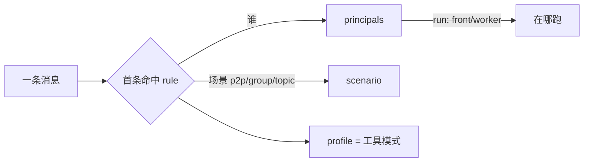

# 配置指南 · 访问策略（principals / profiles / rules）

怎么按「谁、在什么场景、能用哪些工具、在哪台机器跑」来配置 bot。覆盖 **front/worker 分流**、**群聊 vs 他人私聊** 的区别对待、**agent 工具模式**（全开 / 仅特定工具）。

> 只想快速上手？跳到 [常用配方](#常用配方)，复制改 open_id 即可。
> 想懂内部实现？看 [how-it-works/09](./how-it-works/09-access-and-guest-sandbox.md)。

---

## 1. 30 秒心智模型

每条进来的消息，bot 会问三件事，各自由一条命名的「轴」回答：

| 轴 | 配置段 | 回答 |
| --- | --- | --- |
| **谁** | `policy.principals` | 发送者属于哪个命名身份组？没列入的人 = `guest`。 |
| **能用什么** | `policy.profiles` | 用哪个工具模式（profile）？`full`=全开，受限=沙箱。 |
| **什么场景 → 哪个 profile** | `policy.rules` | 按 `(场景 × 身份)` 首条命中规则选 profile。 |
| **在哪台机器跑** | `principals[*].run` | `front`（本地）还是 `worker`（中继到你笔记本）。 |



---

## 2. 配置文件在哪、改完怎么生效

- 路径：`~/.feishu-omp-bridge/`，文件名 **`config.json` 或 `config.yaml` / `config.yml`**（按此顺序取首个存在的；都不存在则默认写 `config.json`）。
- 账号凭据（`accounts`）由首次扫码向导自动写入，你只需手写 `policy` / `relay` 等段。`policy` 是 `config` 顶层的一段，和 `accounts` / `preferences` / `relay` 平级。
- **改完 `policy` 必须整进程重启**：`bridge restart`（或 `node bin/feishu-omp-bridge.mjs restart`）。`/reconnect` 只重连长连接、不重建 agent，**不会**让 `policy` 生效。
- 直接手写 `config.json/yaml` 后也要重启（运行中的进程在启动时快照了配置）。YAML 写回（`/account`、`/config` 等程序化改动）会重序列化、**丢手写注释**。

最小骨架（JSON）：

```json
{
  "accounts": { "app": { "id": "cli_xxx", "secret": "…", "tenant": "feishu" } },
  "policy": {
    "principals": { "owner": ["ou_你的open_id"] },
    "profiles": {},
    "rules": [
      { "when": { "principal": "owner" }, "profile": "full" },
      { "profile": "locked" }
    ]
  }
}
```

同样一份用 YAML（`config.yaml`）：

```yaml
accounts:
  app: { id: cli_xxx, secret: "…", tenant: feishu }
policy:
  principals:
    owner: [ou_你的open_id]
  rules:
    - when: { principal: owner }
      profile: full
    - profile: locked   # 兜底：其他所有人零工具
```

---

## 3. 三轴速查

### 3.1 `principals` — 谁

命名身份组：组名 → open_id 列表。两种写法：

```jsonc
"principals": {
  "owner": ["ou_a"],                                  // 简写：只列成员，run 默认 front
  "team":  { "users": ["ou_b", "ou_c"], "run": "front" },
  "me":    { "users": ["ou_a"], "run": "worker" }     // 这组的会话中继到 worker 跑
}
```

- **没列入任何组的人 = 隐式 `guest`**（保留名，可在 rule 里用 `principal: "guest"` 命中）。
- `run`（`front` | `worker`）是 **per-principal**（按人，不是按场景）：保证某人点的交互卡片回调落在渲染它的同一端。`guest` 恒 `front`（陌生人永不中继到你的 worker）。`run` 只在 front 路由时起作用；单机（无 relay）可忽略。

### 3.2 `profiles` — 能用什么工具

命名工具模式。**内置 `full`（全开、无沙箱）和 `locked`（零工具、全关）恒存在**，无需声明。自定义 profile：

| 字段 | 取值 | 默认 | 说明 |
| --- | --- | --- | --- |
| `tools` | `'all'` 或 `string[]` | `'all'` | `'all'`/省略 = 全开内置工具、**不沙箱**；数组 = **受限沙箱**，只放行这些内置工具（如 `["read","search"]`）；`[]` = 零内置工具（只剩下面的 command/host 工具）。 |
| `commandTools` | `CommandToolConfig[]` | 无 | 暴露给该 profile 的本机 CLI（见 [§5](#5-command-tools-字段)）。任何 profile 都可加。 |
| `feishuHostTools` | `bool` | full=`true`，受限=`false` | 是否开放飞书 host tools（`feishu_send_message` 等）+ `feishu://` scheme。 |
| `maxToolCalls` | `number` | 无（不限） | 每轮跨所有工具的总调用上限。**仅受限 profile 有 hook 强制**。 |
| `systemPrompt` | `string` | 无 | 前置到用户 prompt，给该模式设定角色/用途（不经 `--append-system-prompt`）。 |
| `discovery` | `'on'`/`'off'` | full=`on`，受限=`off` | 外部发现源 MCP（`~/.claude.json`、`~/.codex` 等）。关掉防止继承你个人的 MCP 工具（如可任意执行代码的 `node_repl`）。 |
| `memory` | `'on'`/`'off'` | full=`on`，受限=`off` | 共享记忆（retain/recall/reflect）。关掉则访客既不能读也不能毒化你的记忆库。 |
| `extensions` | `string[]` | 无 | 你自己的 OMP 扩展 `.mjs`/`.js` hook 文件路径（`--extension`）——比如比内置白名单更复杂的「限制工具 + 调用次数」逻辑。每个 profile 各自一组。`~` 展开到家目录；相对路径相对 `~/.feishu-omp-bridge`。见 [§3.3](#33-自定义-hook-extensions)。 |

> **受限 profile 的硬边界**：`tools` 是数组时，bot 给 OMP 注入 `--tools` 白名单 + 一个 fail-closed 的 `tool_call` hook，硬拦白名单外的**一切**工具调用（bash/eval/read/write/edit/任意 MCP…全被挡）。`discovery`/`memory` 关时再叠加 `--config` overlay。`full` profile 不沙箱，但 `discovery`/`memory`/`feishuHostTools` 关掉的设置仍会生效（不会被静默忽略）。

### 3.3 自定义 hook（`extensions`）

bot 默认会按 `tools`/`commandTools`/`maxToolCalls` **自动生成**那个「限制工具 + 调用次数」的 `tool_call` hook（写在 `~/.feishu-omp-bridge/guest/<签名>/allowlist-hook.mjs`）。如果你想要**更复杂**的限制逻辑，自己写一个 `.mjs` hook，把**文件路径**写进 profile 的 `extensions`：

```jsonc
"profiles": {
  "kb": {
    "tools": ["read", "search"],
    "extensions": ["~/.feishu-omp-bridge/hooks/rate-limit.mjs"]   // 你的 hook，与自动 hook 叠加
  },
  "byoh": {
    "tools": "all",                                              // 不要自动白名单
    "extensions": ["~/.feishu-omp-bridge/hooks/my-limiter.mjs"]   // 全部限制逻辑在你的 hook 里
  }
}
```

- **可叠加**：`tools` 是数组（受限）时，你的 `extensions` 与自动 hook **同时**挂上（`--extension` 可多个）——保留内置白名单，再叠加你的规则。`tools: "all"` 时不生成自动 hook，限制全在你的文件里。
- **路径**：`~` 展开到家目录；相对路径相对 `~/.feishu-omp-bridge`；绝对路径原样。**文件不存在会让本次 run 直接失败**（限制器绝不能静默消失）。
- **hook 文件长这样**（OMP extension 协议，与 bot 自动生成的同形）：

```js
// ~/.feishu-omp-bridge/hooks/my-limiter.mjs
const ALLOWED = new Set(["read", "search", "zendesk_kg"]);
let total = 0;
export default function hook(pi) {
  pi.on("tool_call", async (event) => {
    if (!ALLOWED.has(event.toolName)) {
      return { block: true, reason: `工具 ${event.toolName} 不允许` };
    }
    if (++total > 30) return { block: true, reason: "本轮工具调用已达上限" };
  });
}
```

> ⚠️ 多发送者群批次里若不同人解析到**不同** profile，会 fail-closed 成 `locked`（避免一人的 hook 漏到另一人）。改 `extensions` 同样要 `restart`。

### 3.4 `rules` — 什么场景用哪个 profile

**首条命中**（first-match，顺序重要）：

```jsonc
"rules": [
  { "when": { "chat": "p2p", "principal": "owner" }, "profile": "full" },
  { "when": { "chat": "group" }, "profile": "kb" },
  { "profile": "locked" }            // 兜底：when 省略 = 命中一切
]
```

`when` 的每个字段都可省略（省略 = 匹配任意）：

- `chat`：`"p2p"` | `"group"` | `"topic"`，或它们的数组。**`"group"` 也匹配话题群 `topic`**（要单独区分话题群才写 `"topic"`）。
- `principal`：身份组名（含 `"guest"`），或数组。
- `chatId`：限定到具体群 `chat_id`（数组）。p2p 的 chat_id 按用户对生成、不用它门控。
- `profile`：要应用的 profile 名（`profiles` 的 key，或内置 `full` / `locked`）。

---

## 4. 解析顺序与 fail-closed（必读）

一条消息如何定下 profile：

1. 按 `principals` 定发送者身份组（命中第一个含其 open_id 的组，否则 `guest`）。
2. 顺着 `rules` 找**第一条** `when` 命中的，取它的 `profile`。
3. 群里一个 batch 多发送者时 **最严者胜**（`locked` > 受限 > `full`）；若是不同的受限 profile 混杂 → 直接 `locked`（一方的工具集对另一方不安全）。

**两条务必记住的安全语义：**

- ⚠️ **显式 `policy` 是 fail-closed**：发送者未命中任何 rule、或 rule 指向不存在的 profile 名 → 跑 `locked`（零工具）。**所以一定要写一条兜底 rule**（`{ "profile": "guest/kb/locked" }`，`when` 省略），否则没覆盖到的人会被锁死。
- **不配 `policy` = 向后兼容**：见 [§7](#7-向后兼容旧字段仍可用)，按旧 `access`/`guestPolicy`/`relay.route` 自动合成，行为和以前完全一样。

**策略对三种入口都生效**：普通消息、交互卡片回调、云文档评论（评论按 `group` 场景解析评论者）。

---

## 5. command tools 字段

`commandTools` 里每一项把一个本机 CLI 暴露成 host tool。bot 用 `spawn(command, [...args], { shell:false })` 拉起——**不走 shell**，模型无法注入管道/重定向/通配/命令拼接，只能跑 `<command> [固定前缀] [模型参数] [固定后缀]`。

| 字段 | 必填 | 说明 |
| --- | --- | --- |
| `name` | ✅ | 暴露给模型的工具名，须匹配 `^[a-zA-Z0-9_]+$`。 |
| `command` | ✅ | 可执行名或绝对路径。 |
| `args` | | 固定前缀参数（总在模型参数前）。 |
| `appendArgs` | | 固定后缀参数（总在模型参数后，如 `["-o","json"]` 强制结构化输出）。 |
| `allowedSubcommands` | | 钉死第一个模型参数（子命令）到白名单。 |
| `description` | | 给模型看的工具描述。 |
| `cwd` | | 工作目录，默认本次 run 的 cwd。 |
| `timeoutMs` | | 硬超时，默认 `120000`，clamp `[1000, 600000]`。 |
| `maxOutputBytes` | | 返回给模型的最大字节，默认 `30000`，clamp `[1000, 200000]`。 |
| `maxCalls` | | 该工具每轮调用上限（受限 profile 的 hook 强制）。 |

---

## 6. 常用配方

> 下面只给 `policy`（和需要时的 `relay`）段，贴进你的 `config.json` 顶层、改 open_id 即可。`accounts` 保持向导写的不动。

### 配方 0 · 什么都不配

不写 `policy`、不写 `guestPolicy`：**所有人全开**（向后兼容）。生产环境不建议。

### 配方 1 · 只有我全开，别人只读（最常见）

```jsonc
"policy": {
  "principals": { "owner": ["ou_我"] },
  "profiles": {
    "readonly": { "tools": ["read", "search"] }
  },
  "rules": [
    { "when": { "principal": "owner" }, "profile": "full" },
    { "profile": "readonly" }          // 其他所有人：只读
  ]
}
```

把兜底 `readonly` 换成 `locked` = 别人零工具；换成下面的 `kb` = 别人只能用特定 CLI。

### 配方 2 · 群聊给特定工具，我私聊全开，陌生人锁死

「群是共享空间给受限工具集；我自己私聊全开；没列入的陌生人锁死。」

```jsonc
"policy": {
  "principals": {
    "owner": ["ou_我"],
    "team":  ["ou_同事1", "ou_同事2"]
  },
  "profiles": {
    "readonly": { "tools": ["read", "search"] },
    "kb": {
      "tools": [],
      "commandTools": [
        { "name": "zendesk_kg", "command": "zendesk-kg", "allowedSubcommands": ["search", "health"], "appendArgs": ["-o", "json"] }
      ],
      "systemPrompt": "你是面向同事的工单知识库助手，只用 zendesk_kg 查询并简洁作答。"
    }
  },
  "rules": [
    { "when": { "chat": "p2p", "principal": "owner" }, "profile": "full" },
    { "when": { "chat": "p2p", "principal": "team" },  "profile": "readonly" },
    { "when": { "chat": "group" },                      "profile": "kb" },
    { "profile": "locked" }            // 陌生人私聊：锁死
  ]
}
```

> `chat: "group"` 同时覆盖普通群和话题群。注意末条 `locked` 兜底：没被前面规则覆盖到的人（如陌生人私聊）零工具——这是 fail-closed，务必保留。

### 配方 3 · front/worker 分流（我走笔记本，别人留服务器沙箱）

一台常开 **front**（服务器）持唯一飞书长连接；把 `owner` 的会话**中继**到 **worker**（你笔记本）跑全工具，其余人留在 front 走沙箱。

**front 机器**（`config.json`）：

```jsonc
{
  "accounts": { "app": { "id": "cli_xxx", "secret": "…", "tenant": "feishu" } },
  "relay": { "role": "front", "listen": "127.0.0.1:8787" },
  "policy": {
    "principals": { "owner": { "users": ["ou_我"], "run": "worker" } },
    "profiles": { "kb": { "tools": [], "commandTools": [ /* … */ ] } },
    "rules": [
      { "when": { "principal": "owner" }, "profile": "full" },
      { "profile": "kb" }
    ]
  }
}
```

**worker 机器**（你的笔记本，`config.json`）——同一个 app 凭据，只需 relay 段：

```jsonc
{
  "accounts": { "app": { "id": "cli_xxx", "secret": "…", "tenant": "feishu" } },
  "relay": { "role": "worker", "endpoint": "https://your-server.example" }
}
```

要点：
- **路由按人**：`owner.run: "worker"` → 他的消息/卡片/评论中继到 worker；其余人（`guest`，恒 front）留在 front 跑 `kb`。
- worker **反向拨入** front 的 HTTP/SSE，笔记本无需公网入站。worker 不连飞书事件流，用同一 app 凭据自己回写飞书。
- **安全边界 = TLS**：`endpoint` 用 `https://`（服务器侧 TLS 反代即可）。用明文 `http://` 启动会告警——中间人可伪造事件驱动你本地全工具 agent。
- **鉴权零配置**：两端共用 App Secret 派生 HMAC。要把「能连 relay」和「能当 bot」解耦，在两端同时设 `relay.secret`（明文 / `${ENV}` / keystore ref，两端必须一致）。
- **掉线兜底**：worker 不在线时 front 本地降级处理（不丢消息）。
- profile（`full`/`kb`）在**实际执行端**解析应用——owner 的 run 在 worker 上以 `full` 跑，front 永不跑 owner 的会话。

### 配方 4 · 多团队、多 profile

```jsonc
"policy": {
  "principals": {
    "owner": ["ou_我"],
    "support": ["ou_客服1", "ou_客服2"],
    "dev": ["ou_研发1"]
  },
  "profiles": {
    "kb":  { "tools": [], "commandTools": [ { "name": "zendesk_kg", "command": "zendesk-kg" } ] },
    "ro":  { "tools": ["read", "search"], "maxToolCalls": 20 }
  },
  "rules": [
    { "when": { "principal": "owner" }, "profile": "full" },
    { "when": { "principal": "support" }, "profile": "kb" },
    { "when": { "principal": "dev" }, "profile": "ro" },
    { "profile": "locked" }
  ]
}
```

### 配方 5 · 纯 KB 助手（谁来都只有特定 CLI）

公开知识库 bot，所有人（包括你）都只能用白名单 CLI，没有任何内置/全工具：

```jsonc
"policy": {
  "principals": {},
  "profiles": {
    "kb": {
      "tools": [],
      "feishuHostTools": false,
      "maxToolCalls": 15,
      "commandTools": [
        { "name": "zendesk_kg", "command": "zendesk-kg", "allowedSubcommands": ["search"], "appendArgs": ["-o", "json"], "maxCalls": 8 }
      ],
      "systemPrompt": "你是知识库助手，只能用 zendesk_kg search 查询。"
    }
  },
  "rules": [ { "profile": "kb" } ]
}
```

---

## 7. 向后兼容（旧字段仍可用）

**不设 `policy` 时**，bot 用旧字段自动合成等价策略，行为与改造前逐位一致——你不必迁移。旧字段：

- `preferences.access.{allowedUsers,allowedChats,admins}` — 粗门控（谁能进、哪些群、谁能跑 admin 命令）。**与 `policy` 正交，始终生效**（先决定能不能进来，再由 policy 决定工具模式）。
- `preferences.guestPolicy.{unrestrictedUsers,commandTools,extraToolAllowlist,feishuHostTools,maxToolCalls,systemPrompt}` — 旧的「访客沙箱」：信任用户（`unrestrictedUsers`，未设回落 `access.admins`）私聊全开，其余人 + 所有群一律沙箱。
- `relay.route.users` — 中继名单。

合成规则（无 `guestPolicy` 时人人 `full`；有 `guestPolicy` 时信任用户 p2p 全开、其余进 `guest` 沙箱；`relay.route.users` 照常赢得路由）。**一旦你写了 `policy`，它就是权威**（旧 `guestPolicy` 的沙箱逻辑被 `policy` 取代，但 `access` 仍生效）。

迁移建议：保留 `access` 不动；把 `guestPolicy` 翻译成一个受限 `profile` + 对应 rules（参考 [配方 2](#配方-2--群聊给特定工具我私聊全开陌生人锁死)）。

---

## 8. 校验与常见坑

- **本地回归**：`pnpm test:guest`（加 `--model` 跑真实模型越权测试）——对你**真实的** `config` 验证：信任用户全开 / 陌生人进沙箱、危险内置被移除、command tool 注入成功、shell 注入被挡、白名单外子命令被拒。
- **改了不生效**？`policy` 改动要 `restart`，不是 `/reconnect`。
- **某些人被意外锁死**？显式 `policy` fail-closed——补一条兜底 rule（`when` 省略）。
- **群里点卡片/按钮没反应**？卡片回调按发送者身份路由；确认操作者在对应 principal 里、且 `access.allowedUsers` 没把他挡在外面。
- **worker 反复 401**？两端 `relay.secret` 不一致，或都没设但 App Secret 不同。
- **访客还能看到 `node_repl` / MCP 工具名**？那是「可见面」；真正的边界是 fail-closed hook——白名单外的调用在执行时被拦（`pnpm test:guest --model` 验证 canary 不泄漏）。
- 沙箱产物在 `~/.feishu-omp-bridge/guest/<签名>/`（overlay + hook，自动维护、按 profile 内容分目录）。

---

相关：[README 配置文件章节](./README.md#配置文件) · [how-it-works/08 配置与密钥](./how-it-works/08-config-and-secrets.md) · [how-it-works/09 访问控制与统一策略](./how-it-works/09-access-and-guest-sandbox.md) · [README 中继/Relay 章节](./README.md#中继--relay多机分流)
