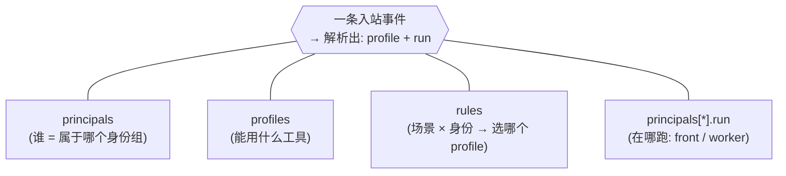
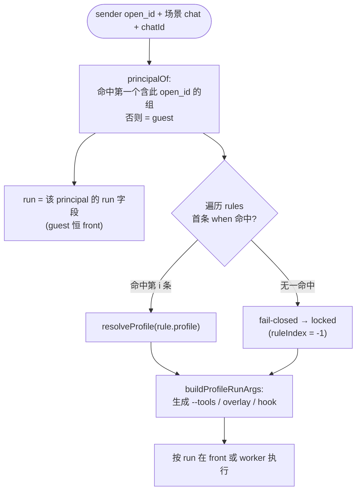
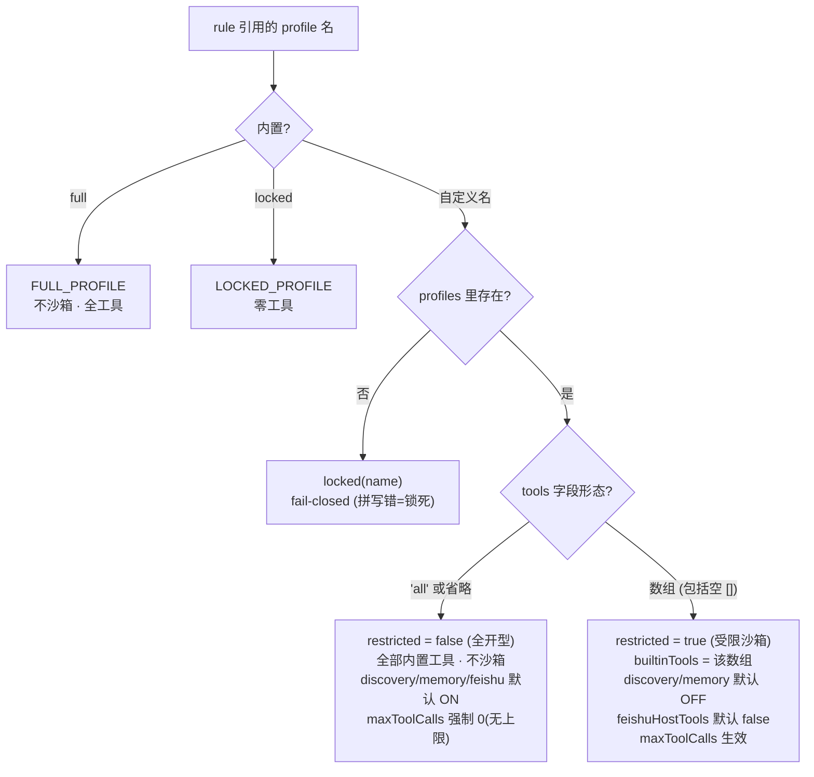
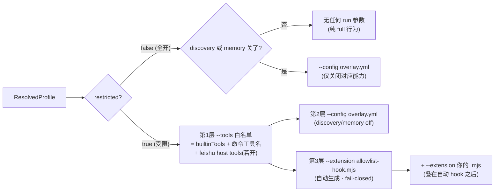
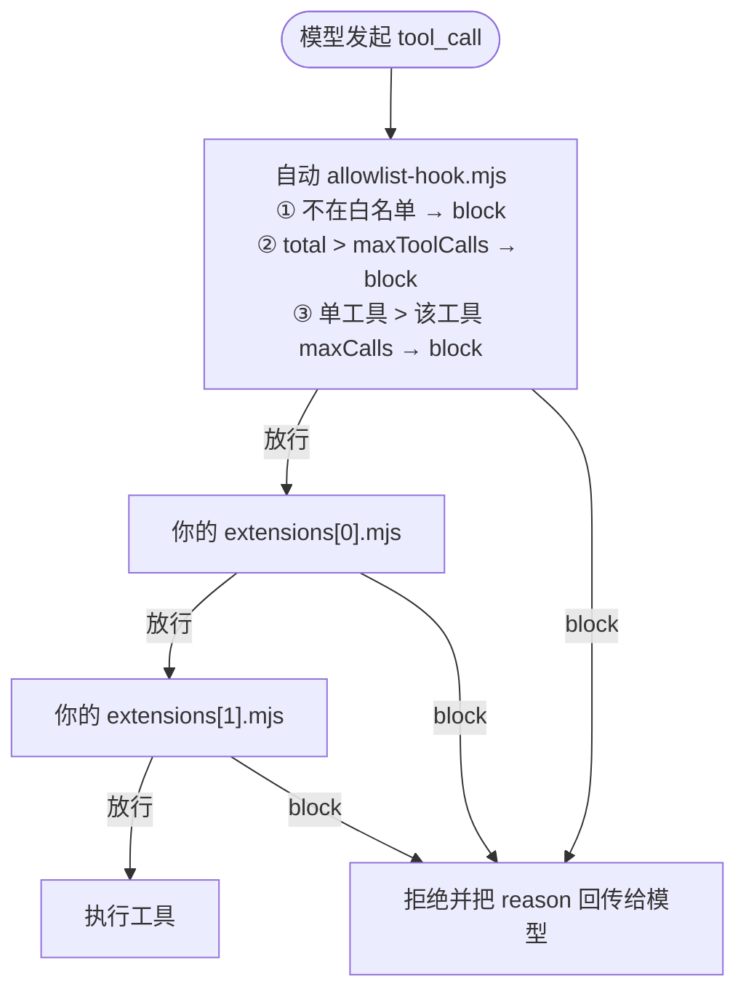
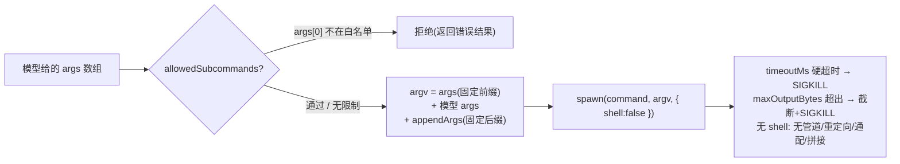
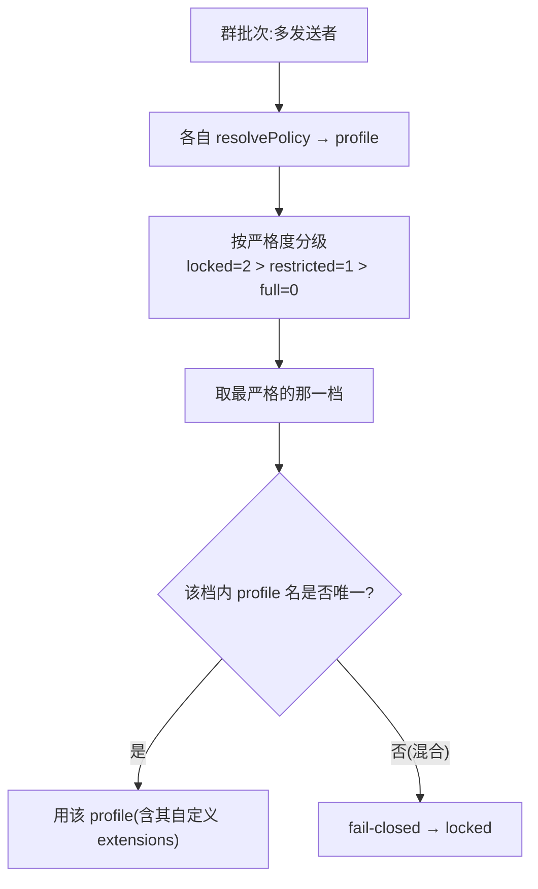
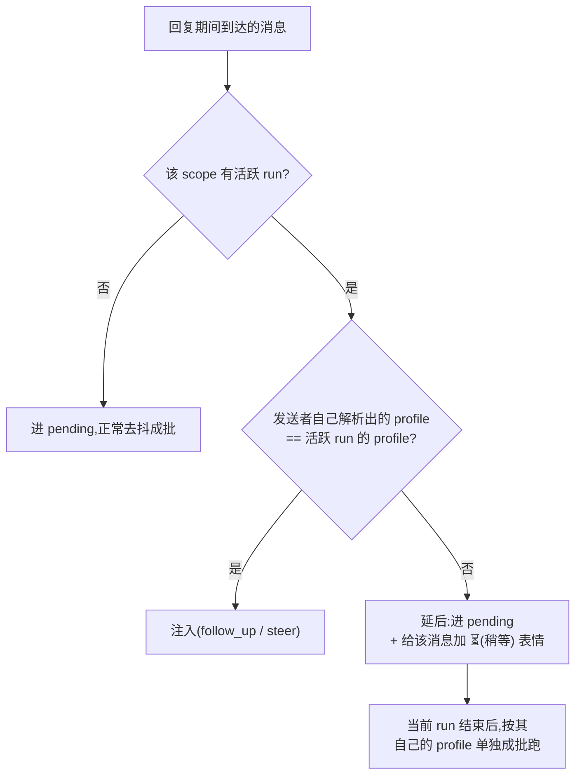
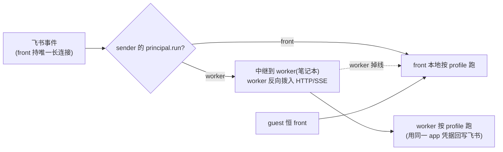
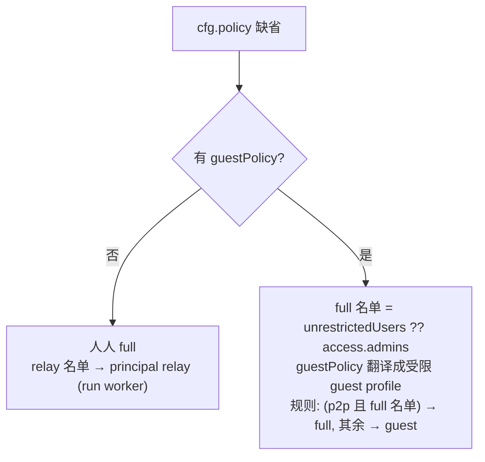

# 配置指南 · 访问策略（`policy`: principals / profiles / rules）

怎么按「**谁** / **在什么场景** / **能用哪些工具** / **在哪台机器跑**」精细地配置 bot。本文不只给现成用例，而是把每一根轴、每一个字段、以及背后**强制边界的实现**讲透，让你能任意拼出自己的策略。

> - 只想抄一份能跑的？跳到 [§10 配方库](#10-配方库copy--改-open_id)。
> - 想查某个字段？跳到 [§12 全字段速查](#12-全字段速查appendix)。
> - 想懂内部实现？看 [how-it-works/09](./how-it-works/09-access-and-guest-sandbox.md)。

---

## 0. 目录

1. [心智模型：星型三轴](#1-心智模型星型三轴)
2. [配置文件在哪、改完怎么生效](#2-配置文件在哪改完怎么生效)
3. [决策流水线：一条消息如何定下 profile + run](#3-决策流水线一条消息如何定下-profile--run)
4. [轴一 `principals` — 谁](#4-轴一-principals--谁)
5. [轴二 `profiles` — 能用什么工具（核心）](#5-轴二-profiles--能用什么工具核心)
6. [三层强制边界：`--tools` / overlay / hook](#6-三层强制边界--tools--overlay--hook)
7. [`commandTools` — 把本机 CLI 安全地暴露给模型](#7-commandtools--把本机-cli-安全地暴露给模型)
8. [Feishu host tools 与 `feishu://`](#8-feishu-host-tools-与-feishu)
9. [轴三 `rules` + 解析顺序 + fail-closed](#9-轴三-rules--解析顺序--fail-closed)
10. [配方库（copy → 改 open_id）](#10-配方库copy--改-open_id)
11. [front/worker 路由与 `relay.secret`](#11-frontworker-路由与-relaysecret)
12. [全字段速查（appendix）](#12-全字段速查appendix)
13. [向后兼容（旧字段仍可用）](#13-向后兼容旧字段仍可用)
14. [校验、调试、常见坑](#14-校验调试常见坑)

---

## 1. 心智模型：星型三轴

每条进来的事件（消息 / 卡片回调 / 文档评论），bot 都会问四件事。它们由 **三根命名的轴**（`principals` / `profiles` / `rules`）加上 principal 自带的 `run` 字段共同回答——这就是 `policy` 的全部：



| 轴 | 配置段 | 回答的问题 |
| --- | --- | --- |
| **谁** | `policy.principals` | 发送者属于哪个命名身份组？没列入的人 = 隐式 `guest`。 |
| **能用什么** | `policy.profiles` | 该用哪个工具模式（profile）？`full`=全开不沙箱，受限=沙箱。 |
| **什么场景 → 哪个 profile** | `policy.rules` | 按 `(场景 × 身份)` **首条命中**的规则选 profile。 |
| **在哪台机器跑** | `principals[*].run` | `front`（本地）还是 `worker`（中继到你笔记本）。 |

三根轴**正交**：principals 只管分组、profiles 只管工具能力、rules 把「某场景某身份」映射到某 profile。要做出复杂策略，就是组合这三者，而不是堆叠特例。

---

## 2. 配置文件在哪、改完怎么生效

- **路径**：`~/.feishu-omp-bridge/`，文件名按 **`config.json` → `config.yaml` → `config.yml`** 顺序取首个存在的；都不存在则默认写 `config.json`。
- **`policy` 的位置**：`config` 的**顶层段**，与 `accounts` / `preferences` / `relay` / `secrets` 平级。账号凭据（`accounts`）由首次扫码向导写入，你只需手写 `policy`（以及需要时的 `relay`）。
- **改完必须整进程重启**：`bridge restart`（或 `node bin/feishu-omp-bridge.mjs restart`）。运行中的进程在**启动时快照**了配置。
  - ⚠️ `/reconnect` 只重连飞书长连接、**不重建 agent**，**不会**让 `policy` 生效。
- **YAML 写回会丢注释**：`/account`、`/config` 等程序化改动会重序列化整个文件，**抹掉你手写的注释**。要保留注释就只手改、别用命令改。

最小骨架（JSON）：

```json
{
  "accounts": { "app": { "id": "cli_xxx", "secret": "…", "tenant": "feishu" } },
  "policy": {
    "principals": { "owner": ["ou_你的open_id"] },
    "profiles": {},
    "rules": [
      { "when": { "principal": "owner" }, "profile": "full" },
      { "profile": "locked" }
    ]
  }
}
```

同一份用 YAML（`config.yaml`）：

```yaml
accounts:
  app: { id: cli_xxx, secret: "…", tenant: feishu }
policy:
  principals:
    owner: [ou_你的open_id]
  rules:
    - when: { principal: owner }
      profile: full
    - profile: locked   # 兜底:其他所有人零工具
```

> 全文示例以 JSONC（带注释的 JSON）书写，方便讲解；真正写进 `config.json` 时要删掉注释（标准 JSON 不允许注释），或改用 YAML/`config.yaml`。

---

## 3. 决策流水线：一条消息如何定下 profile + run



要点：
- **身份只看 open_id**：`principalOf` 跳过保留名 `guest`，命中第一个 `users` 含该 open_id 的组；都没有就是 `guest`。
- **rules 首条命中即停**：顺序重要（见 [§9](#9-轴三-rules--解析顺序--fail-closed)）。
- **没命中任何 rule → `locked`**：显式 `policy` 是 **fail-closed**，宁可锁死也不放开（所以务必写兜底 rule）。
- **三种入口都走这套**：普通消息、交互卡片回调、云文档评论（评论按 `group` 场景解析评论者）。

---

## 4. 轴一 `principals` — 谁

命名身份组：**组名 → open_id 列表**。两种写法（简写 / 完整）：

```jsonc
"principals": {
  "owner": ["ou_a"],                                  // 简写:只列成员, run 默认 front
  "team":  { "users": ["ou_b", "ou_c"], "run": "front" },
  "me":    { "users": ["ou_a"], "run": "worker" }     // 这组的会话中继到 worker 跑
}
```

| 字段 | 取值 | 说明 |
| --- | --- | --- |
| 简写 | `string[]` | 等价于 `{ users: [...], run: "front" }`。 |
| `users` | `string[]` | 该组成员的 open_id。空字符串会被清掉。 |
| `run` | `"front"` \| `"worker"` | **按人**的运行端，默认 `front`。 |

语义细节（都来自实现，别踩坑）：

- **没列入任何组的人 = 隐式 `guest`**。`guest` 是**保留名**：你可以在 rule 里用 `principal: "guest"` 命中它，但**不能**在 `principals` 里重定义它（同名 key 会被解析跳过）。
- **一个人只归一个组**：`principalOf` 取**第一个**含其 open_id 的组（按对象键顺序）。同一个 open_id 写进多个组时，靠前的赢。
- **`run` 是 per-principal，不是 per-场景**：保证某人触发的交互卡片回调，落在最初渲染那张卡片的同一端。
- **`guest` 恒 `front`**：陌生人永不被中继到你的 worker（笔记本）。
- **`run` 只在配了 relay 时有意义**：单机部署（无 `relay`）可完全忽略它。详见 [§11](#11-frontworker-路由与-relaysecret)。

---

## 5. 轴二 `profiles` — 能用什么工具（核心）

这是「高度自定义」的主战场。一个 profile 就是一套**命名的工具模式**。

### 5.1 两个内置 profile（恒存在，无需声明）

| 名字 | 含义 |
| --- | --- |
| `full` | 全开内置工具、**不沙箱**；discovery/memory/feishu host tools 全 ON；无调用上限。 |
| `locked` | **零工具**：无内置工具、无 command tools、无 feishu host tools、无 discovery、无 memory。fail-closed 的归宿。 |

### 5.2 自定义 profile 的「加载/解析」分叉（关键心智）

一个自定义 profile 是「全开型」还是「受限沙箱型」，**完全由 `tools` 字段的形态决定**，并连带改变其它字段的**默认值**：



一句话记忆：**`tools` 是数组 → 受限沙箱（默认收紧一切）；`tools` 省略或 `'all'` → 全开型（默认放开一切）**。

> 「全开型」自定义 profile 有用吗？有——它和内置 `full` 的区别是：你可以在保持「全工具不沙箱」的同时，**单独关掉** discovery / memory / feishuHostTools，或挂上你自己的 `extensions` 限流 hook（见 [§5.5](#55-extensions--挂你自己的-hook)）。这些「关掉」的设置**不会被静默忽略**，照样生成 overlay。

### 5.3 全字段表

| 字段 | 取值 | 全开型默认 | 受限型默认 | 说明 |
| --- | --- | --- | --- | --- |
| `tools` | `'all'` \| `string[]` | `'all'` | —（写了数组才是受限） | `'all'`/省略=全开内置、不沙箱；数组=只放行这些内置工具（如 `["read","search"]`）；`[]`=零内置工具（只剩 command/host 工具）。 |
| `commandTools` | `CommandToolConfig[]` | 无 | 无 | 暴露给该 profile 的本机 CLI（见 [§7](#7-commandtools--把本机-cli-安全地暴露给模型)）。**任何 profile 都可加**。 |
| `feishuHostTools` | `bool` | `true` | `false` | 是否开放飞书 host tools（`feishu_send_message` 等）+ `feishu://` scheme（见 [§8](#8-feishu-host-tools-与-feishu)）。 |
| `maxToolCalls` | `number` | 强制 `0`（无上限） | `0`（无上限） | 每轮跨**所有**工具的总调用上限。**仅受限 profile 有 hook 强制**（全开型忽略它）。 |
| `systemPrompt` | `string` | 无 | 无 | **前置**到用户 prompt（不经 `--append-system-prompt`），给该模式设定角色/用途。 |
| `discovery` | `'on'` \| `'off'` | `on` | `off` | 外部发现源 MCP（`~/.claude.json`、`~/.codex` 等）。关掉防止访客继承你个人的 MCP 工具（如可任意执行代码的 `node_repl`）。 |
| `memory` | `'on'` \| `'off'` | `on` | `off` | 共享记忆（retain/recall/reflect）。关掉则访客既不能读也不能毒化你的记忆库。 |
| `extensions` | `string[]` | 无 | 无 | 你自己的 OMP 扩展 `.mjs` hook 文件路径（`--extension`）。`~` 展开家目录；相对路径相对 `~/.feishu-omp-bridge`。见 [§5.5](#55-extensions--挂你自己的-hook)。 |

> **「默认随 `tools` 翻转」很重要**：同样写 `feishuHostTools` 不写，全开型给 `true`、受限型给 `false`。你想要的任何「非默认」组合都得**显式写出来**。

### 5.4 自定义 profile 的几种典型形态

```jsonc
"profiles": {
  // (a) 只读沙箱:只放行两个内置工具
  "ro":   { "tools": ["read", "search"], "maxToolCalls": 20 },

  // (b) 纯 CLI 沙箱:零内置工具,只能跑白名单 CLI
  "kb":   { "tools": [], "commandTools": [ /* … */ ], "systemPrompt": "你是知识库助手。" },

  // (c) 受限但允许发飞书消息:显式打开 host tools
  "poster": { "tools": ["read"], "feishuHostTools": true },

  // (d) 全开但收紧:全工具不沙箱,却关掉 discovery/memory(不继承你的 MCP/记忆)
  "fullx":  { "tools": "all", "discovery": "off", "memory": "off" },

  // (e) 受限但允许联网发现源(默认是关的,这里显式开)
  "ro_mcp": { "tools": ["read"], "discovery": "on" }
}
```

### 5.5 `extensions` — 挂你自己的 hook

bot 会按 `tools`/`commandTools`/`maxToolCalls` **自动生成**一个「白名单 + 调用计数」的 `tool_call` hook（只在**受限** profile 生成）。想要**更复杂**的限制逻辑时，自己写 `.mjs`，把**文件路径**写进 `extensions`：

```jsonc
"profiles": {
  "kb": {
    "tools": ["read", "search"],
    "extensions": ["~/.feishu-omp-bridge/hooks/rate-limit.mjs"]   // 与自动 hook 叠加
  },
  "byoh": {
    "tools": "all",                                              // 不生成自动 hook
    "extensions": ["~/.feishu-omp-bridge/hooks/my-limiter.mjs"]   // 全部限制逻辑在你的文件里
  }
}
```

- **可叠加**：`tools` 是数组（受限）时，你的 `extensions` 与自动 hook **同时**挂上（`--extension` 可多个）——内置白名单 + 你的规则一起生效。`tools: "all"` 时不生成自动 hook，限制全在你的文件里。
- **路径**：`~` 展开家目录；相对路径相对 `~/.feishu-omp-bridge`；绝对路径原样。**文件不存在会让本次 run 直接失败**（限制器绝不能静默消失）。
- **hook 文件协议**（与 bot 自动生成的同形，OMP extension API）：

```js
// ~/.feishu-omp-bridge/hooks/my-limiter.mjs
const ALLOWED = new Set(["read", "search", "zendesk_kg"]);
let total = 0;
export default function hook(pi) {
  pi.on("tool_call", async (event) => {
    if (!ALLOWED.has(event.toolName)) {
      return { block: true, reason: `工具 ${event.toolName} 不允许` };
    }
    if (++total > 30) return { block: true, reason: "本轮工具调用已达上限" };
  });
}
```

---

## 6. 三层强制边界：`--tools` / overlay / hook

profile 解析完，bot 用 `buildProfileRunArgs` 把它翻译成给 OMP 的运行参数。**全开型几乎不加参数**；**受限型叠三层防线**：



**每一层各管什么：**

1. **`--tools <白名单>`（缩面）**：把内置工具裁到白名单。白名单 = `builtinTools` ∪ 命令工具名 ∪（`feishuHostTools` 开时的 4 个 feishu host tool 名）。白名单为空时用一个哨兵值 `__bridge_no_builtins__` 强制「零内置工具」（OMP 把空 `--tools` 当成「恢复全默认」，所以必须用哨兵）。
2. **`--config overlay.yml`（缩面）**：自动生成的 OMP 配置覆盖层。
   - `discovery: off` → 写 `tools.discoveryMode: off` + 禁用全部发现源 `native, claude, codex, gemini, github, opencode, cursor, agents-md`（防止继承你 `~/.claude.json` 等里的 MCP，如可执行任意代码的 `node_repl`）。
   - `memory: off` → 写 `memory.backend: "off"`（既不注入记忆引导，也禁掉 retain/recall/reflect）。
   - **两者都 ON 时不生成 overlay**；任一关闭就生成（**全开型也会生成**——所以全开 profile 的 discovery/memory 关闭设置不会被静默忽略）。
3. **`--extension allowlist-hook.mjs`（真正的执行边界）**：自动生成的 fail-closed `tool_call` hook。**前两层只是缩小可见面，这一层才硬拦**：



> 即使访客在工具列表里**看见** `node_repl` / 某 MCP 的名字（「可见面」未必完全清空），真正的边界是这个 fail-closed hook——白名单外的调用**在执行时被拦**。`pnpm test:guest --model` 会验证 canary 工具不泄漏。

**`systemPrompt` 怎么注入**：不走 `--append-system-prompt`（实测会让 codex/gpt-5.5 请求间歇性挂起），而是由调用方**前置**到用户 prompt：`<systemPrompt>\n\n---\n\n<用户消息>`。

**生成物落盘**：overlay 与 hook 写在 `~/.feishu-omp-bridge/guest/<内容签名>/`（按 `{allowlist, overlay, hook}` 的 sha1 前 12 位分目录）。**按内容签名分目录**意味着并发活跃的多个 profile 互不覆盖，且内容不变就不重写。

---

## 7. `commandTools` — 把本机 CLI 安全地暴露给模型

`commandTools` 里每一项把一个本机 CLI 暴露成一个 host tool。这是受限 profile 唯一的「执行逃生口」——`bash`/`eval`/MCP 都被拿掉后，只剩这些被你点名的、参数受控的 CLI。

**执行模型（无 shell，无注入）：**



bot 用 `spawn(command, [...args, ...模型args, ...appendArgs], { shell:false })` 拉起——**不走 shell**，模型无法注入管道 `|`、重定向 `>`、通配 `*`、命令拼接 `;`/`&&`，只能跑 `<command> [固定前缀] [模型参数] [固定后缀]`。

| 字段 | 必填 | 默认 / 约束 | 说明 |
| --- | --- | --- | --- |
| `name` | ✅ | 须匹配 `^[a-zA-Z0-9_]+$` | 暴露给模型的工具名。非法名/重名会被丢弃（按 name 去重）。 |
| `command` | ✅ | — | 可执行名（走 PATH）或绝对路径。 |
| `args` | | 无 | **固定前缀**参数（总在模型参数前）。 |
| `appendArgs` | | 无 | **固定后缀**参数（总在模型参数后，如 `["-o","json"]` 强制结构化输出）。 |
| `allowedSubcommands` | | 空/未设 = 任意 | 把**第一个模型参数**（子命令）钉死到白名单；不在表内直接拒绝。 |
| `description` | | 自动生成 | 给模型看的工具描述。 |
| `cwd` | | 本次 run 的 cwd | 工作目录。 |
| `timeoutMs` | | `120000`，clamp `[1000, 600000]` | 硬超时，到点 SIGKILL。 |
| `maxOutputBytes` | | `30000`，clamp `[1000, 200000]` | 返回给模型的最大字节，超出截断并 kill。 |
| `maxCalls` | | 无 | 该工具**每轮**调用上限（由受限 profile 的 hook 强制）。 |

完整示例：

```jsonc
"commandTools": [
  {
    "name": "zendesk_kg",
    "command": "zendesk-kg",
    "allowedSubcommands": ["search", "health"],   // 模型只能跑 search / health
    "appendArgs": ["-o", "json"],                 // 永远追加 -o json
    "description": "查询工单知识库,只读。",
    "timeoutMs": 30000,
    "maxOutputBytes": 50000,
    "maxCalls": 8                                  // 每轮最多 8 次
  }
]
```

> **`maxCalls` 仅在受限 profile 生效**（它靠自动 hook 强制）。在全开型 profile 里加 command tool 不会有 per-tool 上限——若需要上限，把该 profile 改成受限（`tools` 写成数组，哪怕 `[]`）。

---

## 8. Feishu host tools 与 `feishu://`

`feishuHostTools: true` 会给 profile 注入 4 个飞书 host tool + 一个只读 URI scheme：

| 工具 | 作用 |
| --- | --- |
| `feishu_current_context` | 返回当前会话的 chat/topic 上下文。 |
| `feishu_send_message` | 向当前会话或指定 `chatId` 发 markdown 消息。 |
| `feishu_reply_message` | 回复触发消息或指定 `messageId`。 |
| `feishu_get_message` | 按 `messageId` 拉取并归一化一条消息（引用/卡片/转发消息有用）。 |
| `feishu://` (scheme) | **只读**读取飞书资源：`feishu://message/<message_id>`、`feishu://current/context`。写操作被拒。 |

语义：
- 这组工具能**主动发消息/读任意消息 id**，所以默认只有全开型给 `true`、受限型给 `false`。受限 profile 要用得**显式** `"feishuHostTools": true`（白名单 hook 会自动把这 4 个名字纳入，否则会把你刚注册的 host tool 自己拦掉）。
- **云文档评论入口没有飞书 host 集成**：评论场景只暴露 `commandTools`，不挂这 4 个 host tool（评论里没有「当前会话」可发）。

---

## 9. 轴三 `rules` + 解析顺序 + fail-closed

### 9.1 `rules`：首条命中

**first-match，顺序至关重要**：

```jsonc
"rules": [
  { "when": { "chat": "p2p", "principal": "owner" }, "profile": "full" },
  { "when": { "chat": "group" }, "profile": "kb" },
  { "profile": "locked" }            // 兜底:when 省略 = 命中一切
]
```

`when` 的每个字段都可省略（**省略 = 匹配任意**）：

| `when` 字段 | 取值 | 匹配规则 |
| --- | --- | --- |
| `chat` | `"p2p"` \| `"group"` \| `"topic"`，或它们的数组 | **`"group"` 也匹配话题群 `topic`**；要单独区分话题群才写 `"topic"`。⚠️ 场景未知时（部分卡片/评论路由），**带 `chat` 的 rule 一律不命中**。 |
| `principal` | 身份组名（含 `"guest"`），或数组 | 发送者所属组名在表内才命中。 |
| `chatId` | `string[]` | 限定到具体群 `chat_id`。p2p 的 chat_id 按用户对生成、**不用它门控**。 |
| `profile` | profile 名 | 要应用的 profile（`profiles` 的 key，或内置 `full` / `locked`）。 |

### 9.2 解析顺序（单条消息）

1. 按 `principals` 定发送者身份组（命中第一个含其 open_id 的组，否则 `guest`）。
2. 顺着 `rules` 找**第一条** `when` 命中的，取它的 `profile`。
3. 没有任何 rule 命中 → **`locked`**（fail-closed，`ruleIndex = -1`）。

### 9.3 群批次：最严者胜

一次去抖（debounce）的 run 可能裹挟同群多个发送者。**最严格的发送者决定整批**：



- 一个不受信发送者**永远无法**把整批抬到更宽松模式。
- 即便最严格那一档里混了**两个不同的受限 profile**（甚至两个不同的全开 profile），也直接 `locked`——一方的工具集/限流 hook 对另一方不安全。

#### 9.3.1 回复期间插话：同 profile 才能注入

「最严者胜」只覆盖 **run 启动前** 的同一去抖批次。run 一旦开始流式回复,后到的消息走的是另一条路——直接注入正在跑的 agent（`follow_up`,`!` 开头则 `steer`）。这里同样**按发送者自己的 profile 把关**:



- **关键保证**:活跃 run 是用某个 profile 的工具集 spawn 的。一个低权限成员在高权限者回复期间插话,**不会**被塞进那个高权限进程——除非他自己解析出的 profile 名与活跃 run **完全相同**。否则消息被延后,在当前 run 结束后按他本人的 profile 另起一轮。`steer` 与 `follow_up` 同规则。
- **会话也按 profile 隔离**:OMP 会话按 `(scope, profile)` 存。低权限者即便在 run 结束后接着发言,也只 resume 自己那档的会话,**不会继承**高权限对话的历史上下文;每一档在同一个群里各留各的线程。
- **云文档评论同理**:评论者按 `group` 场景解析 profile,会话按 `(doc, profile)` 隔离。

#### 9.3.2 卡片顶部的 profile 徽标

群聊 / 话题群里,bot 回复卡片**顶部带一条带色 header**,标明这轮对话的工具档与发起者:

| profile | 徽标 | 颜色 |
| --- | --- | --- |
| `full` / 全开 | `🔓 full · @发起者` | 绿 |
| 受限沙箱(`kb`/`readonly`…) | `🔒 kb（受限）· @发起者` | 蓝灰 |
| `locked` | `⛔ locked` | 红 |

徽标在 **run 启动时快照**(不是实时读配置),所以中途 `/config` 改动**不会**给一个已经跑起来的 run 贴上它并不持有的权限标签。它也解释了上面 ⏳ 表情的来历——插话者一眼能看出「这是 @某人 的 full 会话,我的消息排队稍后处理」。p2p 单人会话不显示徽标。

### 9.4 两条必记的安全语义

- ⚠️ **显式 `policy` 是 fail-closed**：发送者未命中任何 rule、或 rule 指向**不存在**的 profile 名（拼写错也算）→ 跑 `locked`。**所以一定要写一条兜底 rule**（`{ "profile": "..." }`，`when` 省略）。
- **不配 `policy` = 向后兼容**：见 [§13](#13-向后兼容旧字段仍可用)，按旧 `access`/`guestPolicy`/`relay.route` 自动合成，行为与改造前逐位一致。

---

## 10. 配方库（copy → 改 open_id）

> 下面只给 `policy`（和需要时的 `relay`）段，贴进你的 `config.json` 顶层、改 open_id 即可。`accounts` 保持向导写的不动。

### 配方 0 · 什么都不配

不写 `policy`、不写 `guestPolicy`：**所有人全开**（向后兼容）。生产环境不建议。

### 配方 1 · 只有我全开，别人只读（最常见）

```jsonc
"policy": {
  "principals": { "owner": ["ou_我"] },
  "profiles": { "readonly": { "tools": ["read", "search"] } },
  "rules": [
    { "when": { "principal": "owner" }, "profile": "full" },
    { "profile": "readonly" }          // 其他所有人:只读
  ]
}
```

把兜底 `readonly` 换成 `locked` = 别人零工具；换成下面的 `kb` = 别人只能用特定 CLI。

### 配方 2 · 群聊给受限工具，我私聊全开，陌生人锁死

```jsonc
"policy": {
  "principals": {
    "owner": ["ou_我"],
    "team":  ["ou_同事1", "ou_同事2"]
  },
  "profiles": {
    "readonly": { "tools": ["read", "search"] },
    "kb": {
      "tools": [],
      "commandTools": [
        { "name": "zendesk_kg", "command": "zendesk-kg", "allowedSubcommands": ["search", "health"], "appendArgs": ["-o", "json"] }
      ],
      "systemPrompt": "你是面向同事的工单知识库助手,只用 zendesk_kg 查询并简洁作答。"
    }
  },
  "rules": [
    { "when": { "chat": "p2p", "principal": "owner" }, "profile": "full" },
    { "when": { "chat": "p2p", "principal": "team" },  "profile": "readonly" },
    { "when": { "chat": "group" },                      "profile": "kb" },
    { "profile": "locked" }            // 陌生人私聊:锁死
  ]
}
```

> `chat: "group"` 同时覆盖普通群和话题群。末条 `locked` 兜底务必保留（fail-closed）。

### 配方 3 · 同一个人，不同群给不同能力（`chatId` 精控）

「内部群给全开沙箱+发消息，公开群只给只读，其余兜底锁死。」

```jsonc
"policy": {
  "principals": { "owner": ["ou_我"] },
  "profiles": {
    "ops":  { "tools": ["read", "search", "bash"], "feishuHostTools": true, "maxToolCalls": 40 },
    "ro":   { "tools": ["read", "search"] }
  },
  "rules": [
    { "when": { "chat": "group", "chatId": ["oc_内部群"] }, "profile": "ops" },
    { "when": { "chat": "group", "chatId": ["oc_公开群"] }, "profile": "ro" },
    { "when": { "chat": "p2p", "principal": "owner" },      "profile": "full" },
    { "profile": "locked" }
  ]
}
```

### 配方 4 · 全开但「净身」：全工具、不继承我的 MCP/记忆

给受信的人全工具，但**不让**会话沾上你个人的发现源 MCP（如 `node_repl`）和共享记忆：

```jsonc
"policy": {
  "principals": { "trusted": ["ou_甲", "ou_乙"] },
  "profiles": { "clean": { "tools": "all", "discovery": "off", "memory": "off" } },
  "rules": [
    { "when": { "principal": "trusted" }, "profile": "clean" },
    { "profile": "locked" }
  ]
}
```

### 配方 5 · 多团队、多 profile

```jsonc
"policy": {
  "principals": {
    "owner": ["ou_我"],
    "support": ["ou_客服1", "ou_客服2"],
    "dev": ["ou_研发1"]
  },
  "profiles": {
    "kb":  { "tools": [], "commandTools": [ { "name": "zendesk_kg", "command": "zendesk-kg" } ] },
    "ro":  { "tools": ["read", "search"], "maxToolCalls": 20 }
  },
  "rules": [
    { "when": { "principal": "owner" }, "profile": "full" },
    { "when": { "principal": "support" }, "profile": "kb" },
    { "when": { "principal": "dev" }, "profile": "ro" },
    { "profile": "locked" }
  ]
}
```

### 配方 6 · 纯 KB 助手（谁来都只有特定 CLI）

公开知识库 bot，所有人（包括你）都只能用白名单 CLI：

```jsonc
"policy": {
  "principals": {},
  "profiles": {
    "kb": {
      "tools": [],
      "feishuHostTools": false,
      "maxToolCalls": 15,
      "commandTools": [
        { "name": "zendesk_kg", "command": "zendesk-kg", "allowedSubcommands": ["search"], "appendArgs": ["-o", "json"], "maxCalls": 8 }
      ],
      "systemPrompt": "你是知识库助手,只能用 zendesk_kg search 查询。"
    }
  },
  "rules": [ { "profile": "kb" } ]
}
```

### 配方 7 · 自定义限流 hook（比内置更复杂）

```jsonc
"policy": {
  "principals": { "owner": ["ou_我"] },
  "profiles": {
    "metered": {
      "tools": ["read", "search"],
      "extensions": ["~/.feishu-omp-bridge/hooks/per-user-quota.mjs"]   // 与自动白名单 hook 叠加
    }
  },
  "rules": [
    { "when": { "principal": "owner" }, "profile": "full" },
    { "profile": "metered" }
  ]
}
```

hook 文件写法见 [§5.5](#55-extensions--挂你自己的-hook)。

---

## 11. front/worker 路由与 `relay.secret`

一台常开 **front**（服务器）持唯一飞书长连接；把某些人的会话**中继**到 **worker**（你笔记本）跑全工具，其余人留在 front 走沙箱。**路由按人**（`principal.run`）：



**front 机器**（`config.json`）：

```jsonc
{
  "accounts": { "app": { "id": "cli_xxx", "secret": "…", "tenant": "feishu" } },
  "relay": { "role": "front", "listen": "127.0.0.1:8787" },
  "policy": {
    "principals": { "owner": { "users": ["ou_我"], "run": "worker" } },
    "profiles": { "kb": { "tools": [], "commandTools": [ /* … */ ] } },
    "rules": [
      { "when": { "principal": "owner" }, "profile": "full" },
      { "profile": "kb" }
    ]
  }
}
```

**worker 机器**（你的笔记本，`config.json`）——同一个 app 凭据，只需 relay 段：

```jsonc
{
  "accounts": { "app": { "id": "cli_xxx", "secret": "…", "tenant": "feishu" } },
  "relay": { "role": "worker", "endpoint": "https://your-server.example" }
}
```

要点：
- **路由按人**：`owner.run: "worker"` → 他的消息/卡片/评论中继到 worker；其余人（含 `guest`，恒 front）留 front 跑 `kb`。
- **profile 在实际执行端解析应用**：owner 的会话在 worker 上以 `full` 跑，front 永不跑 owner 的会话。
- **安全边界 = TLS**：`endpoint` 用 `https://`；明文 `http://` 会告警（中间人可伪造事件驱动你本地全工具 agent）。
- **掉线兜底**：worker 不在线时 front 本地降级处理（不丢消息）。

**`relay.secret`（解耦「能连 relay」与 Feishu App Secret）**：两端默认共用 App Secret 派生 HMAC（零配置）。要单独管理 relay 凭据，在两端同时设 `relay.secret`，两端必须一致。它支持和 App Secret 同样的**密钥引用形态**：

| 写法 | 含义 |
| --- | --- |
| 明文字符串 | 原样使用。 |
| `"${VAR_NAME}"` | 取自环境变量 `process.env.VAR_NAME`。 |
| `{ "source": "env", "id": "VAR" }` | 环境变量（带 allowlist）。 |
| `{ "source": "file", "id": "/path" }` | 读取文件内容。 |
| `{ "source": "exec", "id": "...", "provider": "..." }` | 调用 provider 命令（指向本 bridge 时直接读 AES keystore，不会 fork 自己）。 |

不设 `relay.secret` 时回落到 App Secret，relay 保持零配置。

---

## 12. 全字段速查（appendix）

```
policy
├─ principals: Record<name, string[] | { users: string[]; run?: "front"|"worker" }>
│     • 简写 string[] = { users, run:"front" }
│     • 保留名 guest = 任何未列入者(不可重定义)
│     • run: per-principal; guest 恒 front; 仅 relay 下有意义
├─ profiles: Record<name, ProfileConfig>   // 内置 full / locked 恒存在
│     ProfileConfig:
│       tools?: "all" | string[]           // 数组⇒受限沙箱; "all"/省略⇒全开
│       commandTools?: CommandToolConfig[]  // 任何 profile 可加
│       feishuHostTools?: boolean           // 默认 full=true / 受限=false
│       maxToolCalls?: number               // 仅受限有 hook 强制; 0/省略=无上限
│       systemPrompt?: string               // 前置到用户 prompt
│       discovery?: "on" | "off"            // 默认 full=on / 受限=off
│       memory?: "on" | "off"               // 默认 full=on / 受限=off
│       extensions?: string[]               // 你的 .mjs hook; 缺文件⇒run 失败
└─ rules: PolicyRule[]                      // first-match, 顺序重要
      when?:                                // 省略 = 匹配任意
        chat?: ("p2p"|"group"|"topic")[]    // group 也匹配 topic; 场景未知则带 chat 的不命中
        principal?: string | string[]       // 含 "guest"
        chatId?: string[]                    // 仅 group
      profile: string                        // profiles key 或 full/locked; 未知名⇒locked

CommandToolConfig:
  name(必填, /^[a-zA-Z0-9_]+$/)  command(必填)
  args?[]  appendArgs?[]  allowedSubcommands?[]  description?
  cwd?(默认run cwd)  timeoutMs?(120000, clamp[1000,600000])
  maxOutputBytes?(30000, clamp[1000,200000])  maxCalls?(仅受限强制)
```

---

## 13. 向后兼容（旧字段仍可用）

**不设 `policy` 时**，bot 用旧字段自动合成等价策略，行为与改造前逐位一致——你不必迁移：



旧字段：

- `preferences.access.{allowedUsers,allowedChats,admins}` — 粗门控（谁能进、哪些群、谁能跑 admin 命令）。**与 `policy` 正交，始终生效**（先决定能不能进来，再由 policy 决定工具模式）。
- `preferences.guestPolicy.{unrestrictedUsers,commandTools,extraToolAllowlist,feishuHostTools,maxToolCalls,systemPrompt}` — 旧「访客沙箱」：信任用户（`unrestrictedUsers`，未设回落 `access.admins`）私聊全开，其余人 + 所有群一律沙箱。
- `relay.route.users` — 中继名单。

**一旦你写了 `policy`，它就是权威**（旧 `guestPolicy` 的沙箱逻辑被 `policy` 取代，但 `access` 仍生效）。迁移建议：保留 `access` 不动；把 `guestPolicy` 翻译成一个受限 `profile` + 对应 rules（参考 [配方 2](#配方-2--群聊给受限工具我私聊全开陌生人锁死)）。

---

## 14. 校验、调试、常见坑

- **本地回归**：`pnpm test:guest`（加 `--model` 跑真实模型越权测试）——对你**真实的** `config` 验证：信任用户全开 / 陌生人进沙箱、危险内置被移除、command tool 注入成功、shell 注入被挡、白名单外子命令被拒、canary 工具不泄漏。
- **改了不生效**？`policy` 改动要 `restart`，不是 `/reconnect`。
- **某些人被意外锁死**？显式 `policy` fail-closed——补一条兜底 rule（`when` 省略）。
- **rule 写了 `chat` 却不命中**？卡片/评论等**场景未知**时，带 `chat` 的 rule 一律不命中——把不依赖场景的 rule 放后面兜底。
- **拼错 profile 名**？指向不存在的 profile = `locked(<名>)` 锁死；查日志 `policy unknown-profile`。
- **群里点卡片/按钮没反应**？卡片回调按发送者身份路由；确认操作者在对应 principal 里、且 `access.allowedUsers` 没把他挡在外面。
- **全开 profile 的 `maxToolCalls`/`maxCalls` 不生效**？上限只在**受限** profile 由 hook 强制——把该 profile 的 `tools` 改成数组。
- **worker 反复 401**？两端 `relay.secret` 不一致，或都没设但 App Secret 不同。
- **访客还能看到 `node_repl` / MCP 工具名**？那是「可见面」；真正的边界是 fail-closed hook——白名单外的调用在执行时被拦（`pnpm test:guest --model` 验证 canary 不泄漏）。
- **沙箱产物在哪**？`~/.feishu-omp-bridge/guest/<内容签名>/`（overlay + hook，自动维护、按 profile 内容分目录）。

---

相关：[README 配置文件章节](./README.md#配置文件) · [how-it-works/08 配置与密钥](./how-it-works/08-config-and-secrets.md) · [how-it-works/09 访问控制与统一策略](./how-it-works/09-access-and-guest-sandbox.md) · [README 中继/Relay 章节](./README.md#中继--relay多机分流)
