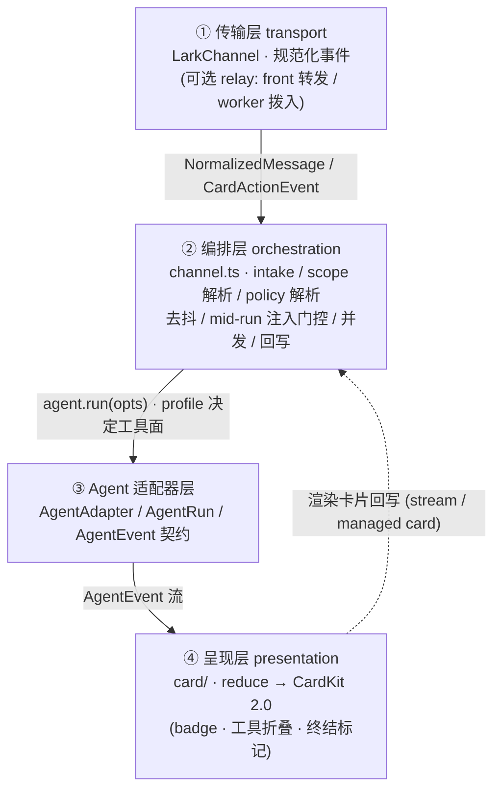
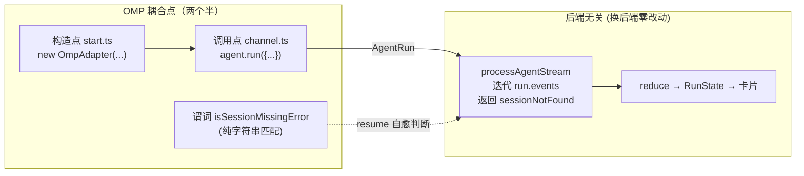
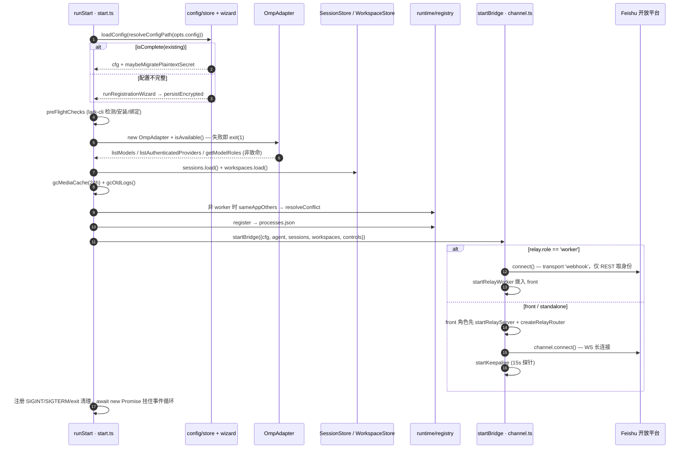
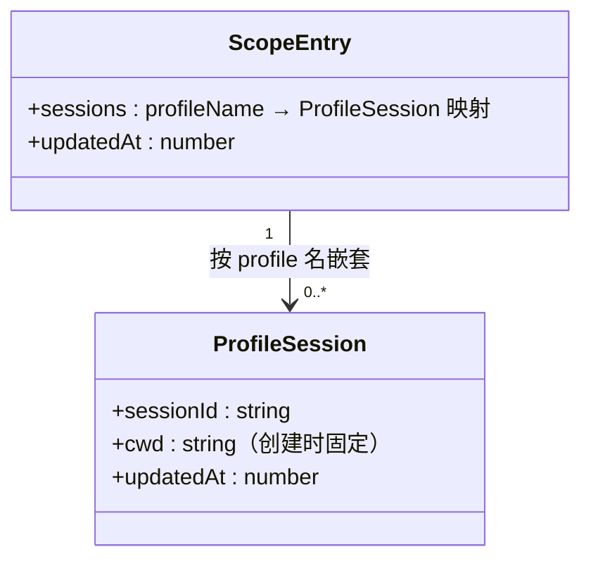

# 01 · 总览与架构

> 源码基线：commit `103dd04`（文档对应的源码 commit；详见 [README](./README.md)）。

> 覆盖范围：四层架构、`AgentAdapter` 这条“缝”及其存在理由、从 `bin/feishu-omp-bridge.mjs` 到 `runStart` 的完整启动序列、运行时数据目录映射。
>
> 源文件：`bin/feishu-omp-bridge.mjs`、`src/cli/index.ts`、`src/cli/commands/start.ts`、`src/bot/channel.ts`、`src/bot/scope.ts`、`src/agent/types.ts`、`src/config/paths.ts`、`src/session/store.ts`、`package.json`、`tsup.config.ts`、`README.md`。

相关篇：[Agent 适配器与 OMP](./02-agent-adapter-and-omp.md)、[飞书传输层](./03-feishu-transport.md)、[消息管线](./04-message-pipeline.md)、[守护进程与 CLI 运行时](./11-daemon-cli-runtime.md)。

## 1. 四层结构

整个系统是“一根管子”，自顶向下四层，各层只认相邻层的契约：

1. **传输层（transport）**：`@larksuiteoapi/node-sdk` 的 `LarkChannel` 负责 WebSocket 长连接、OpenAPI REST、把 Feishu 原始事件规范化成 `NormalizedMessage` / `CardActionEvent`。bridge 自己只在这层之上注册回调。详见 [03](./03-feishu-transport.md)。
2. **编排层（orchestration）**：`src/bot/channel.ts` 的 `createBridgeRuntime` 把规范化事件接入 intake → 去抖（`PendingQueue`）→ 并发受限的 run（`ProcessPool`）→ 流式回写。命令、访问控制、@提及门控、scope 解析（`scopeForMessage`，thread_id 优先——见 `src/bot/scope.ts`）、统一策略解析（`resolveBatchProfile`）、mid-run 注入门控（`injectionDecision` + ⏳ 缓期）、卡片回调都在这层。详见 [04](./04-message-pipeline.md)、[09](./09-access-and-guest-sandbox.md)、[10](./10-commands.md)。
3. **Agent 适配器层（agent-adapter）**：`src/agent/types.ts` 定义 `AgentAdapter` / `AgentRun` / `AgentEvent` 契约，`src/agent/omp/` 提供唯一实现 `OmpAdapter`。详见 [02](./02-agent-adapter-and-omp.md)。
4. **呈现层（presentation）**：`src/card/` 把 `AgentEvent` 流 reduce 成 `RunState` 再渲染成 CardKit 2.0 卡片 / markdown。详见 [05](./05-streaming-and-cards.md)。

## 2. `AgentAdapter` 这条缝，以及它为何存在

呈现层、编排层处理的全部是**规范化后的** `AgentEvent`（`system | text | thinking | tool_use | tool_update | tool_result | usage | ui_request | ui_cancel | ui_notice | ui_status | ui_widget | ui_title | ui_editor_text | ui_open_url | done | error`，见 `src/agent/types.ts`）。它们对“后端究竟是 OMP、Codex 还是别的”一无所知。

与 OMP 直接耦合的接线点是“两个半”：

- **构造点**：`src/cli/commands/start.ts` 的 `runStart` 里 `new OmpAdapter({...})`，紧接着 `agent.listModels()` / `listAuthenticatedProviders()` / `getModelRoles()` 探测模型目录（喂给 `/switch` 卡片）。
- **调用点**：`src/bot/channel.ts` 的 `runAgentBatch` 里 `agent.run({...})`，传入 OMP 口味的选项（`model` / `tools` / `configOverlayPaths` / `extensionPaths` / `hostTools` / `hostUriSchemes` / `stopGraceMs`）。
- **半个：错误文本匹配点**：`channel.ts` 从 `src/agent/omp/adapter.ts` 导入 `isSessionMissingError(message)`（正则识别 error 事件文本里的 “session … not found”），供 stale `--resume` 自愈判断。它只是一个纯字符串谓词，不触碰进程或协议，换后端时给新适配器导出同名谓词（或恒 `false`）即可。

它们之间的 `processAgentStream`（`channel.ts`）是**后端无关**的——它只迭代 `run.events`，按事件类型驱动 idle watchdog、按 `(scope, profile)` 持久化 session、reduce 状态、flush 卡片，并把“resume 的 session 已丢失”通过返回值 `{ sessionNotFound }` 上报给调用方（`driveAgent`），由后者清掉该 profile 的 session 记录、在**同一张卡片**里用 fresh session 重试一次。所以换后端 = 写一个新 `AgentAdapter`，编排层和呈现层零改动。这就是 [dify-feishu-bridge-design](../dify-feishu-bridge-design/README.md) 整套设计的支点。

## 3. 启动序列（`runStart`）

入口链：`bin/feishu-omp-bridge.mjs`（`import '../dist/cli.js'`）→ tsup 把 `src/cli/index.ts` 打成 `dist/cli.js` → commander 解析 argv，默认子命令 `run` → `runStart(opts)`（`src/cli/commands/start.ts`）。

`runStart` 的完整步骤（按代码顺序）：

1. **配置加载 / 向导**：`loadConfig(configPath)`——`resolveConfigPath` 在 `config.json` → `config.yaml` → `config.yml` 中取首个存在者（`-c` 显式非默认路径原样用），按扩展名以 JSON 或 YAML 解析（见 [08](./08-config-and-secrets.md) §4）。若 `isComplete(existing)` 为真则用之，并 `maybeMigratePlaintextSecret`（把 `accounts.app.secret` 里的明文字符串迁进加密 keystore，重写成 exec SecretRef，幂等）；否则跑 `runRegistrationWizard()`（扫码创建应用，见 [03](./03-feishu-transport.md)），再 `persistEncrypted` 立即加密落盘。
2. **预检（preflight）**：`preFlightChecks({ skipCheckLarkCli })`——检测 / 自动安装并绑定 `lark-cli`（`--skip-check-lark-cli` 跳过）。见 [11](./11-daemon-cli-runtime.md)。
3. **适配器 + 模型目录**：`new OmpAdapter({ binary, sessionDir, thinking, tools })`，`await agent.isAvailable()`（`omp --version` 退出码 0），失败则打印“未找到 omp CLI”并 `process.exit(1)`。随后 `Promise.all([listModels, listAuthenticatedProviders, getModelRoles])` 写入 `model-catalog.ts` 的模块状态（`setModelCatalog` / `setAuthenticatedProviders` / `setModelRoles`），全部非致命。
4. **存储（stores）**：`new SessionStore(); await load()`、`new WorkspaceStore(); await load()`。见 [07](./07-sessions-workspaces-media.md)。
5. **GC**：`gcMediaCache(MEDIA_GC_MAX_AGE_MS=24h)` 清理过期媒体、`gcOldLogs()` 清理过期日志。
6. **冲突检测**：`role = cfg.relay?.role ?? 'standalone'`。非 `worker` 角色才检 `sameAppOthers(appId)`——同一应用的多个长连接会让“谁回复我”随机，故发现冲突时 `resolveConflict` 交互式确认：回答 `y` 会先 `SIGTERM` 掉旧进程（等 1.5s 让其自行注销）再继续启动，其余回答取消；非 TTY（launchd / systemd / 管道）跳过提问、直接警告并取消。worker 不开长连接，豁免。见 [11](./11-daemon-cli-runtime.md)。
7. **注册表（registry）**：`register({ appId, tenant, configPath, version, role })` 把自己写进 `processes.json`，返回短 id。
8. **controls + 信号**：构造 `Controls`（`restart()` 连后断的热重连、`exit()`、`configPath`、`cfg` 快照、`processId`）。`bridge = await startBridge({ cfg, agent, sessions, workspaces, controls })`（`startBridge` 按 `relay.role` 选 `startWorker` 或 `startChannel`；front 角色的 `startChannel` 会在挂事件回调前先 `startRelayServer` 并 `createRelayRouter`——router 的 `resolveScenario` 复用 bridge 的 `chatModeCache`，供 per-principal `relayScenarios` 判定卡片回调的场景）。注册 `SIGINT` / `SIGTERM` → 优雅 `stop`、`process.on('exit')` → `unregisterSync` + `cleanupTmpFiles`。
9. **keepalive / 监听**：`startChannel` 内部 `channel.connect()` 后启动 15s app 级 keepalive（见 [03](./03-feishu-transport.md)），打印“正在监听消息”。最后 `await new Promise<void>(() => {})` 挂住事件循环直到信号到来。

进程级安全网：`start.ts` 顶部 `process.on('unhandledRejection')` / `process.on('uncaughtException')` 都只记日志不退出——丢一条回复也比整个 bot 崩掉强；并 `dns.setDefaultResultOrder('ipv4first')` 规避 IPv6 坏路由。

## 4. 运行时数据目录

根目录由 `src/config/paths.ts` 的 `paths` 决定（`~/.feishu-omp-bridge/`）：

| 路径 | `paths` 键 | 用途 |
| --- | --- | --- |
| `~/.feishu-omp-bridge/config.{json,yaml,yml}` | `configFile` / `configFileYaml` / `configFileYml` | App 凭据、SecretRef、偏好、统一 `policy`。按 `json→yaml→yml` 取首个存在者。 |
| `~/.feishu-omp-bridge/secrets.enc` | `secretsFile` | 本地 AES-256-GCM 加密 keystore。 |
| `~/.feishu-omp-bridge/.keystore.salt` | `keystoreSaltFile` | keystore 派生盐（非密钥）。 |
| `~/.feishu-omp-bridge/secrets-getter` | `secretsGetterScript` | exec secret provider 包装脚本。 |
| `~/.feishu-omp-bridge/sessions.json` | `sessionsFile` | 每 scope 按 **profile 名嵌套**的可恢复会话（`sessions: Record<profileName, {sessionId, cwd, updatedAt}>`）。 |
| `~/.feishu-omp-bridge/omp-sessions/` | `ompSessionsDir` | bridge 专用 OMP JSONL session 文件。 |
| `~/.feishu-omp-bridge/guest/` | `guestDir` | 受限 profile 的沙箱产物（`overlay.yml` + `allowlist-hook.mjs`），按 profile 内容签名分子目录。 |
| `~/.feishu-omp-bridge/workspaces.json` | `workspacesFile` | 命名工作空间 + 每 scope cwd。 |
| `~/.feishu-omp-bridge/processes.json` | `processesFile` | 本机 bridge 进程注册表。 |
| `~/.feishu-omp-bridge/media/` | `mediaDir` | 下载的图片 / 文件缓存。 |
| `~/.feishu-omp-bridge/logs/` | （`logger.ts` 内 `logsDir()` + `daemon/paths.ts` 的 `daemonLogDir()`） | 结构化日志 + daemon stdout/stderr。 |

`paths.cacheDir` 当前等于 `appDir`。旧的一次性迁移器（`cli/commands/migrate.ts`）与它引用的 `legacyPaths`（`~/.config/feishu-codex-bridge`、`~/.cache/feishu-codex-bridge`）已整体删除——见 [11](./11-daemon-cli-runtime.md)。

`sessions.json` 的结构（`src/session/store.ts`）——顶层键是 scope（`chatId` 或 `${chatId}:${threadId}`，由 `src/bot/scope.ts` 的 `scopeFor` 决定，thread_id 优先），值为嵌套的 `ScopeEntry`：

session 按 `(scope, profile)` 存取：`resumeFor(scope, cwd, profile)` 在 profile 或 cwd 任一不匹配时返回 undefined（= fresh 开始），这样低权 profile 永远不会 resume 到 `full` 档位的会话线程；`latestSession(scope)` 跨 profile 取最近更新者供 `/status`；`clear(scope)` 清整个 scope（`/new`、`/cd`、`/ws` 用），`clearProfile(scope, profile)` 只清一个档位（resume 自愈用，保留兄弟 profile 会话）。旧扁平结构（`{sessionId, cwd, updatedAt}`）由 `migrateEntry` 容忍但整条**丢弃**：创建它的 profile 未知，fail-safe 宁可让下一条消息新起会话，也不在错误 profile 下 resume 泄露上下文。详见 [07](./07-sessions-workspaces-media.md)。

## 5. 构建与运行约定

- 包名 `feishu-omp-bridge`，`bin` 指向 `bin/feishu-omp-bridge.mjs`，`engines.node >= 22`（`package.json`；README 正文同为 `>= 22`）。
- `tsup.config.ts` 产出两个 ESM bundle：`dist/cli.js`（入口 `src/cli/index.ts`，无 dts）与 `dist/index.js`（入口 `src/index.ts`，带 dts，导出 `renderCard` / `renderText` / `reduce` 等供 smoke test 复用）。
- 脚本：`dev`（tsup --watch）、`build`、`typecheck`（tsc --noEmit）、`test`（vitest run）、`test:guest`（`bun scripts/test-guest.ts`，访客越权回归）。
