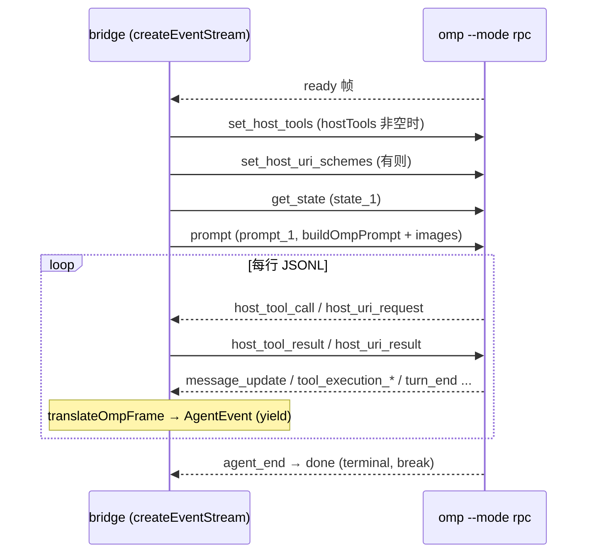

# 02 · Agent 适配器与 OMP

> 源码基线：commit `78460f6`（文档对应的源码 commit；详见 [README](./README.md)）。

> 覆盖范围：`src/agent/types.ts` 的完整类型契约（逐字段释义）；`OmpAdapter` 的探测、`run()` spawn、`AgentRun` 方法、`createEventStream` 握手循环、host 工具/URI 回调；`rpc.ts` 的帧翻译；`args.ts` 的参数构建与 `OMP_BRIDGE_PROMPT`；`model-catalog.ts` 模块状态。末尾标注“哪些是 OMP 专属”。
>
> 源文件：`src/agent/types.ts`、`src/agent/index.ts`、`src/agent/omp/adapter.ts`、`src/agent/omp/rpc.ts`、`src/agent/omp/args.ts`、`src/agent/omp/model-catalog.ts`。

相关篇：[消息管线](./04-message-pipeline.md)（谁调用 `agent.run`）、[流式与卡片](./05-streaming-and-cards.md)（谁消费 `AgentEvent`）、[飞书 host 工具面](./06-feishu-host-surface.md)（host tools 的实现）。

## 1. 类型契约（`src/agent/types.ts`）

这是 bridge 与任意 agent 后端之间的全部契约。

### 1.1 `AgentEvent`（规范化事件联合）

```ts
type AgentEvent =
  | { type: 'system'; sessionId?: string; cwd?: string; model?: string }
  | { type: 'text'; delta: string }
  | { type: 'thinking'; delta: string }
  | { type: 'tool_use'; id: string; name: string; input: unknown }
  | { type: 'tool_update'; id: string; output: string }
  | { type: 'tool_result'; id: string; output: string; isError: boolean }
  | { type: 'usage'; inputTokens?: number; outputTokens?: number; costUsd?: number }
  | { type: 'ui_request'; request: AgentUiRequest }
  | { type: 'ui_cancel'; targetId: string }
  | { type: 'ui_notice'; message: string; level?: AgentUiNoticeType }
  | { type: 'ui_status'; status: AgentUiStatus }
  | { type: 'ui_widget'; widget: AgentUiWidget }
  | { type: 'ui_title'; title: string }
  | { type: 'ui_editor_text'; text: string }
  | { type: 'ui_open_url'; url: string; instructions?: string }
  | { type: 'done'; sessionId?: string }
  | { type: 'error'; message: string };
```

逐项含义：

- `system`：会话元数据。**`sessionId` 在此事件上被持久化**（`processAgentStream` 见到 `system` 且 `sessionId` 非空就 `sessions.set(scope, sessionId, cwd)`）。`done.sessionId` 不会被持久化——这是设计上的关键不对称（见 [04](./04-message-pipeline.md) §流处理；也是 [dify-adapter](../dify-feishu-bridge-design/03-dify-adapter.md) 必须 emit `system` 的原因）。`cwd` 可覆盖记录的 cwd；`model` 仅用于日志/展示。
- `text` / `thinking`：增量文本片段，reduce 时拼接到当前 text block / reasoning。
- `tool_use`：工具开始，`id` 是工具调用 id、`name` 工具名、`input` 任意入参。
- `tool_update`：工具增量输出（按行追加到该 `id` 的 output）。
- `tool_result`：工具最终结果，`isError` 决定面板边框红/灰。
- `usage`：token / 费用，仅记日志（不进 `reduce`）。
- `ui_request` / `ui_cancel`：OMP 原生交互（confirm/select/input/editor）请求与取消，触发飞书交互卡片（见 [05](./05-streaming-and-cards.md)）。
- `ui_notice` / `ui_status` / `ui_widget` / `ui_title` / `ui_editor_text` / `ui_open_url`：非阻塞 UI 事件，渲染进卡片或文本。
- `done` / `error`：终结事件，`processAgentStream` 见到即 break。

`AgentUiNoticeType = 'info' | 'warning' | 'error'`；`AgentUiStatus = { key; text? }`（`text` 空表示删除该 status 行）；`AgentUiWidget = { key; lines?; placement?: 'aboveEditor'|'belowEditor' }`（`lines` 空表示删除该 widget）。

### 1.2 `AgentUiRequest` / `AgentUiResponse`

```ts
type AgentUiRequest =
  | { id; method:'select'; title; options:string[]; timeout? }
  | { id; method:'confirm'; title; message; timeout? }
  | { id; method:'input'; title; placeholder?; timeout? }
  | { id; method:'editor'; title; prefill?; promptStyle? };

type AgentUiResponse =
  | { value: string }
  | { confirmed: boolean }
  | { cancelled: true; timedOut? };
```

请求由 `rpc.ts` 的 `translateExtensionUiRequest` 从 OMP `extension_ui_request` 帧产生；响应由用户点飞书卡片产生，经 `ActiveRuns.respondToUi` → `run.respondToUi` 写回 OMP（见 [05](./05-streaming-and-cards.md) `card/omp-ui.ts`）。

### 1.3 host 工具 / URI 契约

```ts
interface AgentHostToolDefinition { name; label?; description; parameters: Record<string,unknown>; hidden? }
interface AgentHostToolResult { result: unknown; isError? }
interface AgentHostTool { definition: AgentHostToolDefinition; execute(args): Promise<AgentHostToolResult> }

interface AgentHostUriSchemeDefinition { scheme; description?; writable?; immutable? }
interface AgentHostUriResult { content?; contentType?: 'text/markdown'|'application/json'|'text/plain'; notes?; immutable?; isError?; error? }
interface AgentHostUriScheme { definition: AgentHostUriSchemeDefinition; handle(req:{operation:'read'|'write'; url; content?}): Promise<AgentHostUriResult> }
```

`hostTools` / `hostUriSchemes` 经 `AgentRunOptions` 传入，OMP 通过 RPC `host_tool_call` / `host_uri_request` 回调，由 `adapter.ts` 的 `handleHostToolCall` / `handleHostUriRequest` 在进程内执行。实现见 [06](./06-feishu-host-surface.md)。

### 1.4 `AgentRunOptions`

```ts
interface AgentRunOptions {
  prompt: string;
  cwd?: string;
  sessionId?: string;
  model?: string;
  permissionMode?: 'default'|'acceptEdits'|'bypassPermissions'|'plan';
  tools?: string;                 // 每 run 的 OMP --tools 白名单（覆盖 adapter 默认）
  configOverlayPaths?: string[];  // 每 run 的 --config overlay（按序）
  extensionPaths?: string[];      // 每 run 的 --extension hook
  imagePaths?: string[];          // 本地图片路径，转成原生 image payload
  stopGraceMs?: number;           // SIGTERM→SIGKILL 之间的宽限毫秒
  hostTools?: AgentHostTool[];
  hostUriSchemes?: AgentHostUriScheme[];
}
```

`permissionMode` 当前 OMP 路径未使用；`tools` / `configOverlayPaths` / `extensionPaths` 是访客沙箱的注入点（见 [09](./09-access-and-guest-sandbox.md)）。

### 1.5 `AgentRun` 与 `AgentAdapter`

```ts
interface AgentRun {
  readonly events: AsyncIterable<AgentEvent>;
  stop(): Promise<void>;
  respondToUi?(requestId, response): boolean;                       // 可选
  submitPrompt?(kind:'steer'|'follow_up', message, imagePaths?): Promise<boolean>; // 可选
  waitForExit(timeoutMs): Promise<boolean>;
}
interface AgentAdapter {
  readonly id: string;
  readonly displayName: string;
  isAvailable(): Promise<boolean>;
  run(opts: AgentRunOptions): AgentRun;
}
```

- `events`、`stop`、`waitForExit` **必需**；`respondToUi`、`submitPrompt` **可选**。
- `respondToUi` 缺失是安全降级：`ActiveRuns.respondToUi` 用 `?.` 调用，缺失即返回 false。
- `submitPrompt` 缺失是安全降级：`ActiveRuns.submitPrompt` 用 `?? Promise.resolve(false)`，缺失即返回 false → `submitToActiveRun` 返回 false → 消息回落到 `pending.push`（排到下一轮，见 [04](./04-message-pipeline.md)）。
- `waitForExit(timeoutMs)`：终结事件（`done`/`error`）后等子进程自然退出的窗口；超时返回 false，调用方再 `stop()`。注释解释为何不立刻 stop：终结事件可能早于 stdout 真正关闭，过早 stop 会把干净退出变成信号退出。

`src/agent/index.ts` 重导出类型 + `OmpAdapter` + model-catalog 的若干函数（`getAuthenticatedProviders` / `getDefaultRoleModel` / `setAuthenticatedProviders` / `setModelCatalog` / `setModelRoles` / `roleModels` / `OmpModelInfo`）。

## 2. `OmpAdapter`（`src/agent/omp/adapter.ts`）

`id='omp'`、`displayName='Oh My Pi'`。构造选项 `OmpAdapterOptions { binary?; sessionDir?; thinking?; tools? }`，默认 `binary='omp'`。

### 2.1 探测方法

- `isAvailable()`：spawn `omp --version`，退出码 0 即可用。
- `runJson(args)`：spawn 一个产出 JSON 的 omp 子命令并解析；任何失败（二进制缺失/非零退出/不可解析）→ `undefined`，让调用方回落默认。
- `listModels()`：`omp models --json` → `OmpModelInfo[]`（过滤掉缺 provider/id/selector 的项）。
- `listAuthenticatedProviders()`：`omp usage --json`，从 `reports[]` 和 `accountsWithoutUsage[]` 收集 provider 集。
- `getModelRoles()`：`omp config get modelRoles --json`，返回 `{ default?, roles[] }`（每个 selector 去掉 `:thinking` 后缀；`default` 角色即不带 `--model` 时跑的模型）。

这三者的结果在 `runStart` 写入 `model-catalog.ts`，供 `/switch` 卡片用（见 [10](./10-commands.md)）。

### 2.2 `run(opts)`：spawn

`buildOmpArgs({...opts, sessionDir, thinking, tools: opts.tools ?? this.tools})` 得到 argv，`spawn(binary, args, { cwd, env, stdio:['pipe','pipe','pipe'] })`。env 里注入 `LARK_CHANNEL: env.LARK_CHANNEL ?? '1'` 和 `FEISHU_OMP_BRIDGE: '1'`，让 OMP 知道自己跑在 bridge 里。stderr 按行记 `log.warn('agent','stderr')`；`exit` 记日志。`stopGraceMs = opts.stopGraceMs ?? 5000`。

返回的 `AgentRun`：

- `events`：`createEventStream(child, stderrChunks, () => runtimeError, opts)`。
- `stop()`：宽限阶梯（grace ladder）——若已退出直接返回；否则写 `{type:'abort'}` 帧 + `endInput`，等 `min(1000, stopGraceMs)`；仍在就 `SIGTERM`，等 `stopGraceMs`；仍在就 `SIGKILL` 并 `waitForExit`。这给 OMP 及其子进程（如 lark-cli 正在 OAuth）留清理时间。
- `respondToUi(requestId, response)`：未退出时写 `{type:'extension_ui_response', id, ...response}`。
- `submitPrompt(kind, message, imagePaths?)`：未退出时 `loadOmpImages` 后写 `{id:'${kind}_${ts}', type: kind, message: buildOmpPrompt(message), images?}`（`kind` 即 `steer`/`follow_up`）。
- `waitForExit(timeoutMs)`：`waitForExitWithin`，子进程在窗口内退出返 true，否则 false。

### 2.3 `createEventStream`：JSONL 握手循环




异步生成器，逐行读 child.stdout（`readline`），每行 `parseOmpJsonLine`：

1. 若 `child.pid` 缺失 → emit `error` 并返回。
2. **ready 帧**（`isReadyFrame`）：依次写
   - `set_host_tools`（当 `opts.hostTools` 非空，body 为各 tool 的 `definition`）；
   - `set_host_uri_schemes`（当 `opts.hostUriSchemes` 非空）；
   - `get_state`（id `state_1`）；
   - `prompt`（id `prompt_1`，`message: buildOmpPrompt(opts.prompt)`，附 `loadOmpImages(opts.imagePaths)`）。
   任一写失败 → emit `error`、`endInput`、break。
3. **host 回调**：`host_tool_call` → `handleHostToolCall`；`host_uri_request` → `handleHostUriRequest`；`host_tool_cancel`/`host_uri_cancel` → 记日志跳过。
4. 其它帧 → `translateOmpFrame` 产出的每个 `AgentEvent` yield 出去；遇 `done`/`error` 置 `terminal`，`endInput` + break。
5. 循环结束后 `waitForExit`，按退出码/信号/是否见过 ready/prompt 决定是否补一个 `error` 事件（如 `omp exited with code N`、`omp exited before sending ready frame`）。

### 2.4 host 回调处理

- `handleHostToolCall(child, tools, frame)`：先 emit `tool_use`（用 `frame.toolCallId`）；按 `frame.toolName` 找 tool，找不到 → 写 `host_tool_result {isError:true}` + emit `tool_result` 错误；找到则 `tool.execute(frame.arguments)`，写回 `host_tool_result`（`normalizeToolResult` 包成 `{content:[{type:'text',text}]}` 形态）+ emit `tool_result`。
- `handleHostUriRequest(child, schemes, frame)`：先 emit `tool_use`（name `host_uri_<op>`）；按 `schemeOf(url)` 找 scheme，调用 `handler.handle({operation,url,content})`，写回 `host_uri_result` + emit `tool_result`。

## 3. 帧翻译（`src/agent/omp/rpc.ts`）

- `parseOmpJsonLine(line)`：trim 后 `JSON.parse`，非法行 → `undefined`。
- `isReadyFrame` / `isExtensionUiRequest`：类型守卫。
- `translateOmpFrame(raw)`（核心 switch，逐 OMP 帧 → `AgentEvent`）：

| OMP 帧 `type` | 产出 |
| --- | --- |
| `response`（`command==='get_state'` 且 success） | `system{ sessionId, model }`（`formatModel` 拼 provider/id） |
| `response`（`success===false`） | `error{ message }` |
| `message_update`（`assistantMessageEvent.type==='text_delta'`） | `text{ delta }` |
| `message_update`（`thinking_delta`） | `thinking{ delta }` |
| `tool_execution_start` | `tool_use{ id:toolCallId, name:toolName, input:args ?? {} }` |
| `tool_execution_update` | `tool_update{ id, output: renderToolResult(partialResult) }` |
| `tool_execution_end` | `tool_result{ id, output, isError }` |
| `turn_end`（`message.usage`） | `usage{ inputTokens, outputTokens, costUsd }`（`usageEvent`） |
| `agent_end` | `done` |
| `notice`（`error` 字段） | `error{ message }` |
| `extension_ui_request` | 见 `translateExtensionUiRequest` |
| 其它 | 忽略 |

- `translateExtensionUiRequest(frame)`：按 `frame.method` 分发——`select`/`confirm`/`input`/`editor` → `ui_request`；`cancel` → `ui_cancel`；`notify` → `ui_notice`；`setStatus` → `ui_status`；`setWidget` → `ui_widget`；`setTitle` → `ui_title`；`set_editor_text` → `ui_editor_text`；`open_url` → `ui_open_url`。
- `loadOmpImages(paths)`：读文件 → `{type:'image', data: base64, mimeType}`（`mimeTypeForPath` 按扩展名）。

## 4. 参数与 prompt（`src/agent/omp/args.ts`）

- `OMP_BRIDGE_PROMPT`：常量系统约定串，告诉 OMP 它运行在 bridge 里，并解释 `<bridge_context>` / `<quoted_message>` / `<interactive_card>` 三种注入块（“不要照抄 XML 标签”），以及发交互卡片时按钮 `value` 要带兼容标记 `__codex_cb: true` 才会回调。
- `buildOmpPrompt(prompt)`：`${OMP_BRIDGE_PROMPT}\n---\n\n${prompt}`。
- `buildOmpArgs(opts)`：固定 `--mode rpc --no-title`，再按需追加 `--session-dir`、`--resume <sessionId>`、`--model`、`--thinking`、`--tools`、每个 `--config <overlay>`、每个 `--extension <hook>`（空值被 `clean()` 丢弃）。

## 5. 模型目录模块状态（`src/agent/omp/model-catalog.ts`）

进程级单例：`catalog`（`OmpModelInfo[]`）、`authenticatedProviders`、`modelRoles`。`setModelCatalog`（空列表忽略，保留 `FALLBACK_CATALOG`）、`setAuthenticatedProviders`、`setModelRoles`；查询 `getDefaultRoleModel`、`getAuthenticatedProviders`、`isProviderAuthenticated`（空集 = 未知 = 全部视为已认证）、`roleModels()`（去重的角色绑定模型列表，供 `/switch` 下拉）。

## 6. 这些里哪些是 OMP 专属

整棵 `src/agent/omp/` 子树（`adapter.ts` / `rpc.ts` / `args.ts` / `model-catalog.ts` 及其 `*.test.ts`）+ `OMP_BRIDGE_PROMPT` 是 OMP 专属。`src/agent/types.ts` 是后端无关契约。换后端时，前者整体替换、后者仅做最小增量（见 [reuse matrix](../dify-feishu-bridge-design/01-architecture-and-reuse-matrix.md)）。
