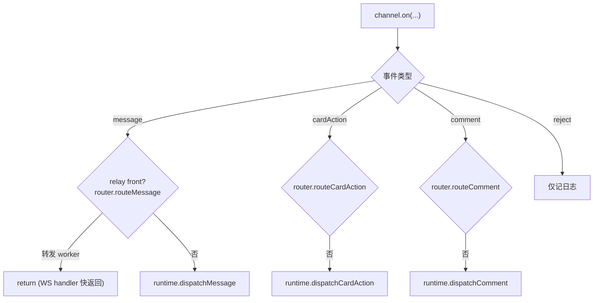
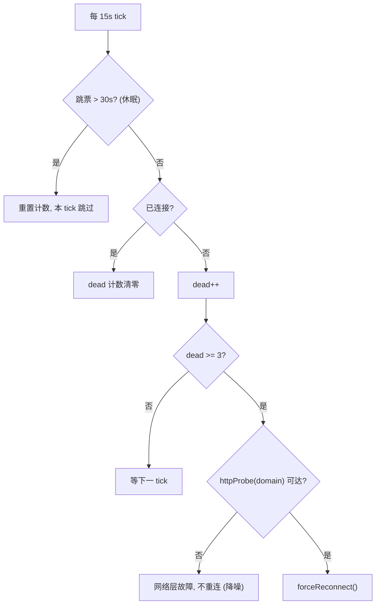
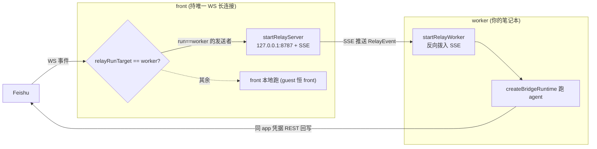

# 03 · 飞书传输层

> 源码基线：commit `78460f6`（文档对应的源码 commit；详见 [README](./README.md)）。

> 覆盖范围：`LarkChannel` 构造与 SDK 旋钮、四类 SDK 事件注册 + WS 生命周期、`NormalizedMessage` 形状、keepalive 看门狗、网络/代理、chat 模式缓存、扫码向导、凭据校验、引用消息、交互卡片展开、建群、reaction、云文档评论，以及可选的 relay 中继（front/worker）。逐项标注“飞书专属 vs 可复用”。
>
> 源文件：`src/bot/channel.ts`（`buildChannelOptions`/`startChannel`/`startWorker`/`startBridge`）、`src/bot/keepalive.ts`、`src/bot/network-config.ts`、`src/bot/chat-mode-cache.ts`、`src/bot/scope.ts`、`src/bot/wizard.ts`、`src/utils/feishu-auth.ts`、`src/bot/quote.ts`、`src/bot/interactive-card.ts`、`src/bot/group.ts`、`src/bot/reaction.ts`、`src/bot/comments.ts`、`src/relay/{protocol,front,route,worker}.ts`、`src/config/schema.ts`（`RelayConfig`）。

相关篇：[消息管线](./04-message-pipeline.md)（事件如何流入 runtime）、[流式与卡片](./05-streaming-and-cards.md)、[配置与密钥](./08-config-and-secrets.md)。

## 1. `createLarkChannel` 与 SDK 旋钮

`startChannel` 调 `createLarkChannel(buildChannelOptions(cfg, appSecret, netOverrides))`。`buildChannelOptions` 设定的关键项（`src/bot/channel.ts`）：

- `appId` / `appSecret`（已解析为明文，见 [08](./08-config-and-secrets.md)）/ `domain`：`tenant==='lark'` → `Domain.Lark` 否则 `Domain.Feishu`。
- `source: 'feishu-omp-bridge'`、`loggerLevel: LoggerLevel.info`、`logger: buildQuietLogger()`（把 SDK 日志降噪并归入自己的结构化日志；对 `SUPPRESSED_API_ERROR_CODES`=`{131005,1069307,1069302}` 这几个“预期会失败”的码直接静音）。
- `policy: { dmMode:'open', requireMention:false, respondToMentionAll:false }`——SDK 层不强制 @bot（bridge 自己在 intake 做群提及门控），但 `@全员` 由 SDK 直接过滤掉。
- `safety: { chatQueue: { enabled:false } }`——关掉 SDK 的 per-chat 串行化，改用 bridge 自己的 debounce + run-chain（见 [04](./04-message-pipeline.md)）。
- `includeRawEvent: true`——把原始 webhook body 附在规范化事件上，供读取 normalizer 丢弃的字段（如 CardKit 2.0 表单的 `action.form_value`、交互卡片的 `user_dsl`）。
- `outbound: { streamThrottleMs: 400 }`——流式发卡的节流由 SDK 负责（bridge 侧不再额外节流，见 [05](./05-streaming-and-cards.md)）。
- `wsConfig: { pingTimeout: 3 }`——3s 内无 inbound 即判 WS 死、强制重连。
- `handshakeTimeoutMs: 8000`——握手快失败快重试。
- `agent`（可选）——仅当 `HTTPS_PROXY`/`HTTP_PROXY` 存在时由 `network-config.ts` 注入。

## 2. 四类事件注册 + WS 生命周期

`startChannel` 里 `channel.on({...})` 注册：

- `message`：先 `router?.routeMessage(msg)`（relay front 模式，可信发送者转发给 worker 后立即返回——WS handler 必须快返回否则 Feishu 重投），否则 `runtime.dispatchMessage(msg)`。包在 `withTrace({chatId,msgId})` 里。
- `cardAction`：同理，`router?.routeCardAction` 否则 `runtime.dispatchCardAction`。
- `comment`：`router?.routeComment` 否则 `runtime.dispatchComment`。
- `reject`：仅记日志。

WS 生命周期回调：`reconnecting`（计数，3 次/10 次时往 stdout 升级告警）、`reconnected`（清零计数）、`error`（按 `ENOTFOUND/getaddrinfo`、`handshake`、`timeout` 分类到 `network` 阶段，便于 `/doctor` 检索）。`await channel.connect()` 后读 `channel.botIdentity` 记 `ws connected`。

## 3. `NormalizedMessage` 形状

SDK 规范化后的消息（bridge 消费的字段）：`messageId`、`chatId`、`chatType`（`p2p`/`group`/…）、`threadId?`、`senderId`、`senderName?`、`content`、`rawContentType`（如 `text`/`post`/`interactive`/`card_action`）、`resources`（`ResourceDescriptor[]`，含 `fileKey`/`type`/`fileName`）、`mentions`、`mentionAll`、`mentionedBot`、`createTime`、`raw`（原始 body，因 `includeRawEvent`）、`replyToMessageId?`。`CardActionEvent` 含 `action.value`、`operator.openId/name`、`chatId`、`messageId`；`CommentEvent` 含 `fileToken`、`operator` 等。

## 4. keepalive 看门狗（`src/bot/keepalive.ts`）

app 级防御性 keepalive（`startKeepalive`），独立于 SDK 自身 ping：

- `KEEPALIVE_INTERVAL_MS=15s` setInterval。
- 睡眠检测 `SLEEP_DETECT_MS=30s`：跳票过久判机器休眠，重置计数器、本 tick 跳过。
- 定时器风暴守卫 `TIMER_STORM_GUARD_MS=5s`：唤醒后多次连发则跳过。
- HTTP 探测：强制重连前先 `httpProbe(domain)`（`HTTP_PROBE_TIMEOUT_MS=5s`），网络层不可达就不是 WS 问题、不重连、降低日志噪声。
- 计数去抖 `DEAD_THRESHOLD=3`：连续 3 tick 确认未连接才 `forceReconnect()`（bridge 传 `controls.restart`）。`NETWORK_DOWN_LOG_EVERY=20`（约 5 分钟记一次）。

`probeDomain` 按 tenant 选 `https://open.feishu.cn` 或 `https://open.larksuite.com`。

## 5. 网络与代理（`src/bot/network-config.ts`）

`configureNetwork()`（启动时调一次，幂等）：把 SDK 的 `defaultHttpInstance.defaults.timeout` 设为 `HTTP_TIMEOUT_MS=30s`；若有 `HTTPS_PROXY`/`HTTP_PROXY` 则建 `HttpsProxyAgent` 同时挂到 axios（`defaults.httpsAgent`）与 WS（返回的 `{ agent }` 供 `LarkChannelOptions.agent`）。`redact()` 给代理 URL 脱敏后记日志。

## 6. chat 模式缓存与 scope（`chat-mode-cache.ts` / `scope.ts`）

`ChatModeCache.resolve(channel, chatId)`：chat 模式（`p2p`/`group`/`topic`）不随生命周期变，但 SDK 不在消息事件里带它，只能 `im.v1.chat.get` 一次，故按 chatId 缓存。查询失败回落 `'group'`（保守：单 session、不拆 thread），且不污染缓存。`scope.ts` 的 `scopeFor`/`scopeForMessage`：`topic` 且有 `threadId` → `${chatId}:${threadId}`，否则 `chatId`。

## 7. 扫码向导与凭据校验（`wizard.ts` / `utils/feishu-auth.ts`）

`runRegistrationWizard()`：调 SDK `registerApp`，在终端用 `qrcode-terminal` 画二维码让用户扫码创建 PersonalAgent 应用；拿到 `client_id`/`client_secret`/`tenant_brand`/`open_id`。**把扫码者 open_id 自动写进 `preferences.access.admins`** 作为初始管理员（`allowedUsers`/`allowedChats` 留空 = 不限制）。`validateAppCredentials(appId, appSecret, tenant)`（`feishu-auth.ts`）：用凭据换 `tenant_access_token`，成功再尽力拉 bot 显示名（`/open-apis/bot/v3/info`）；供 `/account` 改凭据时校验。

## 8. 引用消息（`src/bot/quote.ts`）

`fetchQuotedContext(channel, messageId)`：用户“引用回复”某条消息时，`im.v1.message.get` 返回扁平的 `ApiMessageItem` 列表（merge_forward 时含父+子），bridge 把父 item 合成一个 `RawMessageEvent` 喂给 SDK 的 `normalize()`，让 merge_forward 走与实时事件相同的 `<forwarded_messages>` 展开。`preExpandInteractive(item)`：把交互子消息的 `body.content` 先用 `expandInteractiveCard` 重写，使引用的卡片也能拿到真实 DSL。返回 `QuotedContext { messageId, senderId, senderName?, createdAt, content, rawContentType }`。`renderQuotedBlock(quotes)`：渲染成 `<quoted_message>` XML 块置于 prompt 顶部附近（OMP 被教不要照抄标签）。

## 9. 交互卡片展开（`src/bot/interactive-card.ts`）

`expandInteractiveCard(flattenedContent, rawJsonContent)` 修补 SDK 扁平化交互卡片的三种失真：

1. **webhook v2 双发**：v2 卡片以 `user_dsl`（真 schema 2.0）+ `elements`（“请升级客户端”降级）双发；SDK 只走 `elements`，故有 `user_dsl` 时优先取它。
2. **API v2 响应**：`im.v1.message.get` 带 `card_msg_content_type=user_card_content` 时 `body.content` 本身即 schema 2.0 DSL（按 `schema:"2.0"` 识别），原样注入。
3. **零文本 v1 卡片**：纯按钮/图片卡片被 SDK 塌成占位符 `[interactive card]`（`INTERACTIVE_CARD_PLACEHOLDER`），回落到原始 JSON。

三个分支都包进 `<interactive_card>` 块。`channel.ts` 的 `expandedMessageContent` 对直接收到的交互消息（`rawContentType==='interactive'`）调它，让直接收卡和引用收卡得到同样的注入。

## 10. 建群、reaction、云文档评论

- `group.ts`：`createBoundChat({channel,name,inviteOpenId,description?})` 用 `im.v1.chat.create`（`chat_mode:'group'`、`chat_type:'private'`、`user_id_list`）建私有群并拉人，需 bot 具备 `im:chat`；`defaultChatName()` 生成 `OMP · M-D HH:MM`。供 `/new chat`（见 [10](./10-commands.md)）。
- `reaction.ts`：`addWorkingReaction`/`removeReaction`（IM 消息上的“敲键盘”表情，给 markdown/text 模式一个即时 ack）；`addCommentReaction`/`removeCommentReaction`（云文档评论 reply 上的同等表情，走 `commentReaction` 内部端点）。
- `comments.ts`：`handleCommentMention(deps)`——bot 在云文档评论里被 @ 时，`resolveTarget`（wiki 节点换底层 obj_token）→ `fetchCommentContext`（`fileComment.get`，失败回落 `findCommentViaList`）→ `buildCommentPrompt` → 跑 agent（直接用 `agent.run`，结果 `stripMarkdown` 后 `postCommentReply`）。仅支持 `SUPPORTED_FILE_TYPES={doc,docx,sheet,file}`，回复截断到 `REPLY_MAX_CHARS=2000`。云文档评论**无条件要求 @bot**。

## 11. relay 中继：front / worker 双进程（`src/relay/*`）

可选拓扑。`RelayConfig`（见 [08](./08-config-and-secrets.md)）的 `role` 选 `front` 或 `worker`，缺省即 standalone（单进程，默认）。`startBridge` 按 `relay.role==='worker'` 选 `startWorker`，否则 `startChannel`。

- **`startChannel`（front/standalone）**：持有唯一的飞书 WS 长连接。`role==='front'` 时额外 `startRelayServer({appId,appSecret,listen})`（默认 `127.0.0.1:8787`）并建 `createRelayRouter({cfg, sink})`，把 **run 目标为 worker 的发送者**（`relayRunTarget(cfg, senderId)==='worker'`，由统一 policy 的 principal `run` 决定，见 [09](./09-access-and-guest-sandbox.md)）的 message/cardAction/comment 转发给在线 worker，其余在本地跑（`guest` 恒 front，访客始终留在 front、走 front 渲染的卡片）。
- **`startWorker`**：`transport:'webhook'` 让 SDK **不开 WS 长连接**（同一应用两个长连接会让投递随机），`connect()` 只做一次 REST 取 bot 身份。事件由 `startRelayWorker` 反向拨号 front 的 SSE 端点收来，喂给同一套 `createBridgeRuntime`。
- **协议（`protocol.ts`）**：`RELAY_PROTOCOL_VERSION=1`、`RELAY_EVENTS_PATH='/relay/v1/events'`；`RelayEvent { v,id,kind,ts,payload }`（payload 是 SDK 规范化对象原样，JSON 可无损往返）。**认证无需额外密钥**：`deriveRelayKey(appSecret)` 用 HMAC-SHA256 以 `KEY_LABEL='feishu-omp-bridge/relay/v1'` 派生密钥（从不上线），`signHandshake`/`verifyHandshake` 校验签名+时效，`ReplayGuard` 防 nonce 重放。SSE 用 `sseFrame`/`SSE_HEADERS`/`SSE_HEARTBEAT`（`: ping`，每 `SSE_HEARTBEAT_MS=15s`）。`naturalId(kind,payload)` 给事件算稳定 id 以去重（Feishu 重投/front 重连重放）。worker 侧 `SILENCE_MS=45s` 静默即重连，指数退避 `1s..30s`。
- **路由（`route.ts`）**：纯按发送者/操作者的 run 目标路由——`relayRunTarget(cfg, senderId) !== 'worker'` 即不转发（`return false`，留在 front 本地跑）。`RelaySink { hasWorker(); forward(event) }` 由 front 的 server 实现。

## 12. 飞书专属 vs 可复用

| 模块 | 性质 |
| --- | --- |
| `channel.ts` 的 SDK 旋钮、事件注册、WS 生命周期 | **飞书专属**（绑定 `@larksuiteoapi/node-sdk`） |
| `keepalive.ts`、`network-config.ts`、`chat-mode-cache.ts`、`scope.ts`、`wizard.ts`、`feishu-auth.ts`、`quote.ts`、`interactive-card.ts`、`group.ts`、`reaction.ts`、`comments.ts` | **飞书专属但与 agent 后端无关**——换后端（如 Dify）可整体复用 |
| `relay/*`（front/route/worker） | 飞书侧传输，可整体复用；仅 `protocol.ts` 的 `KEY_LABEL` 带包名标识，换包名时一并改 |
| `RelayConfig` 等 schema | 配置层，复用 |

这些“飞书专属但 agent 无关”的模块构成了 [dify-feishu-bridge-design](../dify-feishu-bridge-design/01-architecture-and-reuse-matrix.md) 复用矩阵里 COPY-UNCHANGED 的主体。
