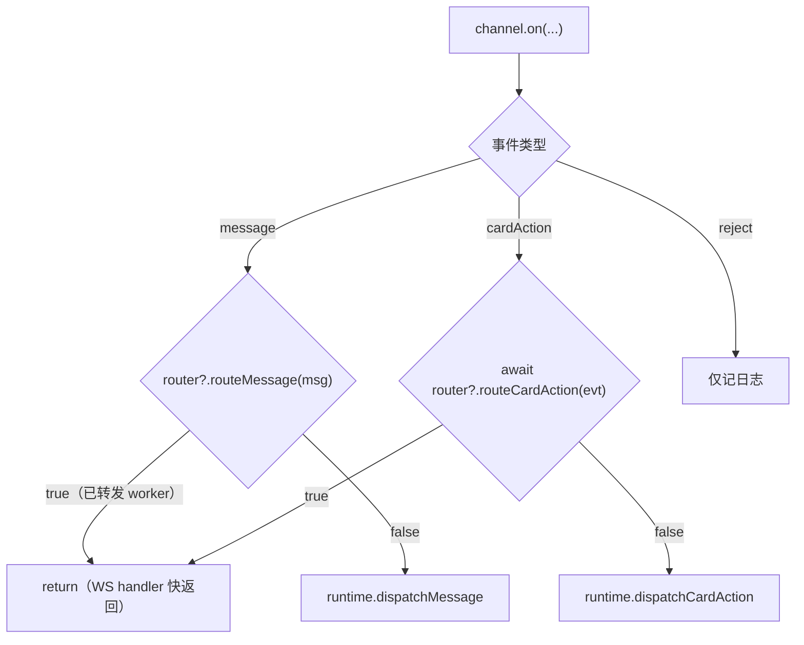
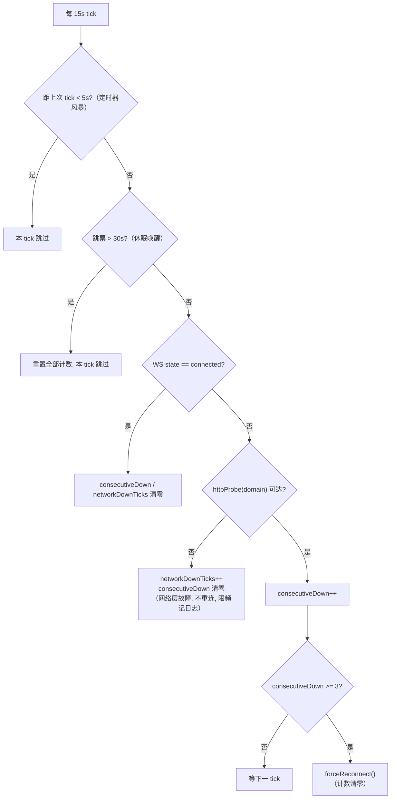
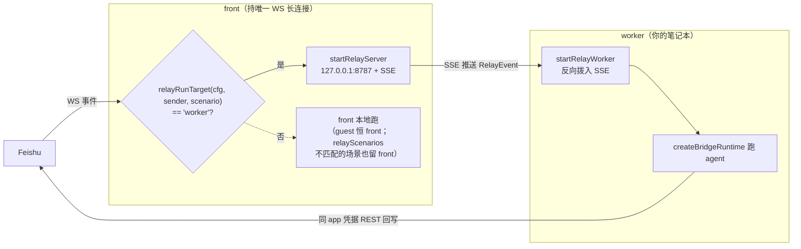
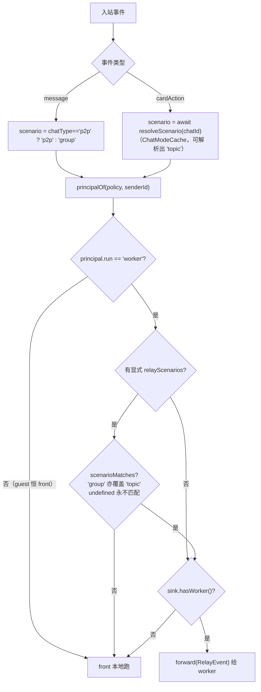
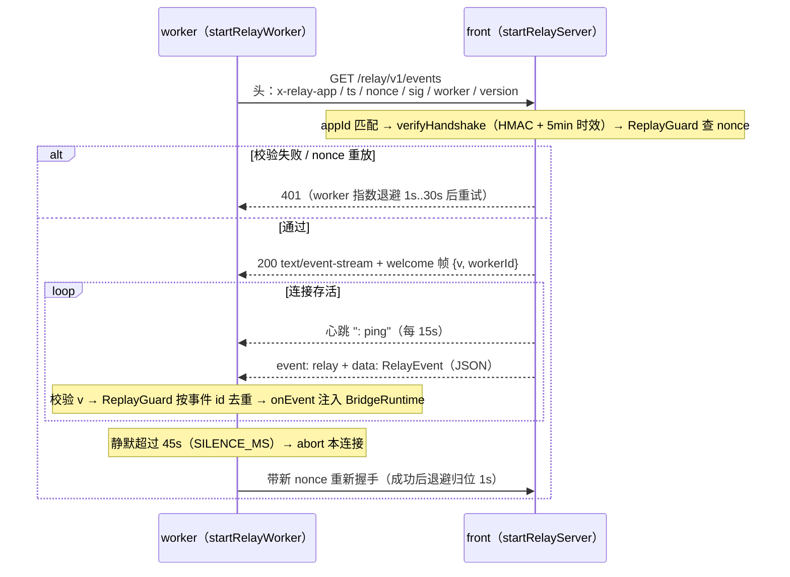

# 03 · 飞书传输层

> 源码基线：commit `103dd04`（文档对应的源码 commit；详见 [README](./README.md)）。

> 覆盖范围：`LarkChannel` 构造与 SDK 旋钮、三类 SDK 事件注册 + WS 生命周期、`NormalizedMessage` 形状、keepalive 看门狗、网络/代理、chat 模式缓存、扫码向导、引用消息、交互卡片展开、建群、reaction，以及可选的 relay 中继（front/worker）。逐项标注"飞书专属 vs 可复用"。云文档评论管线（曾经的第四类事件 + `comments.ts`）已整体移除，@bot 评论不再触发任何响应。
>
> 源文件：`src/bot/channel.ts`（`buildChannelOptions`/`createBridgeRuntime`/`startChannel`/`startWorker`/`startBridge`）、`src/bot/keepalive.ts`、`src/bot/network-config.ts`、`src/bot/chat-mode-cache.ts`、`src/bot/scope.ts`、`src/bot/wizard.ts`、`src/bot/quote.ts`、`src/bot/interactive-card.ts`、`src/bot/group.ts`、`src/bot/reaction.ts`、`src/relay/{protocol,front,route,worker}.ts`、`src/config/schema.ts`（`RelayConfig`/`PrincipalConfig.relayScenarios`）、`src/config/policy.ts`（`relayRunTarget`/`scenarioMatches`）。

相关篇：[消息管线](./04-message-pipeline.md)（事件如何流入 runtime）、[流式与卡片](./05-streaming-and-cards.md)、[配置与密钥](./08-config-and-secrets.md)。

## 1. `createLarkChannel` 与 SDK 旋钮

`startChannel` 调 `createLarkChannel(buildChannelOptions(cfg, appSecret, netOverrides))`。`buildChannelOptions` 设定的关键项（`src/bot/channel.ts`）：

- `appId` / `appSecret`（已解析为明文，见 [08](./08-config-and-secrets.md)）/ `domain`：`tenant==='lark'` → `Domain.Lark` 否则 `Domain.Feishu`。
- `source: 'feishu-omp-bridge'`、`loggerLevel: LoggerLevel.info`、`logger: buildQuietLogger()`（把 SDK 日志降噪、归入自己的结构化日志；曾经对几个云文档评论相关的“预期会失败”错误码做静音过滤，随评论管线一起删除，`error` 现在是无过滤的一行转发）。
- `policy: { dmMode:'open', requireMention:false, respondToMentionAll:false }`——SDK 层不强制 @bot（bridge 自己在 intake 做群提及门控），但 `@全员` 由 SDK 直接过滤掉。
- `safety: { chatQueue: { enabled:false } }`——关掉 SDK 的 per-chat 串行化，改用 bridge 自己的 debounce + run-chain（见 [04](./04-message-pipeline.md)）。
- `includeRawEvent: true`——把原始 webhook body 附在规范化事件上，供读取 normalizer 丢弃的字段（如 CardKit 2.0 表单的 `action.form_value`、交互卡片的 `user_dsl`）。
- `outbound: { streamThrottleMs: 400 }`——流式发卡的节流由 SDK 负责（bridge 侧不再额外节流，见 [05](./05-streaming-and-cards.md)）。
- `wsConfig: { pingTimeout: 3 }`——3s 内无 inbound 即判 WS 死、强制重连。
- `handshakeTimeoutMs: 8000`——握手快失败快重试。
- `agent`（可选）——仅当 `HTTPS_PROXY`/`HTTP_PROXY` 存在时由 `network-config.ts` 注入。

## 2. 三类事件注册 + WS 生命周期

`startChannel` 里 `channel.on({...})` 注册：

- `message`：先 `router?.routeMessage(msg)`（relay front 模式，run 目标为 worker **且场景匹配**的发送者转发给 worker 后立即返回——WS handler 必须快返回否则 Feishu 重投，worker 侧按事件 id 去重；门控详见 §11），否则 `runtime.dispatchMessage(msg)`。包在 `withTrace({chatId,msgId})` 里。
- `cardAction`：同理，但 `routeCardAction` 是 **async**（卡片回调事件不带 chat 类型，需经 `ChatModeCache` 解析场景做 `relayScenarios` 匹配，见 §11），故分发处是 `await router?.routeCardAction(evt)`，否则 `runtime.dispatchCardAction`。
- `reject`：仅记日志。
- 曾经的第四类事件 `comment`（`router?.routeComment` / `runtime.dispatchComment`）已随云文档评论管线一起删除——`channel.on(...)` 不再注册 `comment` 回调，SDK 也就不再向 bridge 投递该事件。

WS 生命周期回调：`reconnecting`（计数，3 次/10 次时往 stdout 升级告警）、`reconnected`（清零计数）、`error`（按 `ENOTFOUND/getaddrinfo`、`handshake`、`timeout` 分类到 `network` 阶段，便于 `/doctor` 检索）。`await channel.connect()` 后读 `channel.botIdentity` 记 `ws connected`。

## 3. `NormalizedMessage` 形状

SDK 规范化后的消息（bridge 消费的字段）：`messageId`、`chatId`、`chatType`（`p2p`/`group`/…）、`threadId?`、`senderId`、`senderName?`、`content`、`rawContentType`（如 `text`/`post`/`interactive`/`card_action`）、`resources`（`ResourceDescriptor[]`，含 `fileKey`/`type`/`fileName`）、`mentions`、`mentionAll`、`mentionedBot`、`createTime`、`raw`（原始 body，因 `includeRawEvent`）、`replyToMessageId?`。`CardActionEvent` 含 `action.value`、`operator.openId/name`、`chatId`、`messageId`。

## 4. keepalive 看门狗（`src/bot/keepalive.ts`）

app 级防御性 keepalive（`startKeepalive`），独立于 SDK 自身 ping：

- `KEEPALIVE_INTERVAL_MS=15s` setInterval。
- 定时器风暴守卫 `TIMER_STORM_GUARD_MS=5s`：唤醒后多个 interval 连发时，距上次 tick 不足 5s 直接跳过。
- 睡眠检测 `SLEEP_DETECT_MS=30s`：跳票过久判机器休眠，重置全部计数器、本 tick 跳过（不信任休眠前采样的状态）。
- HTTP 探测：WS 未连接的**每个 tick** 都先 `httpProbe(domain)`（`HTTP_PROBE_TIMEOUT_MS=5s`，HEAD 请求，任何 HTTP 应答——含 4xx/5xx——都算可达）。网络层不可达就不是 WS 问题：`networkDownTicks++`、`consecutiveDown` 清零、不重连；日志限频 `NETWORK_DOWN_LOG_EVERY=20`（约 5 分钟记一次）。
- 计数去抖 `DEAD_THRESHOLD=3`：网络可达但 WS 未连接，连续 3 tick 确认才 `forceReconnect()`（bridge 传 `controls.restart`），触发后计数清零。

`probeDomain` 按 tenant 选 `https://open.feishu.cn` 或 `https://open.larksuite.com`。

## 5. 网络与代理（`src/bot/network-config.ts`）

`configureNetwork()`（启动时调一次，幂等）：把 SDK 的 `defaultHttpInstance.defaults.timeout` 设为 `HTTP_TIMEOUT_MS=30s`；若有 `HTTPS_PROXY`/`HTTP_PROXY` 则建 `HttpsProxyAgent` 同时挂到 axios（`defaults.httpsAgent`）与 WS（返回的 `{ agent }` 供 `LarkChannelOptions.agent`）。`redact()` 给代理 URL 脱敏后记日志。

## 6. chat 模式缓存与 scope（`chat-mode-cache.ts` / `scope.ts`）

`ChatModeCache.resolve(channel, chatId)`：chat 模式（`p2p`/`group`/`topic`）不随生命周期变，但 SDK 不在消息事件里带它，只能 `channel.getChatMode`（一次 `im.v1.chat.get`）查询，故按 chatId 缓存。查询失败回落 `'group'`（保守默认：按普通群做处理），且不污染缓存——下条消息再试。chatMode 现在只用于 policy 的 scenario 匹配（`group` 规则亦覆盖 `topic`，见 [09](./09-access-and-guest-sandbox.md)）与日志；**session scope 不再看它**。缓存实例以只读字段 `BridgeRuntime.chatModeCache` 暴露，relay front 建 router 时借它实现 `resolveScenario`（见 §11）。

`scope.ts` 的 `scopeFor(chatId, threadId)` / `scopeForMessage(msg)` 是**同步纯函数**，也是 session scope 的唯一事实来源（intake 与卡片 dispatcher 共用）：消息带 `threadId` → `${chatId}:${threadId}`，否则 `chatId`。关键在**只看 thread_id、不看 chat_mode**：开启"话题"功能的普通群 chat_mode 仍是 `'group'`，但每条消息带稳定 `thread_id`（`omt_…`）；旧实现按 `chat_mode==='topic'` 门控，会把这种群的所有话题折叠进同一个 chatId scope（共享 session、单一 active run、跨话题回复错位）。现在话题群和开话题的普通群一视同仁：每个话题各自拥有 session / cwd / pending 队列 / active run。

## 7. 扫码向导（`wizard.ts`）

`runRegistrationWizard()`：调 SDK `registerApp`，在终端用 `qrcode-terminal` 画二维码让用户扫码创建 PersonalAgent 应用；拿到 `client_id`/`client_secret`/`tenant_brand`/`open_id`。**把扫码者 open_id 自动写进 `preferences.access.admins`** 作为初始管理员（`allowedUsers`/`allowedChats` 留空 = 不限制）。换凭据不再有聊天内 `/account` 流程（连同它调用的 `validateAppCredentials`/`src/utils/feishu-auth.ts` 一并删除）——现在只能走 CLI：重新跑注册向导，或 `secrets set` + `service restart`（见 [11](./11-daemon-cli-runtime.md)）。

## 8. 引用消息（`src/bot/quote.ts`）

`fetchQuotedContext(channel, messageId)`：用户“引用回复”某条消息时，`im.v1.message.get` 返回扁平的 `ApiMessageItem` 列表（merge_forward 时含父+子），bridge 把父 item 合成一个 `RawMessageEvent` 喂给 SDK 的 `normalize()`，让 merge_forward 走与实时事件相同的 `<forwarded_messages>` 展开。`preExpandInteractive(item)`：把交互子消息的 `body.content` 先用 `expandInteractiveCard` 重写，使引用的卡片也能拿到真实 DSL。返回 `QuotedContext { messageId, senderId, senderName?, createdAt, content, rawContentType }`。`renderQuotedBlock(quotes)`：渲染成 `<quoted_message>` XML 块置于 prompt 顶部附近（OMP 被教不要照抄标签）。

## 9. 交互卡片展开（`src/bot/interactive-card.ts`）

`expandInteractiveCard(flattenedContent, rawJsonContent)` 修补 SDK 扁平化交互卡片的三种失真：

1. **webhook v2 双发**：v2 卡片以 `user_dsl`（真 schema 2.0）+ `elements`（“请升级客户端”降级）双发；SDK 只走 `elements`，故有 `user_dsl` 时优先取它。
2. **API v2 响应**：`im.v1.message.get` 带 `card_msg_content_type=user_card_content` 时 `body.content` 本身即 schema 2.0 DSL（按 `schema:"2.0"` 识别），原样注入。
3. **零文本 v1 卡片**：纯按钮/图片卡片被 SDK 塌成占位符 `[interactive card]`（`INTERACTIVE_CARD_PLACEHOLDER`），回落到原始 JSON。

三个分支都包进 `<interactive_card>` 块。`channel.ts` 的 `expandedMessageContent` 对直接收到的交互消息（`rawContentType==='interactive'`）调它，让直接收卡和引用收卡得到同样的注入。

## 10. 建群、reaction

- `group.ts`：`createBoundChat({channel,name,inviteOpenId,description?})` 用 `im.v1.chat.create`（`chat_mode:'group'`、`chat_type:'private'`、`user_id_list`）建私有群并拉人，需 bot 具备 `im:chat`；`defaultChatName()` 生成 `OMP · M-D HH:MM`。供 `/new chat`（见 [10](./10-commands.md)）。
- `reaction.ts`：通用 `addReaction(channel, messageId, emojiType = REACTION_WORKING)` / `removeReaction`——IM 消息上的表情 ack，失败只记日志绝不抛（丢一个装饰不能坏掉回复流）。两个导出常量：`REACTION_WORKING='Typing'`（敲键盘，“正在回复”，markdown 回复模式的即时 ack；card 模式初始卡片自带“正在思考…”footer 故不加）、`REACTION_DEFERRED='OneSecond'`（⏳，mid-run 消息因发送者 profile 与活跃 run 不同名被推迟时的“已收到、稍后答复”标记，见 [04](./04-message-pipeline.md)）。

云文档评论管线（`comments.ts` 的 `handleCommentMention`、`addCommentReaction`/`removeCommentReaction`）已整体删除——@bot 评论不再触发任何响应，`channel.on(...)` 也不再订阅 `comment` 事件（见 §2）。

## 11. relay 中继：front / worker 双进程（`src/relay/*`）

可选拓扑。`RelayConfig`（见 [08](./08-config-and-secrets.md)）的 `role` 选 `front` 或 `worker`，缺省即 standalone（单进程，默认）。`startBridge` 按 `relay.role==='worker'` 选 `startWorker`，否则 `startChannel`。

### front / worker 两侧的装配

- **`startChannel`（front/standalone）**：持有唯一的飞书 WS 长连接。`role==='front'` 时额外 `startRelayServer({appId, secret, listen})`——`listen` 默认 `127.0.0.1:8787`；`secret` 经 `resolveRelaySecret(cfg, appSecret)` 解析（设了 `relay.secret` 用它，否则回落 App Secret）——并建 `createRelayRouter({cfg, sink: relayServer, resolveScenario: (chatId) => runtime.chatModeCache.resolve(channel, chatId)})`：`resolveScenario` 直接复用 `BridgeRuntime` 暴露的 `chatModeCache`（见 §6），供卡片回调路由解析场景。把 **run 目标为 worker 且场景匹配**的发送者（`relayRunTarget(cfg, senderId, scenario)==='worker'`，见下）的 message/cardAction 转发给在线 worker，其余在本地跑（`guest` 恒 front，访客始终留在 front、走 front 渲染的卡片）。
- **`startWorker`**：`transport:'webhook'` 让 SDK **不开 WS 长连接**（同一应用两个长连接会让投递随机），`connect()` 只做一次 REST 取 bot 身份（best-effort，失败仅降级引用消息的 bot 识别）。事件由 `startRelayWorker` 反向拨号 front 的 SSE 端点收来，按事件 id 去重后喂给同一套 `createBridgeRuntime`。`relay.endpoint` 若是明文 `http` 且非回环地址会打 `insecure-endpoint` 告警：握手 HMAC 只认证 worker，事件流本身未加密未认证，可被中间人读取/伪造（事件驱动本地 full-tool agent），应上 https。

### 路由（`route.ts`）：per-principal `relayScenarios` 门控

路由判据是 `relayRunTarget(cfg, senderId, scenario?)`（`src/config/policy.ts`），三步：

1. 发送者所属 principal 的 `run !== 'worker'` → `'front'`（`guest` 恒 front，陌生人永不被 relay 到笔记本）。
2. principal 设了显式 `relayScenarios`（`PrincipalConfig.relayScenarios?: PolicyScenario[]`，仅 `run==='worker'` 时有意义）且 `scenarioMatches(relayScenarios, scenario)` 不成立 → `'front'`。`scenarioMatches` 的规则：`'group'` 允许项**亦覆盖** `'topic'`；`scenario === undefined`（未知场景）**永不满足**显式限制——`RelayKind` 现只剩 `message`/`cardAction` 两种（云文档评论管线已删除，曾经恒传 `undefined` scenario 的 `routeComment` 一并没了），两者在生产环境下都能解析出具体场景，这条分支目前是防御性兜底。`normalizeScenarios` 过滤非法项并去重——显式给了数组但过滤后为空是 `[]`（什么都不 relay），与字段缺省（`undefined` = 不限制、全部 relay）是两回事。
3. 否则 `'worker'`。典型用法：`relayScenarios: ['p2p']` 只把该 principal 的私聊送到 worker（个人笔记本），群聊/话题留在常驻 front。

两个 `route*` 各自怎么拿 scenario：

- `routeMessage(msg)`（同步）：`msg.chatType === 'p2p' ? 'p2p' : 'group'`。消息路径**不产出** `'topic'`（话题群消息的 `chatType` 也是 `group`）——要让话题群 relay，写 `'group'` 允许项即可（它覆盖 topic）。
- `routeCardAction(evt)`（**async**）：卡片回调事件不带 chat 类型，经 `opts.resolveScenario?.(evt.chatId)` 解析——由 bridge 的 `ChatModeCache` 支撑（多数命中缓存，每 chat 至多一次 `chat.get`），这条路径**能**解析出 `'topic'`。front 分发处相应 `await router?.routeCardAction(evt)`。卡片回调经同一门控，保证回调落在渲染卡片的那一侧；未传 `resolveScenario`（测试等场景）时 scenario 为 `undefined`，带显式限制的 principal 的卡片回调留在 front。

曾经的第三个 `route*`——`routeComment(evt)`（scenario 恒传 `undefined`）——已随云文档评论管线整体删除，`RelayKind` 现只剩 `'message' | 'cardAction'`。

每个 `route*` 返回 `true` = 已转发（front 跳过本地处理）、`false` = 本地跑。转发非阻塞、绝不 await worker 的运行：`dispatch` 先查 `sink.hasWorker()`（没 worker 在线 → `false` → 回落本地跑），再包 `RelayEvent { v, id: naturalId(kind,payload), kind, ts, payload }` 交 `sink.forward`。`RelaySink { hasWorker(); forward(event) }` 由 front 的 server 实现：`forward` 取**最近连上的** worker（单 worker 是常态）；`res.write` 因背压返回 false 时帧仍在队列里，按“已接收”处理——避免 front 又本地跑一遍、孵化重复 run。

### 协议（`protocol.ts`）：HMAC 握手 + SSE + 去重

`RELAY_PROTOCOL_VERSION=1`、`RELAY_EVENTS_PATH='/relay/v1/events'`；`RelayEvent { v,id,kind,ts,payload }`（payload 是 SDK 规范化对象原样，JSON 可无损往返）。**认证无需额外密钥**：`deriveRelayKey(seed)` 用 HMAC-SHA256 以 `KEY_LABEL='feishu-omp-bridge/relay/v1'` 派生密钥（seed 默认为 App Secret；设了 `relay.secret` 则双方都改用它，把“能连 relay”与“能扮演 bot”解耦。密钥与 seed 均从不上线）。`signHandshake`/`verifyHandshake` 校验签名 + 时效（默认 5 分钟 skew，常量时间比较），`ReplayGuard`（10 分钟滑动 TTL）防 nonce 重放。SSE 用 `sseFrame`/`SSE_HEADERS`（含 `x-accel-buffering: no` 防 nginx/CDN 缓冲）/`SSE_HEARTBEAT`（`: ping`，每 `SSE_HEARTBEAT_MS=15s`）。`naturalId(kind,payload)` 给事件算稳定 id（优先 Feishu 事件信封 event_id，回落各事件家族的自然键），worker 侧用同一个 `ReplayGuard` 按 id 丢弃重复（Feishu 重投 / front 重连重放）。worker 侧 `SILENCE_MS=45s` 静默即断开重连，指数退避 `1s..30s`（成功连上即归位 1s）。

## 12. 飞书专属 vs 可复用

| 模块 | 性质 |
| --- | --- |
| `channel.ts` 的 SDK 旋钮、事件注册、WS 生命周期 | **飞书专属**（绑定 `@larksuiteoapi/node-sdk`） |
| `keepalive.ts`、`network-config.ts`、`chat-mode-cache.ts`、`scope.ts`、`wizard.ts`、`quote.ts`、`interactive-card.ts`、`group.ts`、`reaction.ts` | **飞书专属但与 agent 后端无关**——换后端（如 Dify）可整体复用 |
| `relay/*`（front/route/worker） | 飞书侧传输，可整体复用；仅 `protocol.ts` 的 `KEY_LABEL` 带包名标识，换包名时一并改 |
| `RelayConfig` 等 schema | 配置层，复用 |

这些“飞书专属但 agent 无关”的模块构成了 [dify-feishu-bridge-design](../dify-feishu-bridge-design/01-architecture-and-reuse-matrix.md) 复用矩阵里 COPY-UNCHANGED 的主体。
