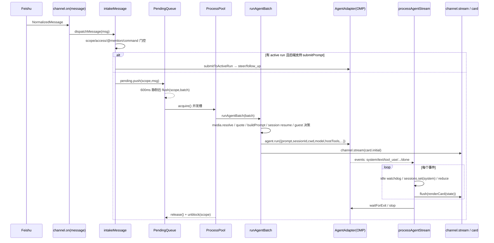
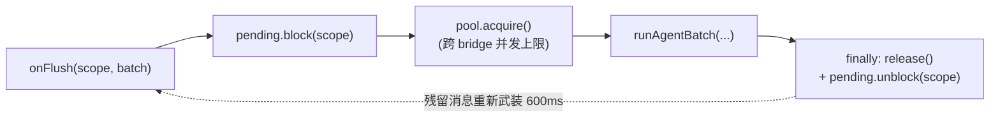
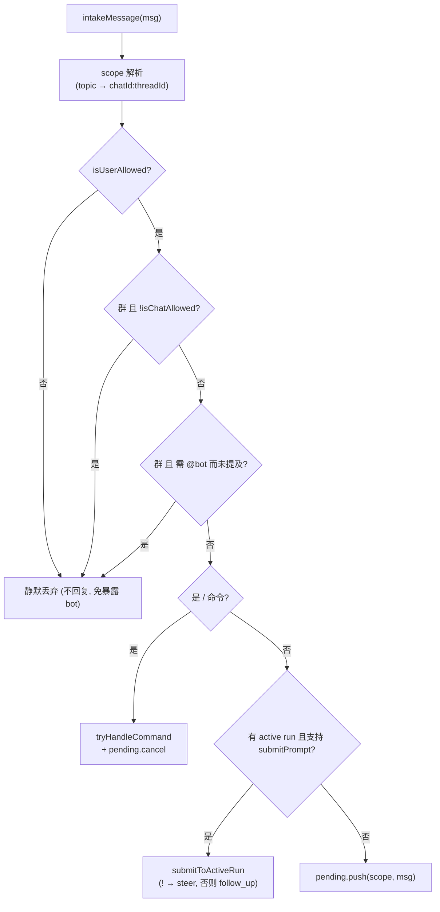

# 04 · 消息管线（脊柱）

> 源码基线：commit `78460f6`（文档对应的源码 commit；详见 [README](./README.md)）。

> 覆盖范围：从规范化消息进入 runtime，到 agent 流式回写飞书的端到端主线——`createBridgeRuntime`、`intakeMessage`、`submitToActiveRun`、`PendingQueue`、`ProcessPool`、`runAgentBatch`、`processAgentStream`、三种回复模式、`buildPrompt`、`ActiveRuns`。
>
> 源文件：`src/bot/channel.ts`（`createBridgeRuntime`/`intakeMessage`/`submitToActiveRun`/`runAgentBatch`/`processAgentStream`/`buildPrompt`/`buildBridgeContextHeader`/`expandedMessageContent`/`stripAttachmentRefs`）、`src/bot/pending-queue.ts`、`src/bot/process-pool.ts`、`src/bot/active-runs.ts`。

相关篇：[飞书传输层](./03-feishu-transport.md)、[Agent 适配器与 OMP](./02-agent-adapter-and-omp.md)、[流式与卡片](./05-streaming-and-cards.md)、[会话/工作空间/媒体](./07-sessions-workspaces-media.md)、[访问控制与访客沙箱](./09-access-and-guest-sandbox.md)、[飞书 host 工具面](./06-feishu-host-surface.md)。

## 0. 一次完整对话的时序

## 1. `createBridgeRuntime`：每实例管线

`createBridgeRuntime(deps)` 组装一套绑定到某个 `channel` 的管线，front 与 worker 都构造一份并通过三个 `dispatch*` 喂事件：

- `activeRuns = new ActiveRuns()`、`chatModeCache = new ChatModeCache()`、`pool = new ProcessPool(() => getMaxConcurrentRuns(controls.cfg))`（cap 每次 acquire 现读，故 `/config` 改并发数下一 run 生效）、`media = new MediaCache(channel)`。
- `pending = new PendingQueue(DEBOUNCE_MS=600, onFlush)`，`onFlush(scope, batch)` 是核心 run-chain：
  1. `pending.block(scope)`（运行期间该 scope 的 pending 继续攒但不 flush）；
  2. `withTrace` 内 `release = await pool.acquire()`（跨整个 bridge 的并发上限）；
  3. `chatModeCache.resolve` 得 mode → `runAgentBatch({...})`；
  4. `finally`：`release()`、`pending.unblock(scope)`（unblock 会为残留消息重新武装一个静默窗口）。

净效果：**每 scope 最多一个 run 在飞**，run 期间所有消息合并进下一 batch（且要等 run 结束后再静默 600ms 才 flush）。

`dispatchMessage`→`intakeMessage`、`dispatchCardAction`→`handleCardAction`（见 [05](./05-streaming-and-cards.md)）、`dispatchComment`→`handleCommentMention`（见 [03](./03-feishu-transport.md)）、`shutdown`→`pending.cancelAll()` + `activeRuns.stopAll()` + flush stores。

## 2. `intakeMessage`：门控与分流

按序（`src/bot/channel.ts`）：

1. **scope 解析**：`chatMode = chatModeCache.resolve(channel, msg.chatId)`；`scope = (chatMode==='topic' && msg.threadId) ? \`${chatId}:${threadId}\` : chatId`。
2. **访问控制（静默丢弃）**：`!isUserAllowed(cfg, senderId)` 直接 return（回复会暴露 bot）；`chatType!=='p2p' && !isChatAllowed(cfg, chatId)` 直接 return（`allowedChats` 故意只作群门控——p2p chat_id 按用户对生成、不可被冒用，用户 allowlist 已是 DM 的权威）。见 [09](./09-access-and-guest-sandbox.md)。
3. **群提及门控**：`chatType!=='p2p' && getRequireMentionInGroup(cfg) && !msg.mentionedBot` → return。斜杠命令不豁免（用户选了严格模式就让群一致安静）。`@全员` 已被 SDK `respondToMentionAll:false` 过滤。
4. **命令检测**：`tryHandleCommand({...})`，处理则 `pending.cancel(scope)` 并 return（见 [10](./10-commands.md)）。
5. **写入 active run**：`submitToActiveRun(...)`，成功 return。
6. **否则排队**：`pending.push(scope, msg)`。

## 3. `submitToActiveRun`：mid-run 跟进 / steer

仅当 `activeRuns.has(scope)`。解析媒体（`media.resolve`）得 `imagePaths`，解析引用（`fetchQuotedContext`），`buildPrompt([msg], attachments, quotes)`；`kind = msg.content.trimStart().startsWith('!') ? 'steer' : 'follow_up'`；`activeRuns.submitPrompt(scope, kind, prompt, imagePaths)`。

**安全降级**：`ActiveRuns.submitPrompt` 在 `run.submitPrompt` 缺失时 `?? Promise.resolve(false)`，于是 `submitToActiveRun` 返 false，`intakeMessage` 回落 `pending.push`——消息排到**下一轮**（靠 session resume 续聊），`!` 前缀失去特殊语义。OMP 实现了 `submitPrompt` 故支持真正的 mid-run steer/follow_up。

## 4. `PendingQueue`（`src/bot/pending-queue.ts`）

按 scope 的去抖队列。`push(scope,msg)` 累积并武装 `delayMs=600` 的定时器（除非该 scope 被 `block`）；静默到点 `flush(scope)` 调 `onFlush(scope, batch)`。`cancel(scope)` 清队列返回已攒消息；`cancelAll()`；`block(scope)`/`unblock(scope)`（运行期暂停/恢复定时器）。命令绕过队列（要响应快）。

## 5. `ProcessPool`（`src/bot/process-pool.ts`）

FIFO 并发上限。`acquire()`：若 `active < cap()` 则占位返回 `release`；否则 push 进 waiters await。`release()` 唤醒下一 waiter（仅当 `active < cap()`，故 `/config` 调小 cap 会自然限流）。cap 是 `() => getMaxConcurrentRuns(cfg)` 现读。`snapshot()` 给 `/status`/`/ps`。

## 6. `runAgentBatch`：组 prompt → 跑 → 回写

`src/bot/channel.ts`，按序：

1. **媒体解析**：`media.resolve(chatId, resourceItems)` → `attachments`，`imagePaths` 取 `kind==='image'` 的 path（见 [07](./07-sessions-workspaces-media.md)）。
2. **引用去重**：收集 batch 内 `replyToMessageId`，去重、并排除 batch 自身已含的 id，对每个 `fetchQuotedContext`。
3. **`buildPrompt(batch, attachments, quotes)`**（见 §8）。
4. **session resume**：`cwd = workspaces.cwdFor(scope) ?? homedir()`；`resumeFrom = sessions.resumeFor(scope, cwd)`（cwd 不匹配则视为陈旧、`sessions.clear`）。见 [07](./07-sessions-workspaces-media.md)。
5. **host 集成**：`feishuHost = createFeishuHostIntegration(channel, {scope,chatId,threadId,replyToMessageId:lastMsg.messageId,cwd})`（见 [06](./06-feishu-host-surface.md)）。
6. **profile 决策**：`resolveBatchProfile(cfg, batch.map(senderId), {chat:mode, chatId})` → `{profile, principals}`（统一 policy 解析：principals×scenario×first-match rules，**最严发送者胜**，缺 senderId 当 `guest`、fail-closed；见 [09](./09-access-and-guest-sandbox.md)）。`guestArgs = buildProfileRunArgs(profile)`（仅**受限** profile 出 `--tools`/hook，discovery/memory 任一关时出 overlay，`full` 返回空）；`commandTools = buildCommandTools(profile.commandTools, cwd)`；host tools 按 `profile.feishuHostTools` 决定是否在 command tools 上并入 feishu host tools + `feishu://` scheme；`profile.systemPrompt` **前置**到 prompt。
7. **`agent.run({...})`**：传 `prompt:runPrompt`、`sessionId:resumeFrom`、`cwd`、`model:getOmpModel(cfg)`、`imagePaths`、`stopGraceMs:getAgentStopGraceMs(cfg)`、`hostTools`、`hostUriSchemes`、`tools/configOverlayPaths/extensionPaths`（访客时来自 guestArgs）。`handle = activeRuns.register(scope, run)`。
8. **idle-timeout 解析**：scope 覆盖（`sessions.getIdleTimeoutMinutes`）优先于全局默认（`getRunIdleTimeoutMs`）；0/undefined = 无看门狗。
9. **回复模式**：`replyMode = getMessageReplyMode(cfg)`。`filterForPrefs(state)` 在 `getShowToolCalls` 关时滤掉 tool block（每 flush 现读）。`sendOpts = { replyTo:lastMsg.messageId, ...(mode==='topic'&&threadId?{replyInThread:true}:{}) }`。
10. **UI hooks**：`uiHooks.onUiRequest`/`onUiCancel` 用托管卡片渲染 OMP 交互（见 [05](./05-streaming-and-cards.md)）。
11. **working reaction**：非 card 模式给触发消息加“敲键盘”表情（card 模式有“正在思考…”footer，免）。
12. **按模式驱动流**（见 §7），`finally` 里 `activeRuns.unregister(scope, run)` + 移除 reaction。

## 7. `processAgentStream`：把事件流驱动成状态

后端无关。签名 `(handle, sessions, scope, cwd, idleTimeoutMs, flush, hooks?)`：

- **idle 看门狗**：`armOrPauseIdle()`——有工具或 UI 在飞（`inFlightTools.size>0 || handle.pendingUiRequests.size>0`）就**暂停**计时；否则武装 `idleTimeoutMs` 定时器，到点置 `idleFired`/`handle.interrupted` 并 `handle.run.stop()`。`handle.onUiSettled = armOrPauseIdle` 让 UI 应答后重新武装。
- **逐事件**（`for await (const evt of handle.run.events)`，`handle.interrupted` 则 break）：
  - 先更新在飞集合：`tool_use` 加、`tool_result` 删、`ui_request` 加 `pendingUiRequests`、`ui_cancel` 删，再 `armOrPauseIdle()`。
  - `system`：若 `evt.sessionId` 则 `sessions.set(scope, evt.sessionId, evt.cwd ?? cwd)`（**这里且仅这里持久化 session**），`continue`。
  - `usage`：记日志，`continue`。
  - `ui_request`/`ui_cancel`：调 `hooks?.onUiRequest`/`onUiCancel`。
  - `state = reduce(state, evt)`（见 [05](./05-streaming-and-cards.md)），`await flush(state)`；`state.terminal!=='running'` 即 break。
- **收尾**：若 `state.terminal==='running'`，按 `idleFired`→`markIdleTimeout`、`handle.interrupted`→`markInterrupted`、否则 `finalizeIfRunning`；`await flush(state)`。
- **reap 子进程**：`interrupted` 则 `await handle.run.stop()`；否则 `waitForExit(POST_DONE_EXIT_GRACE_MS=2000)`，超时再 `stop()`。

## 8. 三种回复模式与 `buildPrompt`

- **card**（默认）：`channel.stream(chatId, {card:{initial:renderCard(initialState), producer: ctrl => processAgentStream(..., state => ctrl.update(renderCard(filterForPrefs(state))))}}, sendOpts)`。
- **markdown**：`channel.stream(chatId, {markdown: ctrl => processAgentStream(..., state => ctrl.setContent(renderText(filterForPrefs(state))))}, sendOpts)`。
- **text**：run 期间不发，只累积 `finalState`；结束后 `renderText` 一次性 `channel.send(chatId, {markdown: body}, sendOpts)`（无流式、无打字机）。

> 卡片节奏说明：bridge 侧**不再额外节流**——每个事件都 flush，靠 SDK 的 `streamThrottleMs:400` 与卡片 `streaming_mode` 限速。

`buildPrompt(batch, attachments, quotes)`：

- `texts`：每条消息 `expandedMessageContent`（交互卡片展开）→ `stripAttachmentRefs`（去掉指向 fileKey 的 markdown 引用）→ trim。
- `ctxHeader = buildBridgeContextHeader(batch)`：`<bridge_context>` 块（`chat_id`/`chat_type`/`sender_id`/可选 `sender_name`/`thread_id`）。
- `quoteBlock = renderQuotedBlock(quotes)`。
- 顺序：`<bridge_context>` → `<quoted_message>` → 用户文本 + 附件。无附件直接 `prefix + texts`；有附件追加 `附件（本地路径）：` 列表（每行 `- <path> (名) — 图片/音频/视频/文件`），无文本时占位“请看下面的附件。”

> 注意：OMP 路径下附件以**本地路径**喂给 Agent（OMP 在本机能读这些文件）。这一“本地路径附录”是 OMP 专属假设；远程后端（Dify）需改为上传文件（见 [dify 适配](../dify-feishu-bridge-design/05-channel-and-commands-adaptation.md)）。

## 9. `ActiveRuns`（`src/bot/active-runs.ts`）

`RunHandle { run; interrupted; pendingUiRequests:Set; onUiSettled? }`。`register/unregister/has`；`interrupt(scope)`（置 interrupted、删除、fire-and-forget `run.stop()`）；`respondToUi(scope, requestId, response)`（`run.respondToUi?.(...)===true` 才算成功，成功后删 pendingUiRequest 并 `onUiSettled?.()`）；`submitPrompt(scope, kind, message, imagePaths)`（`run.submitPrompt?.(...) ?? Promise.resolve(false)`）；`stopAll()`（shutdown 用）。
