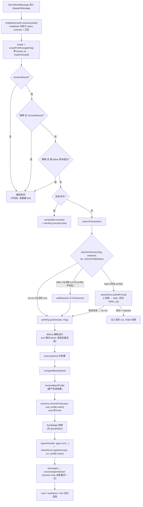
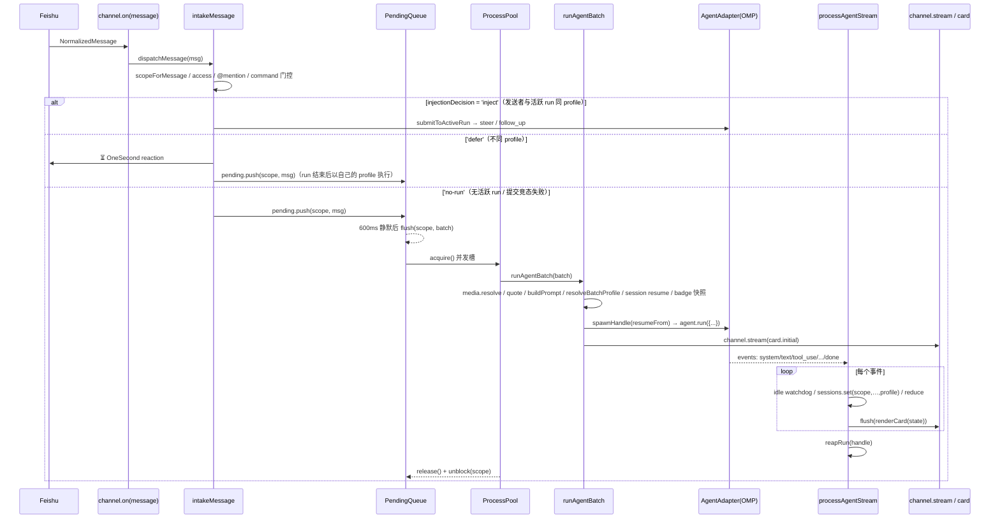
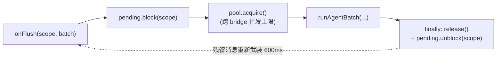
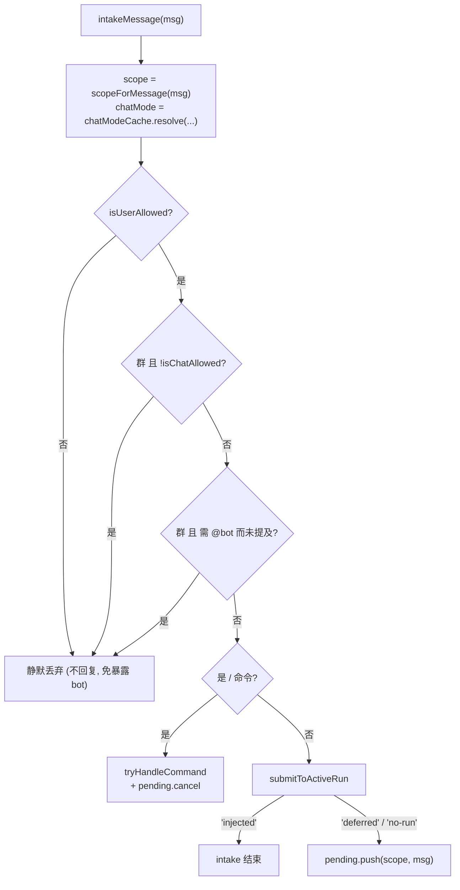
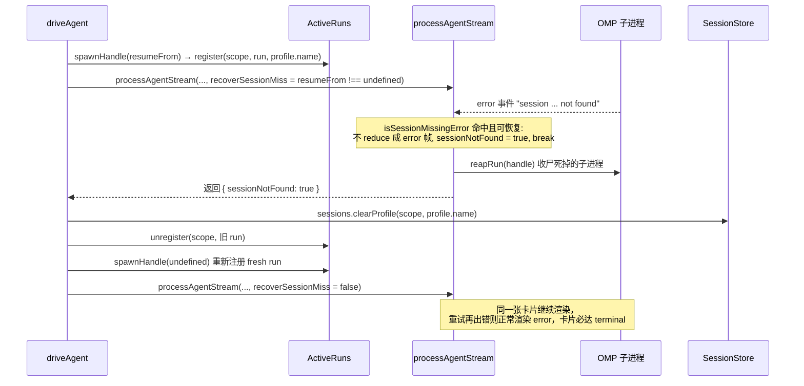

# 04 · 消息管线（脊柱）

> 源码基线：commit `33bcea3`（文档对应的源码 commit；详见 [README](./README.md)）。

> 覆盖范围：从规范化消息进入 runtime，到 agent 流式回写飞书的端到端主线——`createBridgeRuntime`、`intakeMessage`、`submitToActiveRun`、`PendingQueue`、`ProcessPool`、`runAgentBatch`、`driveAgent`（resume 自愈）、`processAgentStream`、`reapRun`、三种回复模式、`buildPrompt`、`ActiveRuns`。
>
> 源文件：`src/bot/channel.ts`（`createBridgeRuntime`/`intakeMessage`/`submitToActiveRun`/`runAgentBatch`/`processAgentStream`/`reapRun`/`buildPrompt`/`buildBridgeContextHeader`/`expandedMessageContent`/`stripAttachmentRefs`）、`src/bot/scope.ts`（`scopeFor`/`scopeForMessage`）、`src/bot/pending-queue.ts`、`src/bot/process-pool.ts`、`src/bot/active-runs.ts`、`src/bot/reaction.ts`（`addReaction`/`removeReaction`）、`src/config/policy.ts`（`injectionDecision`/`resolveBatchProfile`）、`src/session/store.ts`（`resumeFor`/`set`/`clearProfile`）。

相关篇：[飞书传输层](./03-feishu-transport.md)、[Agent 适配器与 OMP](./02-agent-adapter-and-omp.md)、[流式与卡片](./05-streaming-and-cards.md)、[会话/工作空间/媒体](./07-sessions-workspaces-media.md)、[访问控制与访客沙箱](./09-access-and-guest-sandbox.md)、[飞书 host 工具面](./06-feishu-host-surface.md)。

## 0. 端到端总览

一条消息从进入 runtime 到流式回写的全部决策点：



一次完整对话的时序：



## 1. `createBridgeRuntime`：每实例管线

`createBridgeRuntime(deps)` 组装一套绑定到某个 `channel` 的管线，front 与 worker 都构造一份并通过三个 `dispatch*` 喂事件：

- `activeRuns = new ActiveRuns()`、`chatModeCache = new ChatModeCache()`、`pool = new ProcessPool(() => getMaxConcurrentRuns(controls.cfg))`（cap 每次 acquire 现读，故 `/config` 改并发数下一 run 生效）、`media = new MediaCache(channel)`。
- `pending = new PendingQueue(DEBOUNCE_MS=600, onFlush)`，`onFlush(scope, batch)` 是核心 run-chain：
  1. `pending.block(scope)`（运行期间该 scope 的 pending 继续攒但不 flush）；
  2. `withTrace` 内 `release = await pool.acquire()`（跨整个 bridge 的并发上限）；
  3. `chatModeCache.resolve` 得 mode → `runAgentBatch({...})`；
  4. `finally`：`release()`、`pending.unblock(scope)`（unblock 会为残留消息重新武装一个静默窗口）。

净效果：**每 scope 最多一个 run 在飞**，run 期间所有消息合并进下一 batch（且要等 run 结束后再静默 600ms 才 flush）。



`BridgeRuntime` 接口除三个 `dispatch*` 与 `shutdown` 外，还暴露只读的 **`chatModeCache`** 字段——front 侧 `startChannel` 创建 relay router 时把 `resolveScenario: (chatId) => runtime.chatModeCache.resolve(channel, chatId)` 传给 `createRelayRouter`，供 per-principal `relayScenarios` 门控解析卡片回调的场景（多数命中缓存）；相应地 `routeCardAction` 已是 async，cardAction 分发处 `await router?.routeCardAction(evt)`（见 [03](./03-feishu-transport.md)）。

`dispatchMessage`→`intakeMessage`、`dispatchCardAction`→`handleCardAction`（见 [05](./05-streaming-and-cards.md)）、`dispatchComment`→`handleCommentMention`（见 [03](./03-feishu-transport.md)）、`shutdown`→`pending.cancelAll()` + `activeRuns.stopAll()` + flush stores。

## 2. `intakeMessage`：门控与分流

按序（`src/bot/channel.ts`）：



1. **scope 解析**：`chatMode = chatModeCache.resolve(channel, msg.chatId)`（异步，仍解析——供 policy scenario 匹配与日志）；`scope = scopeForMessage(msg)`——`src/bot/scope.ts` 的**同步纯函数** `scopeFor(chatId, threadId)`：只要消息带 `thread_id` 就返回 `${chatId}:${threadId}`，否则 `chatId`，**不看 chat_mode**。这覆盖话题群**和**开启了「话题」功能的普通群——后者 Feishu 上报的 `chat_mode` 仍是 `'group'`，但每条消息带稳定 `thread_id`（`omt_…`）；若按 `chat_mode==='topic'` 门控，这种群的所有话题会折叠进同一个 chatId scope（共享 session、单一 active run、跨话题回复错位）。`scope.ts` 是 scope 组装的唯一事实来源，intake 与卡片 dispatcher 的 `resolveScope`（`src/card/dispatcher.ts`）共用。
2. **访问控制（静默丢弃）**：`!isUserAllowed(cfg, senderId)` 直接 return（回复会暴露 bot）；`chatType!=='p2p' && !isChatAllowed(cfg, chatId)` 直接 return（`allowedChats` 故意只作群门控——p2p chat_id 按用户对生成、不可被冒用，用户 allowlist 已是 DM 的权威）。见 [09](./09-access-and-guest-sandbox.md)。
3. **群提及门控**：`chatType!=='p2p' && getRequireMentionInGroup(cfg) && !msg.mentionedBot` → return。斜杠命令不豁免（用户选了严格模式就让群一致安静）。`@全员` 已被 SDK `respondToMentionAll:false` 过滤。
4. **命令检测**：`tryHandleCommand({...})`（同时收到 `scope` 与 `chatMode`），处理则 `pending.cancel(scope)` 并 return（见 [10](./10-commands.md)）。
5. **写入 active run**：`submitToActiveRun(...)` 返回 `'injected' | 'deferred' | 'no-run'`；仅 `'injected'` 时 return。
6. **`'deferred'` / `'no-run'` 均回落队列**：`pending.push(scope, msg)`——deferred 的消息在活跃 run 结束、unblock 重武装 600ms 静默窗口后，作为新 batch 以**自己发送者**解析出的 profile 执行。

## 3. `submitToActiveRun`：mid-run 注入门控（inject / defer / no-run）

`intakeMessage` 对每条非命令消息都调用它；返回三态 `'injected' | 'deferred' | 'no-run'`：

1. **门控**：`activeProfile = activeRuns.profileName(scope)`（无活跃 run 时为 undefined）；`decision = injectionDecision(cfg, msg.senderId, { chat: chatMode, chatId }, activeProfile)`（`src/config/policy.ts`）：
   - `activeProfileName === undefined` → `'no-run'`；
   - 否则用 `resolveBatchProfile(cfg, [senderId], ctx)` 对**这一个发送者**做完整 policy 解析，解析出的 profile 与活跃 run 的 profile **同名** → `'inject'`，不同名 → `'defer'`。
   
   理由：活跃 run 是以某个 profile 的工具面 spawn 的，把别的 profile 的消息注入进去，等于让该发送者在他无权的权限下执行（群内提权：低权成员搭 `full` run 的便车）——这正是 `resolveBatchProfile` 对 batch 防的那类逃逸（batch 内两个不同 profile 都要 fail-closed 到 `locked`）。
2. **`'defer'` 路径**：打日志 `mid-run-deferred` 后 `await addReaction(channel, msg.messageId, REACTION_DEFERRED)`——给消息加 ⏳（`OneSecond`，「稍等」）表情作为无噪声回执（"收到了，当前 run 结束后回答"），返回 `'deferred'`，由 intake 回落 pending queue。
3. **`'inject'` 路径**：解析媒体（`media.resolve`）得 `imagePaths`，解析引用（`fetchQuotedContext`），`buildPrompt([msg], attachments, quotes)`；`kind = msg.content.trimStart().startsWith('!') ? 'steer' : 'follow_up'`；`ok = await activeRuns.submitPrompt(scope, kind, prompt, imagePaths)`。
4. **提交竞态**：门控通过和真正提交之间 run 恰好结束时 `ok === false`，按 `'no-run'` 返回——消息回落 pending queue 而不是被丢弃。

**安全降级**：`ActiveRuns.submitPrompt` 在后端未实现 `run.submitPrompt` 时 `?? Promise.resolve(false)`，同样走 `'no-run'` 回落——消息排到**下一轮**（靠 session resume 续聊），`!` 前缀失去特殊语义。OMP 实现了 `submitPrompt` 故支持真正的 mid-run steer/follow_up。

## 4. `PendingQueue`（`src/bot/pending-queue.ts`）

按 scope 的去抖队列。scope 即 §2 的 session scope 字符串（p2p/无话题普通群为 `chatId`，带 `thread_id` 的消息为 `chatId:threadId`）。`push(scope,msg)` 累积并武装 `delayMs=600` 的定时器（除非该 scope 被 `block`）；静默到点 `flush(scope)` 调 `onFlush(scope, batch)`。`cancel(scope)` 清队列返回已攒消息；`cancelAll()`；`block(scope)`/`unblock(scope)`（运行期暂停/恢复定时器）。命令绕过队列（要响应快）。

## 5. `ProcessPool`（`src/bot/process-pool.ts`）

FIFO 并发上限。`acquire()`：若 `active < cap()` 则占位返回 `release`；否则 push 进 waiters await。`release()` 唤醒下一 waiter（仅当 `active < cap()`，故 `/config` 调小 cap 会自然限流）。cap 是 `() => getMaxConcurrentRuns(cfg)` 现读。`snapshot()` 给 `/status`/`/ps`。

## 6. `runAgentBatch`：组 prompt → 跑 → 回写

`src/bot/channel.ts`，按序：

1. **媒体解析**：`media.resolve(chatId, resourceItems)` → `attachments`，`imagePaths` 取 `kind==='image'` 的 path（见 [07](./07-sessions-workspaces-media.md)）。
2. **引用去重**：收集 batch 内 `replyToMessageId`，去重、并排除 batch 自身已含的 id，对每个 `fetchQuotedContext`。
3. **`buildPrompt(batch, attachments, quotes)`**（见 §8）。
4. **cwd**：`cwd = workspaces.cwdFor(scope) ?? homedir()`。
5. **profile 决策**：`resolveBatchProfile(cfg, batch.map(senderId), {chat:mode, chatId})` → `{profile, principals}`（统一 policy 解析：principals×scenario×first-match rules，**最严发送者胜**，缺 senderId 当 `guest`、fail-closed；同 rank 的不同 profile 混批 fail-closed 到 `locked`；见 [09](./09-access-and-guest-sandbox.md)）。
6. **session resume**：`resumeFrom = sessions.resumeFor(scope, cwd, profile.name)`——session 按 **(scope, profile)** 存取，profile 或 cwd 任一不匹配即 miss、直接 fresh（不再有「stale-cleared」清 entry 的分支）。低权 run 永远 resume 不到同一聊天里 `full` 层级的会话线程。见 [07](./07-sessions-workspaces-media.md)。
7. **host 集成**：`feishuHost = createFeishuHostIntegration(channel, {scope,chatId,threadId,replyToMessageId:lastMsg.messageId,cwd})`（见 [06](./06-feishu-host-surface.md)）。
8. **profile 工具面**：`guestArgs = buildProfileRunArgs(profile)`（仅**受限** profile 出 `--tools`/hook，discovery/memory 任一关时出 overlay，`full` 返回空）；`commandTools = buildCommandTools(profile.commandTools, cwd)`；host tools 按 `profile.feishuHostTools` 决定是否在 command tools 上并入 feishu host tools + `feishu://` scheme；`profile.systemPrompt` **前置**到 prompt。
9. **RunBadge 快照**：`mode === 'p2p'` 时无 badge；group/topic 时 `badge = { profileName: profile.name, restricted: profile.restricted, owner: firstMsg.senderName }`——**run 启动时快照**、绝非实时 cfg 查询（防 mid-stream `/config` 改动错标权限）。`runInitialState = badge ? { ...initialState, badge } : initialState`，badge 从第一帧就 seed 进 `RunState`，卡片/markdown 顶部徽章让共享群里的所有人看到本次对话持有什么权限、由谁触发（也解释了低权成员的 mid-run 消息为何被 defer）。渲染见 [05](./05-streaming-and-cards.md)。
10. **`spawnHandle` 闭包**：`spawnHandle = (sessionId) => activeRuns.register(scope, agent.run({prompt:runPrompt, sessionId, cwd, model:getOmpModel(cfg), imagePaths, stopGraceMs:getAgentStopGraceMs(cfg), hostTools, hostUriSchemes, tools/configOverlayPaths/extensionPaths}), profile.name)`——注册时带 `profile.name`，供 §3 的注入门控读取；做成闭包是为了 resume 自愈重试时可以用 `undefined` sessionId 再 spawn 一次（见 §7）。
11. **idle-timeout 解析**：scope 覆盖（`sessions.getIdleTimeoutMinutes`）优先于全局默认（`getRunIdleTimeoutMs`）；0/undefined = 无看门狗。
12. **回复模式**：`replyMode = getMessageReplyMode(cfg)`（默认 `markdown`，见 §8）。`filterForPrefs(state)` 在 `getShowToolCalls` 关时滤掉 tool block（每 flush 现读）。
13. **回复线程化**：`sendOpts = { replyTo:lastMsg.messageId, ...(threadId?{replyInThread:true}:{}) }`——只要消息带 `threadId` 就 `replyInThread:true`（不再限 topic 模式；话题化普通群同样受益，否则 SDK 会把回复发到群顶层、打断话题内讨论）。
14. **UI hooks**：`uiHooks.onUiRequest`/`onUiCancel` 用托管卡片渲染 OMP 交互（见 [05](./05-streaming-and-cards.md)）。
15. **`driveAgent` 定义**：包装 `processAgentStream` 并实现 resume-miss 自愈（见 §7）；`finally` 里 `activeRuns.unregister(scope, handle.run)`。
16. **working reaction**：非 card 模式给触发消息 `addReaction(channel, lastMsg.messageId)`（默认 emoji `REACTION_WORKING='Typing'`，“敲键盘”）作即时回执——markdown 模式要等第一个 token、text 模式要等整个 run 结束才有可见输出；card 模式初始卡片自带“正在思考…”footer，免。
17. **按模式驱动流**（见 §8），外层 `finally` 移除 reaction。

## 7. `driveAgent` + `processAgentStream`：事件流驱动与 resume 自愈

### 7.1 `driveAgent`：resume-miss 自愈一次

若带 `resumeFrom` 启动而 omp 因「要 resume 的 session 已不存在」中止（session 目录被清理/过期），不能把错误糊在用户脸上然后每条后续消息都撞同一堵墙——`driveAgent` 在**同一张卡片**里自动重试一次 fresh session：



要点：

- `sessionNotFound && resumeFrom` 才重试；`sessions.clearProfile(scope, profile.name)` **只清这一个 profile 的 session**（保留兄弟 profile 会话与 idle override，对比 `/new` 用的 `clear(scope)` 全清）。
- 重试传 `recoverSessionMiss=false`：重试**不再可恢复**，（极小概率的）重复错误正常 reduce 渲染，保证卡片必达 terminal、不会卡在非终态。
- 首次尝试的 miss **不渲染 error**——`processAgentStream` 不把该 error 事件 reduce 进 state，重试直接续进同一张卡，用户看不到「错误闪一下」。
- `isSessionMissingError(message)`（`src/agent/omp/adapter.ts`，正则 `/session\b[\s\S]*\bnot found/i`）识别 omp 的 session-missing error 文本。
- `finally` 里 `activeRuns.unregister(scope, handle.run)` 用的是当前 `handle`（重试后指向新 run）。

### 7.2 `processAgentStream`：把事件流驱动成状态

后端无关。签名 `(handle, sessions, scope, cwd, profileName, initial, idleTimeoutMs, recoverSessionMiss, flush, hooks?)`，返回 `Promise<{ sessionNotFound: boolean }>`：

- **初始 state**：`state = initial`（即 §6 的 `runInitialState`，携带 badge，卡片 header 从第一帧就在）。
- **idle 看门狗**：`armOrPauseIdle()`——有工具或 UI 在飞（`inFlightTools.size>0 || handle.pendingUiRequests.size>0`）就**暂停**计时；否则武装 `idleTimeoutMs` 定时器，到点置 `idleFired`/`handle.interrupted` 并 `handle.run.stop()`。`handle.onUiSettled = armOrPauseIdle` 让 UI 应答后重新武装。

  ```mermaid
  stateDiagram-v2
    [*] --> Armed: armOrPauseIdle()<br/>在飞集合为空时武装定时器
    Armed --> Armed: 任意事件到达<br/>(集合仍空 → 重置定时器)
    Armed --> Paused: tool_use / ui_request<br/>(在飞集合非空)
    Paused --> Armed: tool_result / ui 应答·取消<br/>(集合清空后重武装)
    Armed --> Fired: idleTimeoutMs 到点
    Fired --> [*]: idleFired=true · handle.interrupted=true<br/>run.stop()
  ```

- **逐事件**（`for await (const evt of handle.run.events)`，`handle.interrupted` 则 break）：
  - 先更新在飞集合：`tool_use` 加、`tool_result` 删、`ui_request` 加 `pendingUiRequests`、`ui_cancel` 删，再 `armOrPauseIdle()`。
  - `system`：若 `evt.sessionId` 则 `sessions.set(scope, evt.sessionId, evt.cwd ?? cwd, profileName)`（**这里且仅这里持久化 session**，键为 (scope, profile)），`continue`。
  - `usage`：记日志，`continue`。
  - `ui_request`/`ui_cancel`：调 `hooks?.onUiRequest`/`onUiCancel`。
  - **session-missing 检测**：`recoverSessionMiss && evt.type==='error' && isSessionMissingError(evt.message)` → 置 `sessionNotFound=true` 并 break（**不 reduce**，见 §7.1）。
  - `state = reduce(state, evt)`（见 [05](./05-streaming-and-cards.md)），`await flush(state)`；`state.terminal!=='running'` 即 break。
  - 循环 `finally`：清定时器、若 `handle.onUiSettled` 仍是本次的 `armOrPauseIdle` 则复位为 undefined。
- **resume-miss 提前返回**：`sessionNotFound` 时**不写终态**（卡片留在非终态给重试续用），仅 `reapRun(handle)` 后返回 `{ sessionNotFound: true }`。
- **终态优先级**：若 `state.terminal==='running'`，按 `idleFired`→`markIdleTimeout`、`handle.interrupted`→`markInterrupted`、否则 `finalizeIfRunning`；**真实终态（done/error）先到则不被覆盖**——避免「OMP 已完成但 flush 慢、定时器 mid-flush 触发 → 成功的 run 却显示 idle_timeout」。最后 `await flush(state)`、`await reapRun(handle)`、返回 `{ sessionNotFound: false }`。

### 7.3 `reapRun`：两种收尸模式

独立函数（`src/bot/channel.ts`）：

- **interrupted**（用户 `/stop`、idle 看门狗、断连）：`stop()` 已被置 interrupted 的一方 fire-and-forget 发出，这里 `await handle.run.stop()` 等它完成。
- **自然结束**：`agent_end` 可能先于 OMP 关 stdout 到达；`waitForExit(POST_DONE_EXIT_GRACE_MS=2000)` 等它以 code 0 退出，超时才 `stop()`（SIGTERM 兜底，此时卡片早已渲染终态，用户无感）。

## 8. 三种回复模式与 `buildPrompt`

三种模式**共用 `driveAgent`**（从而共享 resume 自愈与 `processAgentStream`），唯一区别是 `flush(state)` 拿到状态后做什么：

- **markdown**（**默认**）：`channel.stream(chatId, {markdown: ctrl => driveAgent(state => ctrl.setContent(renderText(filterForPrefs(state))))}, sendOpts)`。`renderText` 顶行带 `badgeLine()` profile 徽章（如 `🔒 **guest（受限）** · @张三`；见 [05](./05-streaming-and-cards.md)）。
- **card**：`channel.stream(chatId, {card:{initial:renderCard(runInitialState), producer: ctrl => driveAgent(state => ctrl.update(renderCard(filterForPrefs(state))))}}, sendOpts)`——初始卡片就含 badge header。
- **text**：run 期间不发，只累积 `finalState`（初值 `runInitialState`）；结束后 `body = renderText(filterForPrefs(finalState))`，`body.trim()` 非空才一次性 `channel.send(chatId, {markdown: body}, sendOpts)`（msg_type=post，无流式、无打字机）。

> 默认值细节（`getMessageReplyMode`，`src/config/schema.ts`）：未设 `messageReply` 的新配置默认 `'markdown'`；0.1.27 前配置里的 `'text'` 在 `messageReplyMigrated !== true` 时也被强制映射为 `'markdown'`（老用户当年选 text 实际想要的就是现在的流式 markdown）。

> 卡片节奏说明：bridge 侧**不再额外节流**——每个事件都 flush，靠 SDK 的 `streamThrottleMs:400` 与卡片 `streaming_mode` 限速。

`buildPrompt(batch, attachments, quotes)`：

- `texts`：每条消息 `expandedMessageContent`（交互卡片展开）→ `stripAttachmentRefs`（去掉指向 fileKey 的 markdown 引用）→ trim。
- `ctxHeader = buildBridgeContextHeader(batch)`：`<bridge_context>` 块（`chat_id`/`chat_type`/`sender_id`/可选 `sender_name`/`thread_id`）。
- `quoteBlock = renderQuotedBlock(quotes)`。
- 顺序：`<bridge_context>` → `<quoted_message>` → 用户文本 + 附件。无附件直接 `prefix + texts`；有附件追加 `附件（本地路径）：` 列表（每行 `- <path> (名) — 图片/音频/视频/文件`），无文本时占位“请看下面的附件。”

> 注意：OMP 路径下附件以**本地路径**喂给 Agent（OMP 在本机能读这些文件）。这一“本地路径附录”是 OMP 专属假设；远程后端（Dify）需改为上传文件（见 [dify 适配](../dify-feishu-bridge-design/05-channel-and-commands-adaptation.md)）。

## 9. `ActiveRuns`（`src/bot/active-runs.ts`）

`RunHandle { run; profileName; interrupted; pendingUiRequests:Set; onUiSettled? }`——`profileName` 是 run spawn 时的 profile 名，§3 的注入门控靠它判断 mid-run 消息可否注入。`register(scope, run, profileName)`/`unregister`/`has`；`profileName(scope)`（无活跃 run 返回 undefined）；`interrupt(scope)`（置 interrupted、删除、fire-and-forget `run.stop()`）；`respondToUi(scope, requestId, response)`（`run.respondToUi?.(...)===true` 才算成功，成功后删 pendingUiRequest 并 `onUiSettled?.()`）；`submitPrompt(scope, kind, message, imagePaths)`（`run.submitPrompt?.(...) ?? Promise.resolve(false)`）；`stopAll()`（shutdown 用）。
