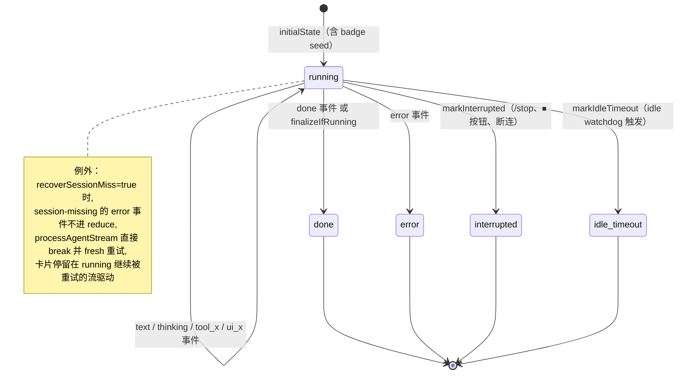
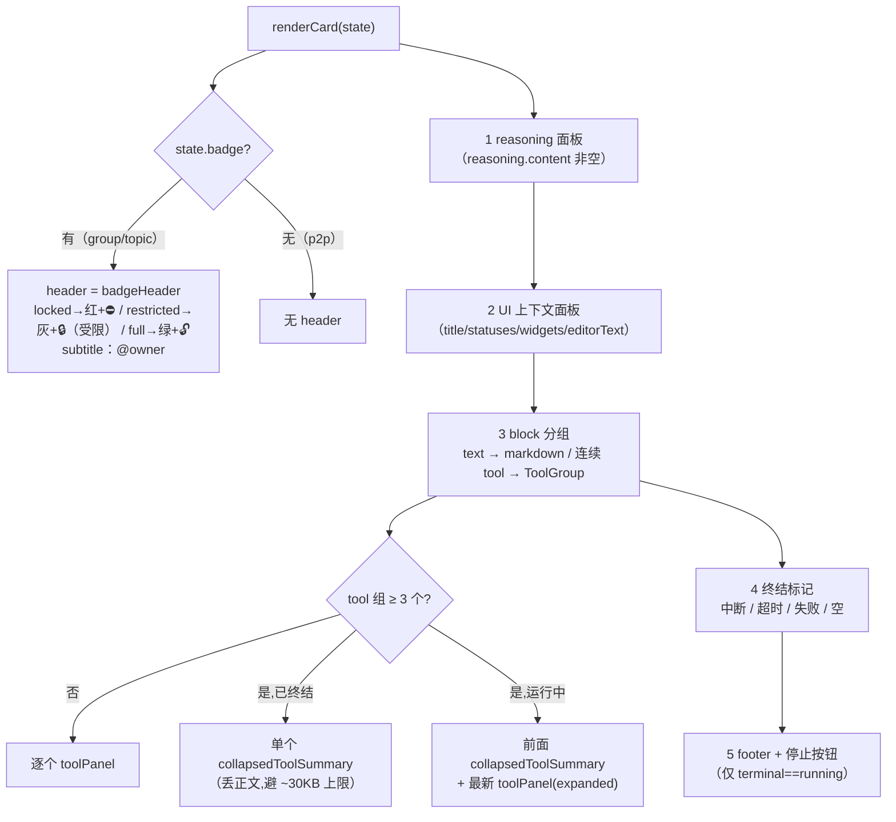
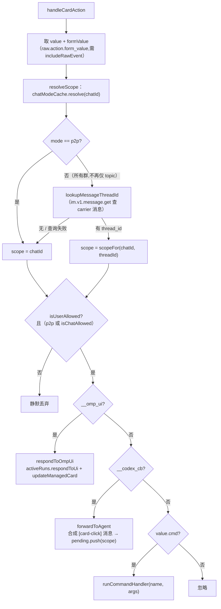

# 05 · 流式与卡片

> 源码基线：commit `103dd04`（文档对应的源码 commit；详见 [README](./README.md)）。

> 覆盖范围：`run-state.ts` 的状态类型（含 run 启动时快照的 `RunBadge`）与 `reduce()` 事件→状态全表；`run-renderer.ts` 的 CardKit 2.0 渲染（权限徽章 header、元素排序、工具折叠阈值、终结标记、footer、停止按钮）；`text-renderer.ts` 扁平 markdown 回退（顶行徽章 `badgeLine`）；`tool-render.ts` 工具头/体与截断；`managed.ts` 托管卡片生命周期；`templates.ts` 等静态/表单卡片；`dispatcher.ts` 卡片回调分发优先级（thread_id 优先的 scope 解析）；`omp-ui.ts` 交互卡片构建。
>
> 源文件：`src/card/run-state.ts`、`src/card/run-renderer.ts`、`src/card/text-renderer.ts`、`src/card/tool-render.ts`、`src/card/managed.ts`、`src/card/templates.ts`、`src/card/switch-card.ts`、`src/card/config-card.ts`、`src/card/dispatcher.ts`、`src/card/omp-ui.ts`。

相关篇：[消息管线](./04-message-pipeline.md)（谁驱动 reduce/flush、badge 在哪里 seed）、[Agent 适配器与 OMP](./02-agent-adapter-and-omp.md)（`AgentEvent` 来源）、[访问控制与统一策略](./09-access-and-guest-sandbox.md)（profile / restricted 的语义）、[聊天命令](./10-commands.md)（命令卡片）。

## 1. `run-state.ts`：状态模型

```ts
type ToolStatus = 'running'|'done'|'error';
interface ToolEntry { id; name; input:unknown; status:ToolStatus; output? }
type Block = { kind:'text'; content; streaming } | { kind:'tool'; tool:ToolEntry };
interface UiState { title?; statuses:Record<string,string>; widgets:Record<string,AgentUiWidget>; editorText? }
type FooterStatus = 'thinking'|'tool_running'|'streaming'|'waiting_input'|null;
type Terminal = 'running'|'done'|'interrupted'|'error'|'idle_timeout';
interface RunBadge { profileName:string; restricted:boolean; owner?:string }
interface RunState { blocks:Block[]; reasoning:{content;active}; footer:FooterStatus; terminal:Terminal; ui:UiState; errorMsg?; badge?:RunBadge; idleTimeoutMinutes? }
```

`initialState`：空 blocks、`reasoning:{content:'',active:false}`、`footer:'thinking'`、`terminal:'running'`、`ui:{statuses:{},widgets:{}}`。`closeStreamingText(blocks)`：把所有 `streaming:true` 的 text block 置为 false（终结/插入工具/UI 前调）。

**`RunBadge`**：这次 run 以哪个 profile（工具模式）执行、由谁发起——`profileName` / `restricted` / `owner?`（批次首条消息的 `senderName`）。三点关键语义（见接口上的注释）：

- **run 启动时快照一次**，绝非实时 cfg 查询——mid-stream 有人改 `/config` 也不会把正在跑的 run 错标成它实际不具备的权限；
- 仅 group / topic 场景有（p2p 单人对话没有第三方需要知情，badge 为 `undefined`）；
- `initialState` 本身不含 badge——由 `channel.ts` 在 run 启动时以 `{ ...initialState, badge }` seed 成本次 run 的初始状态（`runInitialState`），使 header 从卡片第一帧就存在（见 [04](./04-message-pipeline.md)）。

## 2. `reduce(state, evt)`：事件→状态全表

纯函数，每个 `AgentEvent` 的 mutation：

| `evt.type` | 对 state 的作用 |
| --- | --- |
| `text` | 末块是 streaming text 则追加 `delta`，否则新建 streaming text block；`reasoning.active=false`；`footer='streaming'`。 |
| `thinking` | `reasoning.content += delta`、`reasoning.active=true`；`footer='thinking'`。 |
| `tool_use` | `closeStreamingText` 后追加 `{kind:'tool', tool:{id,name,input,status:'running'}}`；`reasoning.active=false`；`footer='tool_running'`。 |
| `tool_result` | 把同 `id` 的 tool 置 `status: isError?'error':'done'` 并写 `output`。 |
| `tool_update` | 把同 `id` 的 tool 的 `output` 追加 `\n+evt.output`。 |
| `ui_request` | `closeStreamingText` 后插一条文本块“🧩 OMP 需要用户交互：**title** …已发送交互卡片”；`footer='waiting_input'`。 |
| `ui_cancel` | 插文本“🧩 OMP 交互已取消：targetId”；`footer` 若为 `waiting_input` 则置 null。 |
| `ui_notice` | 插一条 `noticeText`（按 level 选 ⚠️/ℹ️）文本块。 |
| `ui_status` | `updateStatus`：text 空则删该 key，否则写入。 |
| `ui_widget` | `updateWidget`：lines 空则删该 key，否则写入。 |
| `ui_title` | `ui.title = title`。 |
| `ui_editor_text` | `ui.editorText = text`。 |
| `ui_open_url` | 插文本“🔗 OMP 请求打开链接：url（+instructions）”。 |
| `error` | `terminal='error'`、`errorMsg=message`、`footer=null`。 |
| `done` | `closeStreamingText`、`reasoning.active=false`、`terminal='done'`、`footer=null`。 |
| 其它（`system`/`usage`/默认） | 原样返回（`system`/`usage` 已在 `processAgentStream` 里 `continue` 短路，不进 reduce）。 |

注意：`badge` 不受任何事件影响——它只在初始状态里 seed 一次，reduce 的所有分支都用 `...state` 原样携带。另一个不进 reduce 的例外：resume 启动的首次尝试里，命中 `isSessionMissingError` 的 `error` 事件被 `processAgentStream` 直接 `break` 吞掉（不 reduce 成 `terminal='error'`），由调用方清掉该 profile 的 session 后 fresh 重试续写**同一张卡片**（见 [04](./04-message-pipeline.md)）。

终结辅助（`processAgentStream` 收尾用）：`markInterrupted`（terminal `interrupted`）、`markIdleTimeout(state, minutes)`（terminal `idle_timeout` + `idleTimeoutMinutes`）、`finalizeIfRunning`（仅当 running → done）。三者都会 `closeStreamingText` 并置 `footer=null`。

`terminal` 的完整状态机（reduce 只产生 `done`/`error`，其余 terminal 由 `processAgentStream` 收尾时打上；收尾逻辑先判断“已是 terminal 则不覆盖”，避免 watchdog 在慢 flush 期间把成功的 run 误标为超时）：



## 3. `run-renderer.ts`：CardKit 2.0 渲染

`renderCard(state): object` 返回：

```ts
{
  schema: '2.0',
  config: { streaming_mode: state.terminal==='running', summary:{ content: summaryText(state) } },
  ...(header ? { header } : {}),   // header = badgeHeader(state.badge)
  body: { elements },
}
```

### 3.1 `badgeHeader(badge)`：权限徽章 header

`state.badge` 存在时（group / topic run）给卡片加一个**彩色 header**，用颜色编码信任级别；p2p 无 badge → 卡片无 header：

- **locked**（`profileName === 'locked'` 或以 `'locked('` 为前缀，即 fail-closed 的锁定 profile）→ `template:'red'` + 图标 ⛔；
- **restricted**（受限沙箱 profile，非 locked）→ `template:'grey'` + 图标 🔒，label 追加“（受限）”后缀（如 `🔒 guest（受限）`）；
- 其余（无限制的 `full`）→ `template:'green'` + 图标 🔓。

`title` 为 `plain_text` 的 `图标 label`；`badge.owner` 存在时 `subtitle` 为 `plain_text` 的 `@owner`（run 发起人）。这让共享群聊里的所有人一眼看到这段对话持有什么权限、由谁发起——也解释了为什么低权成员的 mid-run 消息会被缓期（⏳，见 [04](./04-message-pipeline.md) 的 `injectionDecision`）。

### 3.2 body 元素顺序



1. **reasoning 面板**（`state.reasoning.content` 非空时）：`reasoningPanel`——可折叠面板，标题“🧠 思考中 / 思考完成，点击查看”，`active` 时展开，正文 `truncate(content, REASONING_MAX=1500)`。
2. **UI 上下文面板**（`uiContextPanel(state.ui)` 非空时）：把 `title`/`statuses`/`widgets`/`editorText` 汇成一个蓝边可折叠面板“🧩 OMP 状态 / Widget”（`editorText` 截 1200）。
3. **block 分组**（`groupBlocks` 把连续 tool 聚成 ToolGroup，text 单独成组）：
   - text 组：非空则 `markdown(content)`。
   - tool 组：`renderToolGroup(tools, finalized=state.terminal!=='running')`——`< COLLAPSE_TOOL_THRESHOLD(3)` 个时每个独立 `toolPanel`；≥3 且已终结时合成一个 `collapsedToolSummary`（只留每工具头行，丢正文以免超 Feishu 单元素 ~30KB 上限）；≥3 且运行中时把前面折叠、最新一个 `toolPanel(latest, expanded)`。
4. **终结标记**：`interrupted`→“⏹ 已被中断”；`idle_timeout`→“⏱ N 分钟无响应,已自动终止”；`error`→“⚠️ agent 失败：errorMsg”；`done` 且无任何元素→“（未返回内容）”。
5. **footer + 停止按钮**（仅 `terminal==='running'`）：`footer` 非 null 时先 `footerStatus(footer)`（思考/调用工具/等待交互/输出），再恒定追加 `stopButton()`（danger 按钮，`behaviors:[{type:'callback', value:{cmd:'stop'}}]`，回调走 dispatcher）。

面板辅助：`collapsiblePanel`/`panelHeader`（带 `down-small-ccm_outlined` 折叠图标）/`markdown`/`noteMd`（`text_size:'notation'`）。`summaryText(state)` 给卡片 summary 一行短语（已中断/已超时/出错/已完成/正在调用工具/正在输出/等待用户交互/思考中）。

## 4. `text-renderer.ts`：扁平 markdown 回退

`renderText(state): string`，用于 `messageReply:'markdown'`（**默认模式**：流式 markdown 卡片，`ctrl.setContent` 打字机）。与卡片的差异：无折叠面板/按钮、工具塌成单行（`> ✅ **Read** — path`，复用 `toolHeaderText`）、不渲染 thinking、footer 直接行内追加。`renderUiContext` 把 UI 状态渲成 `> 🧩 OMP 状态` 列表。终结行：中断/超时/错误/运行中 footer。

**`badgeLine(badge)`**：markdown 消息没有卡片 header，所以徽章渲成**顶行**——`renderText` 输出的第一个片段，如：

```
🔒 **guest（受限）** · @张三
```

判定逻辑与 `badgeHeader` 完全一致（locked → ⛔、restricted → 🔒 + “（受限）”后缀、其余 → 🔓；owner 以 ` · @owner` 追加）；markdown 无颜色可用，信任级别完全由图标承载。同样只在 group / topic run 有（badge 为空时返回空串，不占行）。

## 5. `tool-render.ts`：工具头/体

- `toolHeaderText(tool)`：`图标 **name** — summary`，图标按 status（✅/❌/⏳），`summarizeInput(name, input)` 给常见工具（如 Bash/Read）提炼一行简介（`HEADER_SUMMARY_MAX=80`）。
- `toolBodyMd(tool)`：`renderInput`（输入字段，`BODY_FIELD_MAX=600`）+ 输出（`OUTPUT_MAX=1200`，bash 用 `renderBashOutput`）或“运行中…”，整体 `BODY_TOTAL_MAX=2500` 末位截断（提示查 `/doctor` 或日志）。`shortenPath` 缩短路径。

## 6. `managed.ts`：托管卡片生命周期

不同于流式回复卡（走 `channel.stream`），托管卡用于需要后续 `update` 的场景（OMP UI 卡、`/config`/`/switch` 表单）。模块级 `byMessageId: Map<messageId, {cardId, sequence}>`（进程内，重启即失，可接受）：

- `sendManagedCard(channel, chatId, card, replyTo?)`：`cardkit.v1.card.create({type:'card_json', data:JSON})` 得 `card_id`；再发引用消息（`im.v1.message.reply`，有 replyTo）或顶层消息（`im.v1.message.create`，`receive_id_type:'chat_id'`）携带 `{type:'card', data:{card_id}}`；记录 `{cardId, sequence:0}`，返回 `{messageId, cardId}`。
- `updateManagedCard(channel, messageId, card)`：按 messageId 找 entry，`sequence += 1`，`cardkit.v1.card.update({card_id, data:{card:{type:'card_json',data:JSON}, sequence}})`（递增 sequence 防乱序/被拒）。
- `isManaged(messageId)` / `forgetManagedCard(messageId)`。

## 7. `templates.ts` 与表单卡片

`templates.ts` 是命令回复用的静态卡片模板（旧版 v1 卡片结构：顶层 `config:{wide_screen_mode,update_multi}` + `header` + `elements`，按钮直接带 `value:{cmd:…}`，回调进 dispatcher 的 `cmd` 分支）：

- `workspacesCard(current, named)`：当前 cwd + 命名工作空间列表，每项带“切换到此处”（`cmd:'ws.use'`）/“删除”（`cmd:'ws.remove'`）按钮。
- `statusCard(info: StatusInfo)`：scope / cwd / session / agent 四行 + “新会话/工作空间/帮助”按钮。**scope 标注**改为 `info.scope.includes(':')` 时追加 “_（话题独立 session）_”——判据是 scope 本身是否是 `chatId:threadId` 复合形态，而不再看 `chatMode==='topic'`（开启话题的普通群 chat_mode 仍是 `'group'` 但 scope 同样按线程拆分，见 `src/bot/scope.ts` 的 `scopeFor`）；`StatusInfo.chatMode` 只作参考信息保留。
- `helpCard()`：命令清单 + 快捷按钮。

`switch-card.ts`（`/switch` 模型下拉表单，`OMP_DEFAULT_MODEL_VALUE='__omp_default__'` 作“回到 OMP 默认”的非空哨兵）、`config-card.ts`（`/config` 偏好表单，`cmd:'config.submit'/'config.cancel'`）均是 schema 2.0 表单卡，经 §6 的 `sendManagedCard`/`updateManagedCard` 管理，提交按钮带 `form_action_type:'submit'`，输入值经 `form_value` 回到 dispatcher（详见 [10](./10-commands.md)）。`/account` 表单卡（`account-cards.ts`）已随聊天内换凭据流程一起删除，换凭据改走 CLI（见 [10](./10-commands.md)）。

## 8. `dispatcher.ts`：卡片回调分发

`handleCardAction(deps)`（deps 含 `chatModeCache`；由 `channel.ts` 的 cardAction 监听经 relay router 的 `routeCardAction`——现为 async，`resolveScenario` 由 `ChatModeCache` 支撑——决定在 front 还是 worker 上执行后调用，见 [09](./09-access-and-guest-sandbox.md)）：



1. 取 `value`（按钮 `value` 对象）与 `formValue`（CardKit 2.0 表单提交的 `raw.action.form_value`，靠 `includeRawEvent`）。
2. `resolveScope(deps)`：先 `chatModeCache.resolve(channel, chatId)` 得 mode。p2p 直接用 `chatId`；**所有非 p2p 群**（不再仅 topic 群——开启话题的普通群消息同样带 thread_id）都 `lookupMessageThreadId`（`im.v1.message.get` 取 carrier 消息的 thread_id），有则复用 `src/bot/scope.ts` 的 `scopeFor(chatId, threadId)` 组 `${chatId}:${threadId}`，查不到 / 查询失败回落 `chatId`——与 intake 的 `scopeForMessage` 同一事实来源，保证点击落在渲染卡片的那个线程 session 上。scope 解析放在访问控制**之前**，因为要先知道 p2p/group 才能决定跳不跳 chat allowlist。
3. **访问控制**：`!isUserAllowed(cfg, operator.openId)` 静默丢；`mode!=='p2p' && !isChatAllowed(cfg, chatId)` 静默丢（给未授权者回“拒绝卡”只会暴露 bot 存在）。
4. **`__omp_ui`**（`isOmpUiPayload`）→ `respondToOmpUi`：解析 `requestId`/`title`/`response`，targetScope 取 `payload.scope`（构卡时随 value 带上）否则回落解析出的 scope，`activeRuns.respondToUi(targetScope, requestId, response)`，再 `updateManagedCard` 显示 submitted/cancelled/unavailable。
5. **`__codex_cb`**（`AGENT_CALLBACK_MARKER`，兼容旧名）→ `forwardToAgent`：剥掉 marker、并入 `form_value`，合成一条 `[card-click] {...}` 的 `NormalizedMessage`（`chatType` 用真实 `mode`：`group|topic→'group'`，否则 `'p2p'`——使统一 policy 按真实场景解析 profile，避免群里点卡片被当 p2p 拿到更宽 profile；`threadId` 一并带上）`pending.push(scope, ...)`，让 agent 在同 session 收到点击结果。
6. **`cmd`**：拆 `name.sub`，`composeArgs` 拼参，`runCommandHandler(name, args, ctx)`（见 [10](./10-commands.md)），`ctx.fromCardAction=true`、`makeFakeMsg` 合成 msg。

## 9. `omp-ui.ts`：OMP 交互卡片

常量 `OMP_UI_MARKER='__omp_ui'`、`OMP_UI_VALUE_FIELD='omp_ui_value'`。`renderOmpUiRequestCard(request, scope?)`：按 `request.method` 构建 confirm（确认/否/取消）、select（下拉+提交/取消）、input（单行+提交/取消）、editor（多行+提交/取消，支持 `prefill` 预填）表单；request 带 `timeout` 时插一行超时秒数提示。按钮 `value` 带 `{__omp_ui:true, requestId, method, title, action, scope?}`。`responseFromOmpUiAction(payload, formValue)`：把点击+表单值映射回 `AgentUiResponse`（`{value}`/`{confirmed}`/`{cancelled}`）。`renderOmpUiResultCard(title, status)`：终态卡（submitted/cancelled/unavailable）。

`runAgentBatch` 的 `uiHooks` 用 `sendManagedCard`/`updateManagedCard` 管理这些卡（`uiCards: Map<requestId, {messageId,title}>`；同 requestId 重复请求就地 update），见 [04](./04-message-pipeline.md)。

## 10. 卡片节奏

bridge **不做自己的节流**：`processAgentStream` 每个（进 reduce 的）事件都 `flush`。card 模式的初始帧就是 `renderCard(runInitialState)`——badge header 从第一帧可见；markdown 模式每次 flush `ctrl.setContent(renderText(...))`。限速来自 SDK 的 `outbound.streamThrottleMs:400`（见 [03](./03-feishu-transport.md)）与卡片 `config.streaming_mode`（运行中为 true）。终结时 `streaming_mode` 转 false，卡片定格。
