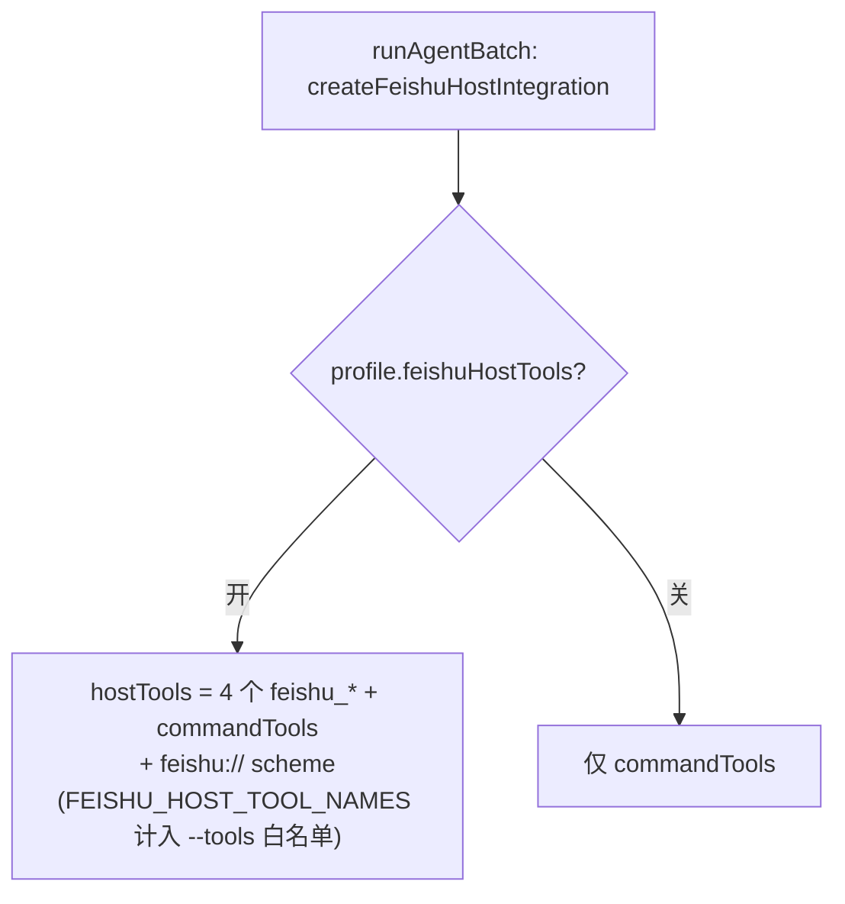
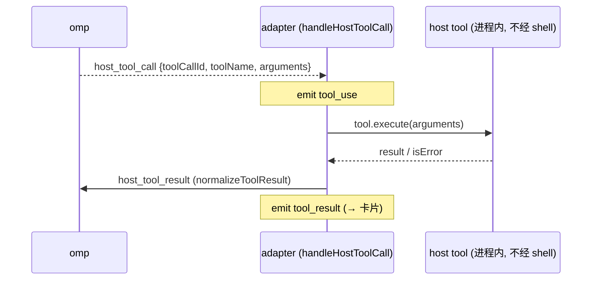

# 06 · 飞书 host 工具面

> 源码基线：commit `78460f6`（文档对应的源码 commit；详见 [README](./README.md)）。

> 覆盖范围：`createFeishuHostIntegration` 暴露的 4 个 host tool（`feishu_current_context`/`feishu_send_message`/`feishu_reply_message`/`feishu_get_message`）及只读 `feishu://` scheme（`feishu://current/context`、`feishu://message/<id>`）；它们如何按 run 注册、如何在 OMP RPC 循环里被执行。
>
> 源文件：`src/bot/feishu-host.ts`、`src/agent/omp/adapter.ts`（`handleHostToolCall`/`handleHostUriRequest`）、`src/bot/channel.ts`（注册点）、`src/agent/types.ts`（`AgentHostTool`/`AgentHostUriScheme`）、`README.md`（公开契约）。

相关篇：[Agent 适配器与 OMP](./02-agent-adapter-and-omp.md)、[消息管线](./04-message-pipeline.md)、[访问控制与访客沙箱](./09-access-and-guest-sandbox.md)。

## 1. 为什么有 host 工具面

让 OMP 用结构化 host callback 使用飞书资源，而不是让模型在 shell 里拼 `lark-cli` 命令。bridge 负责权限、当前上下文、消息解析与结果格式化。host tool 在 **bridge 进程内**执行（不经 shell），通过 OMP RPC 的 `host_tool_call` / `host_uri_request` 帧来回。

## 2. `createFeishuHostIntegration(channel, ctx)`

`ctx: FeishuHostContext { scope; chatId; threadId?; replyToMessageId?; cwd }`。返回 `{ tools: AgentHostTool[], uriSchemes: AgentHostUriScheme[] }`，含 4 个 tool + 1 个 scheme。

### 2.1 `feishu_current_context`

入参：无。`execute()` 返回 `jsonResult(ctx)`——当前 scope/chatId/threadId/replyToMessageId/cwd。对应 `README.md` 的返回示例。

### 2.2 `feishu_send_message`

入参 `{ content: string（必填，markdown）, chatId?: string }`。`execute`：`chatId` 缺省取 `ctx.chatId`；`channel.send(chatId, {markdown:content}, ctx.threadId && chatId===ctx.chatId ? {replyInThread:true} : undefined)`（目标是当前 topic 所在 chat 时带 thread reply）。返回 `sent message to <chatId>`。

### 2.3 `feishu_reply_message`

入参 `{ content: string（必填）, messageId?: string }`。`execute`：`messageId` 缺省取 `ctx.replyToMessageId`；无可回复目标则抛错；`channel.send(ctx.chatId, {markdown:content}, {replyTo:messageId, ...(ctx.threadId?{replyInThread:true}:{})})`。返回 `replied to <messageId>`。

### 2.4 `feishu_get_message`

入参 `{ messageId: string（必填）}`。`execute`：`fetchQuotedContext(channel, messageId)`（见 [03](./03-feishu-transport.md)），找不到返回 `{isError:true}`，否则 `jsonResult(message)`。适合让 OMP 查看引用消息、卡片来源、转发内容。

### 2.5 `feishu://` 只读 scheme

`feishuUriScheme(channel, ctx)`：`definition { scheme:'feishu', writable:false, immutable:false }`。`handle(req)`：

- 非 `read` 操作 → `{isError:true, error:'feishu:// is read-only in this bridge'}`（写操作被拒，避免 Agent 绕开发送工具与权限边界）。
- `parseFeishuUri(url)`：`feishu://message/<id>` → 取该消息（`fetchQuotedContext`）返回 JSON；`feishu://current/context` → 返回 ctx JSON；其它 → 不支持错误。

辅助：`objectSchema`/`requiredString`/`optionalString`/`textResult`/`jsonResult`。

## 3. 按 run 注册

`runAgentBatch`（`channel.ts`，见 [04](./04-message-pipeline.md)）每次 run 都 `createFeishuHostIntegration(channel, {scope,chatId,threadId,replyToMessageId:lastMsg.messageId,cwd})`，把 `feishuHost.tools` / `feishuHost.uriSchemes` 作为 `hostTools` / `hostUriSchemes` 传给 `agent.run({...})`。

host 工具面随 **profile** 走（见 [09](./09-access-and-guest-sandbox.md)）：`profile.feishuHostTools` 开才在 command tools 上并入这 4 个 feishu host tools + `feishu://` scheme；关则只暴露 command tools（`feishu://` 能按 id 读任意消息，故随同一开关）。受限 profile 的 `--tools` allowlist 通过 `feishu-host.ts` 导出的 `FEISHU_HOST_TOOL_NAMES` 把这些 host 工具名计入——否则 fail-closed hook 会把刚注册的 host 工具一并拦掉。

## 4. 在 OMP RPC 循环里执行

`OmpAdapter.createEventStream`（见 [02](./02-agent-adapter-and-omp.md)）在 ready 帧时把 `tools.map(t=>t.definition)` 通过 `set_host_tools` 帧、`schemes.map(s=>s.definition)` 通过 `set_host_uri_schemes` 帧告知 OMP。之后：

- 收到 `host_tool_call` 帧 → `handleHostToolCall(child, hostTools, frame)`：emit `tool_use` → 找 tool → `execute(arguments)` → 写回 `host_tool_result`（`normalizeToolResult` 包成 `{content:[{type:'text',text}]}`）+ emit `tool_result`。
- 收到 `host_uri_request` 帧 → `handleHostUriRequest(child, hostUriSchemes, frame)`：emit `tool_use`（name `host_uri_read`/`host_uri_write`）→ 找 scheme → `handle({operation,url,content})` → 写回 `host_uri_result` + emit `tool_result`。

因此 host tool 的执行也以 `tool_use`/`tool_result` 形式出现在卡片上（见 [05](./05-streaming-and-cards.md)）。

## 5. 公开契约（`README.md`）

`README.md` 的“OMP host tools 细节”“`feishu://` URI”两节是面向用户/Agent 的公开契约：4 个 tool 的入参/返回示例、`feishu://current/context` 与 `feishu://message/<message_id>` 只读、写操作返回错误。当前 scheme 只支持这两类资源（`README.md` 当前限制）。

## 6. 是否后端通用

host 工具面是 OMP 的 host-callback 通道的产物：OMP 支持在 RPC 里反向回调 bridge。**并非所有后端都有这种回调通道**——例如 Dify 的 chat API 没有 host-callback，故 `dify-feishu-bridge` 会**删掉** `feishu-host.ts`，改由 `<bridge_context>`/`<quoted_message>`/`<interactive_card>` 注入把飞书上下文送进 app（见 [dify 适配](../dify-feishu-bridge-design/03-dify-adapter.md) 的行为保真说明）。
