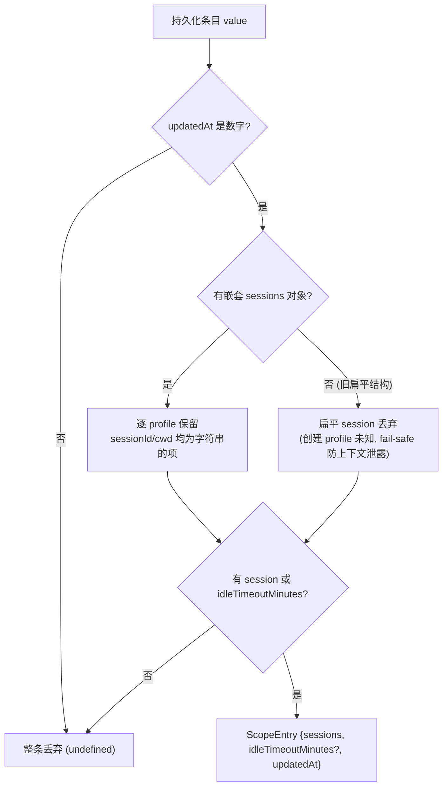
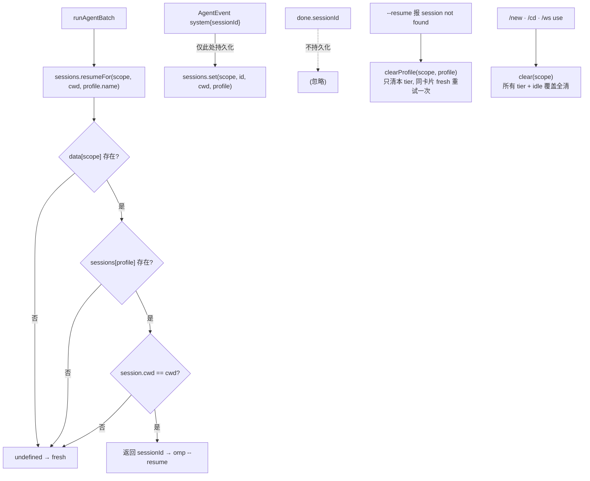
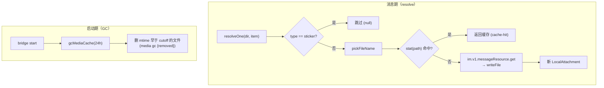

# 07 · 会话 / 工作空间 / 媒体

> 源码基线：commit `33bcea3`（文档对应的源码 commit；详见 [README](./README.md)）。

> 覆盖范围：`session/store.ts`（`ScopeEntry`/`ProfileSession`、`sessions.json`、scope 键、`migrateEntry` 旧结构迁移、`resumeFor` 的 scope→profile→cwd 三重匹配、`latestSession`、`clear` vs `clearProfile`、idle-timeout 覆盖与 clamp、串行持久化）；`workspace/store.ts`（`workspaces.json` 的 chats/named、每 scope cwd + 命名别名）；`media/cache.ts`（磁盘布局、文件名清洗、`AttachmentKind`、sticker 跳过、stat 缓存命中、下载、`gcMediaCache`）。
>
> 源文件：`src/session/store.ts`、`src/workspace/store.ts`、`src/media/cache.ts`、`src/config/paths.ts`。

相关篇：[消息管线](./04-message-pipeline.md)（谁调用这些 store、resume-miss 自愈）、[访问控制](./09-access-and-guest-sandbox.md)（profile 是什么）、[聊天命令](./10-commands.md)（`/new`/`/cd`/`/ws`/`/timeout`/`/status`）。

## 1. `SessionStore`（`src/session/store.ts`）

持久化到 `paths.sessionsFile`（`~/.feishu-omp-bridge/sessions.json`）。顶层键是 **scope**（`src/bot/scope.ts` 的 `scopeFor(chatId, threadId)`：消息带 `thread_id` 就是 `chatId:threadId`——话题群与开启"话题"功能的普通群都算；否则 chat_id，见 [04](./04-message-pipeline.md)）。每个 scope 的值是嵌套的 `ScopeEntry`——session 在 scope 之下再按 **profile 名**分一层：

```ts
interface ProfileSession { sessionId: string; cwd: string; updatedAt: number }

interface ScopeEntry {
  sessions: Record<string /* profileName */, ProfileSession>;
  idleTimeoutMinutes?: number; // per-scope 覆盖；0 = 该 scope 显式关闭，undefined = 跟随全局
  updatedAt: number;
}
```

- `ProfileSession.cwd`：session 创建时的 cwd 钉在条目里——OMP 只能在创建 session 的 cwd 里 resume。
- session 按 profile 分层的原因（`channel.ts` 注释同款）：同一群里低权限 run 绝不 resume（并继承其上下文的）高权限 profile 创建的 session，每个 tier 各有自己的对话线程。这是权限边界的"后半段"——前半段是 profile 本身的工具限制（见 [09](./09-access-and-guest-sandbox.md)）。
- `idleTimeoutMinutes` 是 **scope 级**（不 per-profile）：`/new` 用 `clear` 连它一起抹掉，回落"跟随全局"。

`sessions.json` 实例（一个普通群 scope 下 `full`/`guest` 两个 tier 各自的线程 + 一个话题 scope）：

```json
{
  "oc_abc123": {
    "sessions": {
      "full":  { "sessionId": "ses_01aaa", "cwd": "/Users/me/repos/proj", "updatedAt": 1751400000000 },
      "guest": { "sessionId": "ses_01bbb", "cwd": "/Users/me/repos/proj", "updatedAt": 1751400060000 }
    },
    "idleTimeoutMinutes": 30,
    "updatedAt": 1751400060000
  },
  "oc_abc123:omt_deadbeef": {
    "sessions": {
      "full": { "sessionId": "ses_01ccc", "cwd": "/Users/me", "updatedAt": 1751400120000 }
    },
    "updatedAt": 1751400120000
  }
}
```

方法：

- `load()`：读 JSON，逐条过 `migrateEntry` 归一化；归一化失败（返回 undefined）的条目整条丢弃。
- `migrateEntry(value)`：把持久化条目归一成当前嵌套形。`updatedAt` 非数字 → 整条丢；嵌套 `sessions` 里 `sessionId`/`cwd` 任一不是字符串的 profile 项跳过（profile 级 `updatedAt` 缺失时回落条目级）。**容忍旧扁平结构** `{sessionId?, cwd?, updatedAt, idleTimeoutMinutes?}`：扁平 session **直接丢弃**——创建它的 profile 未知，猜一个 profile 挂上去就可能把旧上下文 resume 给不该看的层级，fail-safe 宁可让下一条消息新起会话；只有裸 `idleTimeoutMinutes` 覆盖被保留。既无 session 又无覆盖 → 返回 undefined（没有值得留的东西）。



- `resumeFor(scope, cwd, profile)`：**scope → profile → cwd 三重匹配**，任一 miss 即 `undefined`（= fresh，`channel.ts` 日志 `session fresh`；不再有旧版"stale-cleared"清条目的分支，miss 不写库）。cwd 变了即视为陈旧的理由不变：OMP 无法在不同 cwd 续 session。
- `latestSession(scope)`：跨 profile 取 `updatedAt` 最新的一条，返回 `{sessionId, cwd, profile}`；scope 无可 resume 的 session 时 `undefined`。`/status` 用它展示"最近的会话"（`src/commands/index.ts` 的 `handleStatus`，`sessionStale` 由 `sess.cwd !== cwd` 判定）。
- `set(scope, sessionId, cwd, profile)`：只覆写本 profile 的 `ProfileSession`（`updatedAt: now`），**保留兄弟 profile 的 session 与 scope 的 idle 覆盖**。
- `clear(scope)`：删**整个 scope**——所有 profile 的 session + idle 覆盖一起没。`/new`、`/cd`、`/ws use` 用：语义是"这个聊天从头来"，每个 tier 的线程都该清。
- `clearProfile(scope, profile)`：只删**一个 profile** 的 session，兄弟 profile 与 idle 覆盖保留（条目 `updatedAt` 刷新）。resume-miss 自愈专用：`channel.ts` 的 `driveAgent` 发现 `--resume` 的 session 已被 OMP 清掉（`isSessionMissingError`）时清本 tier、同一张卡片里 fresh 重试一次，不连坐其它 tier（见 [04](./04-message-pipeline.md)）。
- `getIdleTimeoutMinutes(scope)` / `setIdleTimeoutMinutes(scope, minutes)`（`clamp [0,120]`，`Math.floor`；已有 sessions 原样保留）/ `clearIdleTimeoutOverride(scope)`（只删覆盖回落全局，session 保留，返回是否删过）。
- `flush()` / `schedulePersist()`：串行化持久化（`this.saving = this.saving.then(写文件)`），写前 `mkdir` 父目录，写 `JSON.stringify(data, null, 2)` + 末尾换行。
- 旧版的 `getRaw(scope)` **已删除**——嵌套化后没有调用方需要裸条目。

**关键不对称**（与 [04](./04-message-pipeline.md) 呼应）：session 仅在 `AgentEvent` 的 `system` 事件上由 `processAgentStream` 调 `sessions.set(scope, evt.sessionId, effectiveCwd, profileName)` 持久化（`effectiveCwd = evt.cwd ?? cwd`）；`done.sessionId` 不持久化。



## 2. `WorkspaceStore`（`src/workspace/store.ts`）

持久化到 `paths.workspacesFile`（`~/.feishu-omp-bridge/workspaces.json`）。结构未随 session 嵌套化改变：

```ts
interface WorkspaceData { chats: Record<scope, {cwd}>; named: Record<name, cwd> }
```

- `cwdFor(scope)` / `setCwd(scope, cwd)`：每 scope 的工作目录（`/cd`、`/ws use`、`/new chat` 继承用；注意 cwd **不**按 profile 分层——分层的只有 session）。`/cd` 与 `/ws use` 在 `setCwd` 后紧跟 `sessions.clear(scope)`：cwd 变了所有 tier 的 session 都续不上。
- `listNamed()` / `getNamed(name)` / `saveNamed(name, cwd)` / `removeNamed(name)`：命名工作空间别名（`/ws save`/`use`/`list`/`remove`）。
- `load()` / `flush()` / `schedulePersist()`：同 SessionStore 的串行持久化。

`runAgentBatch` 里 `cwd = workspaces.cwdFor(scope) ?? homedir()`——未设则用 `$HOME`。

## 3. `MediaCache`（`src/media/cache.ts`）

构造时持有 `channel`。磁盘布局：`paths.mediaDir/<sanitized chatId>/<sanitized fileKey>[-name].<ext>`。

```ts
type AttachmentKind = 'image'|'file'|'audio'|'video';
interface LocalAttachment { path; kind:AttachmentKind; originalName? }
interface ResourceRequest { messageId; resource: ResourceDescriptor }
```

- `resolve(chatId, items)`：`mkdir` chat 目录，逐 item `resolveOne`，单 item 失败只记日志不中断，返回成功的 `LocalAttachment[]`。
- `resolveOne(dir, item)`：`sticker` 类型跳过（返回 null）；`kind = resource.type`；`pickFileName` 算文件名；先 `stat(path)` 命中即返回缓存（`cache-hit`）；否则 `im.v1.messageResource.get({params:{type}, path:{message_id, file_key}})` → `result.writeFile(path)`，返回新 `LocalAttachment`。（用 message-resource 端点而非 channel 的 `downloadResource`——后者只对 bot 自传文件有效。）
- `pickFileName(r)`：用完整 `fileKey`（清洗，飞书 key 前缀长且稳定，截断会撞名）+ 可选 `fileName`（`sanitize`，截 80）；无 fileName 时按 type 给扩展名（image→.png/audio→.ogg/video→.mp4/其它→.bin）。清洗规则分两套：`dirFor`（chatId）与 fileKey 用 `[^a-zA-Z0-9_-]` → `_`（**不**保留点）；文件名的 `sanitize` 用 `[^a-zA-Z0-9._-]` → `_`（保留点，扩展名不被吃掉）。
- `gcMediaCache(maxAgeMs)`（`cli/commands/start.ts` 启动时以 `MEDIA_GC_MAX_AGE_MS = 24h` 调用，见 [01](./01-overview-and-architecture.md)）：遍历各 chat 目录删 mtime 早于 cutoff 的文件，有删除时记 `media gc {removed}`。



在管线里：`runAgentBatch` 的 `attachments` 喂给 `buildPrompt` 的本地路径附录，`imagePaths`（`kind==='image'`）喂给 `agent.run` 的 `imagePaths`（OMP 转 image payload，见 [02](./02-agent-adapter-and-omp.md)）。

> 后端差异：OMP 在本机能直接读这些缓存路径，故附件以本地路径传递。远程后端需上传文件（见 [dify 配置/会话/访客](../dify-feishu-bridge-design/04-config-session-and-guest.md)）。`sessions.json`/`workspaces.json`/媒体缓存本身与后端无关，可整体复用——Dify 下 `ProfileSession.sessionId` 改装 Dify 的 `conversation_id`。
