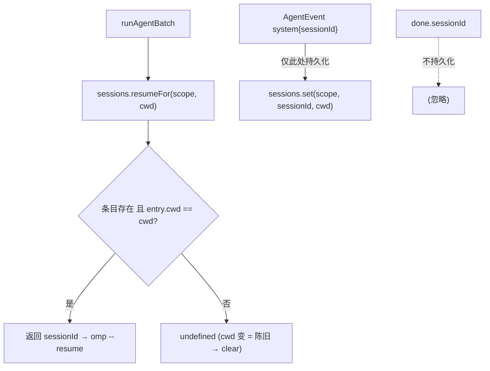
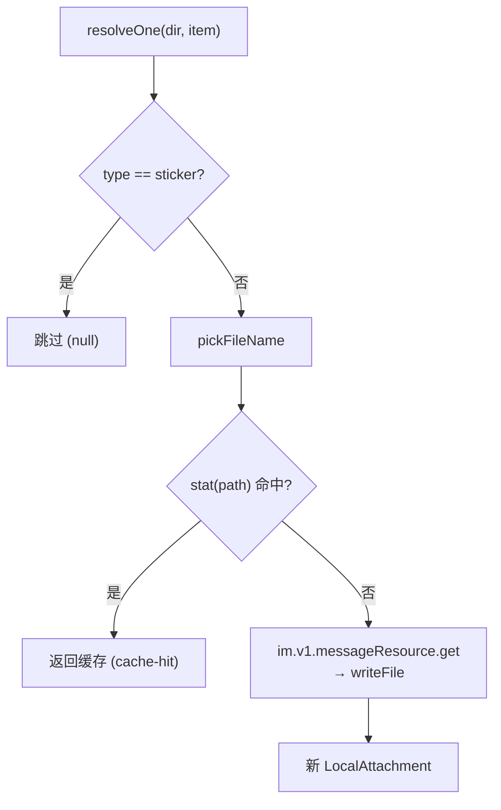

# 07 · 会话 / 工作空间 / 媒体

> 源码基线：commit `78460f6`（文档对应的源码 commit；详见 [README](./README.md)）。

> 覆盖范围：`session/store.ts`（`SessionEntry`、`sessions.json`、scope 键、`resumeFor` 的 cwd 匹配失效、idle-timeout 覆盖与 clamp、串行持久化）；`workspace/store.ts`（`workspaces.json` 的 chats/named、每 scope cwd + 命名别名）；`media/cache.ts`（磁盘布局、文件名清洗、`AttachmentKind`、sticker 跳过、stat 缓存命中、下载、`gcMediaCache`）。
>
> 源文件：`src/session/store.ts`、`src/workspace/store.ts`、`src/media/cache.ts`、`src/config/paths.ts`。

相关篇：[消息管线](./04-message-pipeline.md)（谁调用这些 store）、[聊天命令](./10-commands.md)（`/new`/`/cd`/`/ws`/`/timeout`）。

## 1. `SessionStore`（`src/session/store.ts`）

持久化到 `paths.sessionsFile`（`~/.feishu-omp-bridge/sessions.json`）。键是 **scope**（p2p/群为 chat_id，话题群为 `chatId:threadId`）。

```ts
interface SessionEntry { sessionId?; cwd?; updatedAt:number; idleTimeoutMinutes? }
```

- `sessionId` / `cwd` 可缺失（`/timeout` 可能在任何 run 记录 session 前就建了条目）；缺这对就不可 resume。
- `idleTimeoutMinutes`：per-scope idle-timeout 覆盖（分钟）。`0` = 该 scope 显式关闭，`undefined` = 跟随全局默认。

方法：

- `load()`：读 JSON，丢弃 `updatedAt` 非数字的条目；只保留“有完整 session 对（sessionId+cwd）”或“有 idleTimeoutMinutes 覆盖”的条目（resume 需完整对，否则 OMP resume 会失败）。
- `resumeFor(scope, cwd)`：条目存在且 `entry.cwd===cwd` 才返回 `sessionId`，否则 `undefined`（**cwd 变了即视为陈旧**——OMP 无法在不同 cwd 续 session）。
- `getRaw(scope)`：原始条目。
- `set(scope, sessionId, cwd)`：写 `{sessionId, cwd, updatedAt:now, idleTimeoutMinutes?(保留旧值)}`——idle 覆盖是 per-scope 偏好，跨 run 保留；`/new`（clear）才抹掉。
- `clear(scope)`：删条目。
- `getIdleTimeoutMinutes(scope)` / `setIdleTimeoutMinutes(scope, minutes)`（`clamp [0,120]`，`Math.floor`）/ `clearIdleTimeoutOverride(scope)`（删覆盖回落全局，返回是否删过）。
- `flush()` / `schedulePersist()`：串行化持久化（`this.saving = this.saving.then(写文件)`），写前 `mkdir` 父目录，写 `JSON.stringify(data, null, 2)`。

**关键不对称**（与 [04](./04-message-pipeline.md) 呼应）：session 仅在 `AgentEvent` 的 `system` 事件上由 `processAgentStream` 调 `sessions.set` 持久化；`done.sessionId` 不持久化。




## 2. `WorkspaceStore`（`src/workspace/store.ts`）

持久化到 `paths.workspacesFile`（`~/.feishu-omp-bridge/workspaces.json`）。

```ts
interface WorkspaceData { chats: Record<scope, {cwd}>; named: Record<name, cwd> }
```

- `cwdFor(scope)` / `setCwd(scope, cwd)`：每 scope 的工作目录（`/cd`、`/ws use`、`/new chat` 继承用）。
- `listNamed()` / `getNamed(name)` / `saveNamed(name, cwd)` / `removeNamed(name)`：命名工作空间别名（`/ws add`/`use`/`list`）。
- `load()` / `flush()` / `schedulePersist()`：同 SessionStore 的串行持久化。

`runAgentBatch` 里 `cwd = workspaces.cwdFor(scope) ?? homedir()`——未设则用 `$HOME`。

## 3. `MediaCache`（`src/media/cache.ts`）

构造时持有 `channel`。磁盘布局：`paths.mediaDir/<sanitized chatId>/<sanitized fileKey>[-name].<ext>`。

```ts
type AttachmentKind = 'image'|'file'|'audio'|'video';
interface LocalAttachment { path; kind:AttachmentKind; originalName? }
interface ResourceRequest { messageId; resource: ResourceDescriptor }
```

- `resolve(chatId, items)`：`mkdir` chat 目录，逐 item `resolveOne`，单 item 失败只记日志不中断，返回成功的 `LocalAttachment[]`。
- `resolveOne(dir, item)`：`sticker` 类型跳过（返回 null）；`kind = resource.type`；`pickFileName` 算文件名；先 `stat(path)` 命中即返回缓存（`cache-hit`）；否则 `im.v1.messageResource.get({params:{type}, path:{message_id, file_key}})` → `result.writeFile(path)`，返回新 `LocalAttachment`。（用 message-resource 端点而非 channel 的 `downloadResource`——后者只对 bot 自传文件有效。）
- `pickFileName(r)`：用完整 `fileKey`（清洗）+ 可选 `fileName`（`sanitize`，截 80）；无 fileName 时按 type 给扩展名（image→.png/audio→.ogg/video→.mp4/其它→.bin）。`sanitize`/`dirFor` 把非 `[a-zA-Z0-9._-]` 替成 `_`。
- `gcMediaCache(maxAgeMs)`（启动时以 24h 调用，见 [01](./01-overview-and-architecture.md)）：遍历各 chat 目录删 mtime 早于 cutoff 的文件，记 `media gc removed`。




在管线里：`runAgentBatch` 的 `attachments` 喂给 `buildPrompt` 的本地路径附录，`imagePaths`（`kind==='image'`）喂给 `agent.run` 的 `imagePaths`（OMP 转 image payload，见 [02](./02-agent-adapter-and-omp.md)）。

> 后端差异：OMP 在本机能直接读这些缓存路径，故附件以本地路径传递。远程后端需上传文件（见 [dify 配置/会话/访客](../dify-feishu-bridge-design/04-config-session-and-guest.md)）。`sessions.json`/`workspaces.json`/媒体缓存本身与后端无关，可整体复用——Dify 下 `SessionEntry.sessionId` 改装 Dify 的 `conversation_id`。
