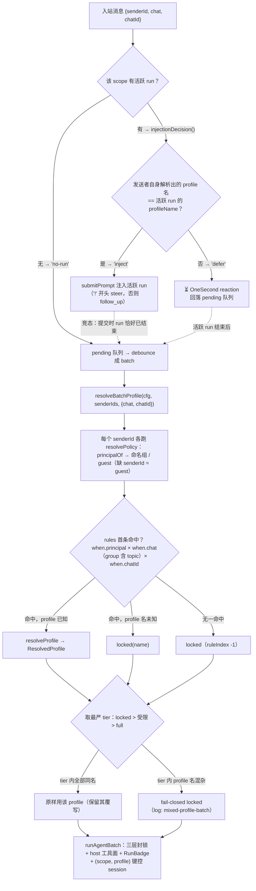
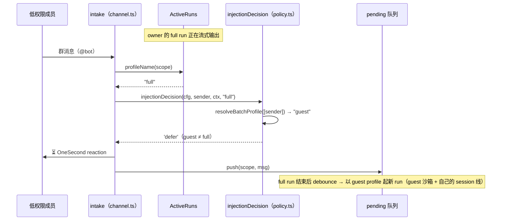
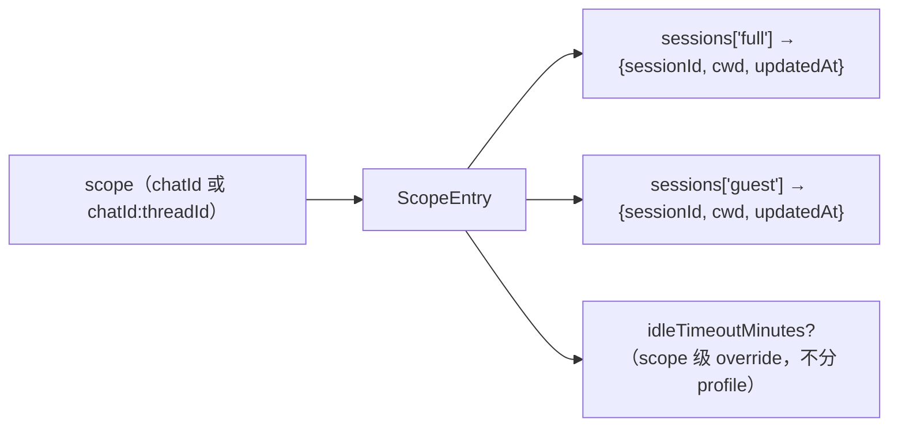
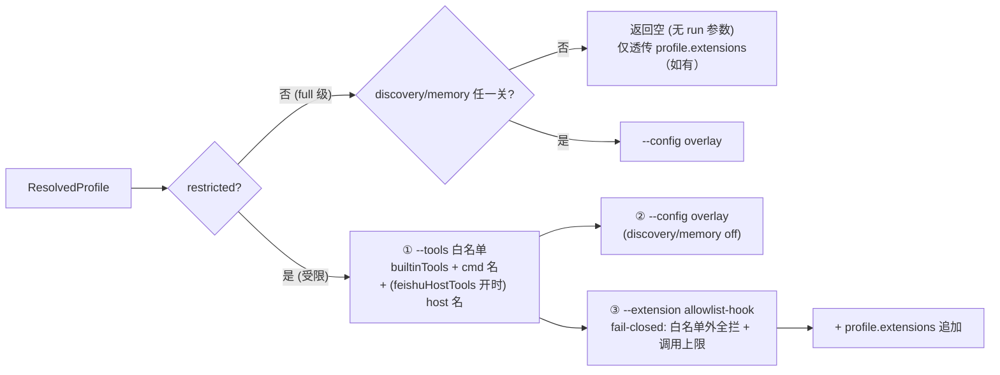

# 09 · 访问控制与统一策略（principals / profiles / rules）

> 源码基线：commit `33bcea3`（文档对应的源码 commit；详见 [README](./README.md)）。

> 覆盖范围：访问控制语义（allowedUsers/allowedChats/admins）；**统一策略模型**（`config/policy.ts` 的 principals×profiles×rules、`resolvePolicy`/`resolveBatchProfile`/`relayRunTarget`、`synthesizeLegacyPolicy` 向后兼容合成、fail-closed 默认）；**mid-run 注入门控**（`injectionDecision`）；**per-profile sessions**（`session/store.ts` 按 (scope, profile) 键控——权限边界的另一半）；**RunBadge 权限徽章**（卡片 header / markdown 顶行）；per-principal `relayScenarios` 场景级 relay 门控；profile 的应用（`runAgentBatch`、评论、卡片回调）；`guest-lockdown.ts` 的三层封锁、`buildProfileRunArgs`、按 profile 内容签名的产物目录；`command-tools.ts` 的 `buildCommandTools`。
>
> 源文件：`src/config/schema.ts`（access/policy 接口 + 旧 `guestPolicy` 访问器）、`src/config/policy.ts`（统一解析器与合成）、`src/bot/channel.ts`（`runAgentBatch` 应用 profile、`submitToActiveRun` 门控）、`src/bot/active-runs.ts`（`RunHandle.profileName`）、`src/bot/reaction.ts`（⏳ deferred reaction）、`src/session/store.ts`（per-profile sessions）、`src/card/run-state.ts` / `run-renderer.ts` / `text-renderer.ts`（RunBadge 渲染）、`src/bot/comments.ts`、`src/card/dispatcher.ts`、`src/bot/guest-lockdown.ts`、`src/bot/command-tools.ts`、`src/bot/feishu-host.ts`（host 工具名）。

相关篇：[消息管线](./04-message-pipeline.md)、[飞书 host 工具面](./06-feishu-host-surface.md)、[配置与密钥](./08-config-and-secrets.md)、[聊天命令](./10-commands.md)、[飞书传输/中继](./03-feishu-transport.md)、[会话/工作区/媒体](./07-sessions-workspaces-media.md)。

## 1. 访问控制语义（`AppAccess`）

`preferences.access { allowedUsers?; allowedChats?; admins? }`，三个列表空/未设 = 不限制（向后兼容）：

- `isUserAllowed(cfg, senderId)`：`allowedUsers` 空 → 允许所有；否则需在列表内。intake 与 cardAction 都查。
- `isChatAllowed(cfg, chatId)`：`allowedChats` 空 → 所有 chat；否则需在列表内。**仅作群门控**——p2p chat_id 按用户对生成、不可冒用，DM 由用户 allowlist 把关。
- `isAdmin(cfg, senderId)`：`admins` 空 → 所有允许用户都是 admin；否则需在列表内。门控敏感命令（见 [10](./10-commands.md)）。

> 注意 `admins` 的**不对称语义**：空 admins 对命令门控 = “人人是 admin”，但对旧 guest/relay 回落 = “无信任用户”。统一策略模型把“谁可信”收敛到 `policy.principals` 一处，消除这种回落链歧义。

访问控制是 profile/run 之外的**正交粗门控**（先决定“能不能进来”），保持不变；扫码向导仍把首个扫码者写进 `admins`（见 [03](./03-feishu-transport.md)）。

## 2. 统一策略模型（`config/policy.ts`）

三条正交、命名的轴，对每条入站事件解析出“用什么工具模式”和“在哪端跑”：

```ts
interface PolicyConfig {
  principals?: Record<string, string[] | PrincipalConfig>;
  profiles?: Record<string, ProfileConfig>;
  rules?: { when?: { chat?; principal?; chatId? }; profile: string }[];
}
interface PrincipalConfig {
  users: string[];
  run?: 'front' | 'worker';       // 该组的 run 在哪端跑（默认 front）
  relayScenarios?: PolicyScenario[]; // run='worker' 时限制哪些场景 relay（缺省=全部）
}
interface ProfileConfig {
  tools?: 'all' | string[];      // 'all'/省略 = 全开不沙箱；string[] = 受限（钉死内置工具）
  commandTools?: CommandToolConfig[];
  feishuHostTools?: boolean;      // 默认：full=true，受限=false
  maxToolCalls?: number;         // 每 run 总调用上限（受限才有 hook 强制）
  systemPrompt?: string;         // 前置到 user prompt
  discovery?: 'on' | 'off';      // 默认：full=on，受限=off
  memory?:    'on' | 'off';      // 默认：full=on，受限=off
  extensions?: string[];         // 自定义 OMP 扩展 .mjs hook 路径（--extension），各 profile 一组
}
```

- **WHO `principals`**：命名 open_id 组。未列入任何组者 = 隐式 `guest`（保留名），其 `run` 恒 `front`（陌生人永不转发到 worker）。`principalOf(policy, senderId)` 返回首个含该 id 的组名，否则 `guest`。简写 `string[]` 形式经 `normalizePrincipal` 归一为 `{ users, run: 'front' }`。
- **WHAT `profiles`**：命名工具模式。内置 `full`（全开、无沙箱、feishu host tools 开、discovery/memory 开）与 `locked`（零工具、全关、fail-closed）恒存在。`resolveProfile(name, profiles)` 把名字解析成完全填默认的 `ResolvedProfile`；**未知 profile 名 → `locked(<name>)`**（不静默放行，`log.warn('policy','unknown-profile')`）。
- **WHEN `rules`**：首条命中（first-match）。`matchRule` 逐条匹配 `when.principal`（含 `guest`）、`when.chat`（p2p/group/topic，其中 `group` 也匹配 `topic`；scenario 未知时带 `chat` 约束的 rule 不命中）、`when.chatId`。
- **WHERE `run`（front/worker）**：**principal 级**属性（不是 per-rule）。`relayRunTarget(cfg, senderId, scenario?)` = 非 worker principal（含 guest）恒 `front`；worker principal 还要过 `relayScenarios` 场景门控（见 [§2.5](#25-relayscenarios按场景的-relay-门控)）才返回 `worker`。设计成 per-person 而非 per-rule：保证某人点击的交互卡片回调落在渲染它的同一端，否则会错投（卡片在 front 渲染却把回调转发到 worker）。

`resolvePolicy(cfg, {senderId, chat, chatId})` → `{ principal, run, profile, ruleIndex }`。无 rule 命中 → fail-closed `locked`（`ruleIndex: -1`）。

完整的权限决策路径（含 mid-run 门控与批次“最严者胜”）：



### 2.1 批次解析与“最严者胜”

一次 debounce run 的 batch 可能含多发送者（群）。`resolveBatchProfile(cfg, senderIds, {chat, chatId})` 取**最严 tier**（`rank`：locked=2 > 受限=1 > full=0）：

- 该 tier 内所有发送者解析到**同一** profile 名 → 原样用（保留其覆写，含自定义 `extensions` 限制器）。
- 同一最严 tier 内 profile 名**混杂** → 一律 fail-closed `locked`（`log.warn('policy','mixed-profile-batch')`）。**即便都是 full 级也如此**——两个不同的 full 级 profile 可能各带不同的 `extensions` 限制器 hook，静默丢掉一方的限制器、或让一方以另一方的权限运行，都不可接受。
- 缺 senderId 当 `guest`（fail-closed）；senderIds 为空数组时按 `[undefined]` 处理（同样落 guest）。

这复刻并强化了旧的“p2p 且全员可信才全开，否则沙箱”规则。

### 2.2 向后兼容：从旧字段合成

未设 `policy` 时，`effectivePolicy(cfg)` 调 `synthesizeLegacyPolicy(cfg)` 用旧 `access`/`guestPolicy`/`relay.route` 合成等价策略：

- **无 `guestPolicy`**：人人 `full`；`relayTrustedUsers`（`relay.route.users` → 回落 unrestricted → admins）合成一个 `run:'worker'` 的 `relay` principal。
- **有 `guestPolicy`**：合成 `guest` profile（`tools=extraToolAllowlist`、`commandTools`、`feishuHostTools`、`maxToolCalls`、`systemPrompt`、discovery/memory off）。按 full 集（`unrestrictedUsers ?? admins`）与 relay 集忠实拆出 `full_worker`/`full_front`/`relay_only` principals（让 `relay.route.users` 即便仍被沙箱也照常赢得路由）。rules：`{chat:p2p, principal:全权组}→full`，末条 `{profile:'guest'}` 兜底（群/话题、非可信 p2p 全进沙箱）。

故行为与改造前逐位一致；旧 `getGuestPolicy`/`isUnrestrictedUser`/`relayTrustedUsers` 等访问器仍在（作为合成器读的旧字段访问器与测试用）。

### 2.3 显式策略 = fail-closed

一旦设了 `policy`，它是权威：未命中任何 rule 或指向未知 profile → `locked`（零工具），**绝不**回落全集。这与项目“宁锁勿漏”的访客沙箱哲学一致——避免“假锁”（见 [配置](./08-config-and-secrets.md)）。

### 2.4 mid-run 注入门控（`injectionDecision`）

**为什么需要**：pre-run 的批次解析（§2.1）只覆盖 debounce 队列里的消息。但流式期间到达的消息走的是另一条路——`channel.ts` 的 `submitToActiveRun` 把它作为 follow_up/steer **直接注入活跃 run**，旧实现这里没有任何权限检查。这就是**群聊提权漏洞**：owner 的 `full` run 正在流式输出时，群里任何低权限成员发一条消息就能“搭便车”——他的输入在 `full` 的工具集（bash/文件/MCP 全开）下执行，绕过了批次的“最严者赢”。

**语义**（`policy.ts` 的 `injectionDecision(cfg, senderId, ctx, activeProfileName)` → `'no-run' | 'inject' | 'defer'`）：

- `activeProfileName === undefined`（该 scope 无活跃 run）→ `'no-run'`。
- 否则对该单一发送者跑 `resolveBatchProfile(cfg, [senderId], ctx)`（复用批次解析器，含 fail-closed 语义），所得 profile 名与活跃 run 的 **profile 名相同** → `'inject'`，否则 → `'defer'`。判据是**同名**而非“不更严”——不同名即不同工具集/限制器，任何方向的混用都是越权（full 发送者注入受限 run 同样被拒，避免身份混淆）。

`activeProfileName` 来自 `active-runs.ts`：`activeRuns.register(scope, run, profileName)` 在 run 注册时把 profile 名快照进 `RunHandle.profileName`，`activeRuns.profileName(scope)` 供门控查询（连 `/doctor` 的诊断 run 也以 `'full'` 注册——它本就是 admin-only 的无限制运行）。

`channel.ts` 的 `submitToActiveRun` 消费三态：

- `'inject'`：构建 prompt（含附件/引用），`'!'` 开头 → `steer`，否则 `follow_up`，经 `activeRuns.submitPrompt` 注入。若门控与提交之间 run 恰好结束（竞态，`submitPrompt` 返回 false），按 `'no-run'` 处理——回落 pending 队列，**不丢消息**。
- `'defer'`：给消息打 ⏳（`REACTION_DEFERRED = 'OneSecond'`，`reaction.ts` 的通用 `addReaction`）作为非刷屏的“已收到，稍后答复”确认，然后回落 pending 队列——活跃 run 结束后 debounce 出新批次，**以发送者自身的 profile** 起新 run。
- `'no-run'`：正常入 pending 队列走 debounce。



### 2.5 `relayScenarios`：按场景的 relay 门控

`schema.ts` 的 `PrincipalConfig.relayScenarios?: PolicyScenario[]`——`run === 'worker'` 时限制**哪些聊天场景**才 relay 到 worker（缺省 = 全部）。典型用法 `['p2p']`：本人私聊去 worker（自己的笔记本），群/话题活动留在常驻 front。`policy.ts` 侧：

- `normalizeScenarios`：过滤非法项并去重；**字段缺席返回 `undefined`（= 不限制），显式数组滤空后保持 `[]`（= 什么都不 relay）**，二者语义不同。
- `scenarioMatches(allowed, scenario)`：`'group'` 允许项**亦覆盖 `'topic'`**；scenario 未知（如云文档评论传 `undefined`）**永不满足**显式限制 → 留在 front。
- `relayRunTarget(cfg, senderId, scenario?)`：非 worker principal → `'front'`；worker principal 且设了 `relayScenarios` 但 scenario 不匹配 → `'front'`；否则 `'worker'`。`run:'front'` 时该字段被忽略。

卡片回调与评论经**同一门控**（`route.ts` 的 `routeCardAction` 经 `resolveScenario` 查 chat_mode 后传 scenario、comment 恒传 `undefined`），保证回调落在渲染卡片的一侧。路由细节（`routeMessage` 的 scenario 推导、`ChatModeCache`）见 [03](./03-feishu-transport.md)。

## 3. profile 的应用点

profile 在**任何 agent 从某发送者起跑处**生效，使策略真正权威（而非又一层假锁）：

- **消息**（`runAgentBatch`，`channel.ts`）：`resolveBatchProfile(cfg, batch.map(senderId), {chat: mode, chatId})`。host 工具面对**所有** profile 都随 profile 走：`feishuHostTools` 开才加飞书 host tools（连带 `feishu://` scheme），加上 profile 的 command tools；`buildProfileRunArgs(profile)` 仅对受限 profile 出 `--tools`+hook，并在 discovery/memory 任一关时出 overlay（故 `full` profile 的这些旋钮也不会被静默忽略）。`profile.systemPrompt` 前置到 prompt。session 恢复按 `(scope, profile.name)` 键控（见 [§4](#4-per-profile-sessions权限边界的另一半sessionstorets)），run 注册时携带 `profile.name`（供 §2.4 门控），group/topic 还快照 RunBadge（见 [§5](#5-runbadge权限徽章)）。
- **卡片回调**（`card/dispatcher.ts` `forwardToAgent`）：合成消息回灌 `pending` → 走 `runAgentBatch`。合成消息 `chatType` 用真实 `mode`（`group|topic→'group'`，否则 `'p2p'`），避免群里点卡片被当 p2p 拿到更宽 profile。
- **云文档评论**（`comments.ts`）：评论是**共享面**，按 `chat:'group'` 解析评论者 profile 并应用 command tools/沙箱参数/系统提示——堵上了“非可信者评论可跑全工具”的旧绕过（旧实现直接 `agent.run` 无沙箱）。评论无飞书 host 集成，只暴露 command tools。session 同样按 `(synthChatId, profile.name)` 存取（`sessions.resumeFor` / `sessions.set` 均带 profile 名），受限评论者不会 resume 同一文档上 full 层级的会话。无沙箱配置时仍是全工具（旧行为）。

## 4. per-profile sessions：权限边界的另一半（`session/store.ts`）

工具封锁（§6）只管“这次 run 能调什么”；**上下文泄露**是另一半：若受限 run 能 `--resume` full run 留下的 OMP session，它就继承了 full 对话里的全部上下文（读过的文件内容、密钥讨论……）。所以 session 按 **(scope, profile)** 键控，各 tier 各自成线：



- 持久化结构：嵌套 `ScopeEntry { sessions: Record<profileName, ProfileSession{sessionId, cwd, updatedAt}>, idleTimeoutMinutes?, updatedAt }`（`sessions.json`）。
- `resumeFor(scope, cwd, profile)`：profile、cwd **任一不匹配即 fresh**（cwd 钉死是因为 OMP 只能在创建 session 的 cwd 里 resume 它）。受限 run 永不 resume `full` 线程的上下文；反过来 full 也不 resume 受限线程——各 tier 各自延续自己的对话。
- `set(scope, sessionId, cwd, profile)`：只覆写该 profile 的槽位，**保留兄弟 profile 的会话与 idle override**。
- `clear(scope)` vs `clearProfile(scope, profile)`：前者清整个 scope（`/new`、`/cd`、`/ws` 用——“这个聊天重新开始”应抹掉**所有** tier 的线程）；后者只清一个 tier（`runAgentBatch` 的 resume-miss 自愈用：某 tier 的 session 过期失效时自我修复，不殃及兄弟 profile 的会话与 idle override）。
- `latestSession(scope)`：跨 profile 取最近更新的 session（`/status` 卡片显示用，见 [10](./10-commands.md)）。旧的 `getRaw` 已删除。
- `migrateEntry`：容忍旧扁平结构 `{sessionId, cwd, updatedAt, idleTimeoutMinutes?}`——**扁平 session 直接丢弃**（其创建 profile 未知，猜错 profile resume 会泄露上下文，fail-safe 宁丢勿漏），仅保留裸 `idleTimeoutMinutes` override；两者皆无则整条丢弃。

消费方：`channel.ts`（`sessions.resumeFor(scope, cwd, profile.name)` / `sessions.set(scope, sessionId, cwd, profileName)`，resume-miss 自愈走 `clearProfile`）与 `comments.ts`（同一套，scope 为 `doc:<fileToken>`）。scope 本身的构成（thread_id 隔离）见 [07](./07-sessions-workspaces-media.md)。

## 5. RunBadge：权限徽章

群/话题是共享空间：旁观者应能看出“当前这条对话在什么权限下跑、是谁起的”——也解释了为什么某人的 mid-run 消息被 ⏳ 推迟。`card/run-state.ts` 的 `RunBadge { profileName; restricted; owner? }`：

- **run 启动时快照**（`channel.ts`：`{ profileName: profile.name, restricted: profile.restricted, owner: firstMsg.senderName }`，owner 是批次首条消息的发送者显示名），seed 进初始 `RunState.badge`，之后**绝不做实时 cfg 查询**——防止流式中途 `/config` 改动把 run 错标成它并不实际持有的权限。
- **仅 group/topic**；p2p 单方对话 `badge` 为 `undefined` → 卡片无 header、markdown 无顶行。
- **卡片模式**（`run-renderer.ts` `badgeHeader()`）：彩色 header，`title` 为 `图标 + label`，`subtitle` 为 `@owner`（owner 缺席则无 subtitle）。
- **markdown / text 模式**（`text-renderer.ts` `badgeLine()`）：`renderText` 输出的顶行徽章，如 `🔒 **guest（受限）** · @张三`——markdown 无颜色，信任级别由图标承载。markdown 是**默认回复模式**，text 模式的最终 post 同样经 `renderText` 带此行。

判定与映射（两个渲染器共用同一套判定：`locked` = 名字为 `'locked'` 或以 `'locked('` 为前缀）：

| 信任级别 | 判定 | 图标 | 卡片 header 颜色 | label |
|---|---|---|---|---|
| 无限制（full 或自定义 full 级） | `restricted === false` | 🔓 | `green` | profile 名原样 |
| 受限沙箱 | `restricted` 且非 locked | 🔒 | `grey` | `<名>（受限）` |
| fail-closed | 名为 `locked` / `locked(<name>)` | ⛔ | `red` | profile 名原样（无“受限”后缀） |

## 6. 三层封锁（`guest-lockdown.ts`）

`buildProfileRunArgs(profile)` 返回 `GuestRunArgs { tools?; configOverlayPaths; extensionPaths }`，对应 `agent.run` 同名选项。仅受限 profile 出 `--tools`/hook；overlay 按需出；纯 `full` profile 返回空。



1. **`--tools <allowlist>`**（受限才出）：去掉内置工具。`allowlist = builtinTools(=profile.tools) + command tool 名 + （feishuHostTools 开时）飞书 host 工具名`。空则用非空哨兵 `__bridge_no_builtins__`（OMP 把未知名当“什么都不放行”，空 `--tools` 会回落全集）。
   - **修正**：飞书 host 工具名现在**计入** allowlist（来自 `feishu-host.ts` 导出的 `FEISHU_HOST_TOOL_NAMES`），否则 hook 会把刚注册的 host 工具一并拦掉（旧 `getGuestToolAllowlist` 漏了这点）。
2. **`--config <overlay>`**（discovery 或 memory 任一关时出）：`profileOverlayYaml(discovery, memory)`——discovery 关则 `tools.discoveryMode: off` + 列 `disabledProviders`（native/claude/codex/gemini/github/opencode/cursor/agents-md，防继承 operator 个人 MCP 如可任意执行代码的 `node_repl`）；memory 关则 `memory.backend: "off"`（既不能读也不能毒化 operator 记忆库，并禁 retain/recall/reflect）。两者都开 → 返回 `''`，不出 overlay。
3. **`--extension <hook>`**（受限才出）：`profileHookSource(allowlist, limits)` 一个 fail-closed 的 `tool_call` hook——硬拦不在白名单的**一切**工具，并施加每 run 总上限 `MAX_TOTAL` 与每工具上限 `PER_TOOL`。这是真正的执行边界；(1)(2) 只缩小暴露面。
   - **自定义 hook**：`profile.extensions`（在 `policy.ts` 解析：`~`→home、相对→`paths.appDir`、绝对原样）被**追加**到 `extensionPaths`，与自动 hook 叠加（受限）或单独生效（`full`）。`buildProfileRunArgs` 对缺失文件 `log.warn('policy','extension-missing')` 但仍透传——限制器缺失要让 run 失败、不静默消失。仅纯 `full`（无 overlay/hook/extensions）返回空、不写产物。

产物写在 `paths.guestDir/<sig>/`（`<sig>` = `{allowlist, overlay, hook}` 的 sha1 前 12 位），`ensureArtifacts` 幂等 `writeIfChanged` 并按 sig 缓存——**按 profile 内容分目录**，故多个并发 profile 互不覆盖。

> profile 系统提示**前置**到 user prompt，不经 `--append-system-prompt`（给 codex/gpt-5.5 追加系统块会偶发卡死无回复）。改 `policy`/`guestPolicy` 后需整进程 `restart`。

## 7. command tools（`command-tools.ts`）

`buildCommandTools(configs, defaultCwd)` 把每个 `CommandToolConfig` 变成一个 host tool（`normalizeCommandTools` 已校验 name `^[a-zA-Z0-9_]+$`、非空 command、去重、填超时/输出默认；该校验现由 `schema.ts` 导出、profile 解析器复用）：

- 模型只能传 `args: string[]`（argv tokens），`spawn(command, [...args...], { shell:false, cwd })`——**不经 shell**，无法注入管道/重定向/通配/命令拼接，只能跑 `<command> [fixedArgs] [args] [appendArgs]`。
- `allowedSubcommands` 非空时校验 `userArgs[0]` 在集合内。
- `runCommand`：捕获 stdout/stderr，超 `maxBytes`/`timeoutMs` SIGKILL；`isError = timedOut || code!==0`。

这是受限发送者唯一的执行逃生口：raw bash/eval/MCP/文件工具都被去掉，只剩白名单 CLI（如 zendesk_kg/zendesk_docs）。

## 8. 本地回归

`pnpm test`：`config/policy.test.ts`（合成、显式策略、fail-closed、scenario 匹配、batch 最严者胜、混杂 profile→locked、**injectionDecision mid-run 门控**——同 profile 注入 / 低权限并入 full 被 defer / full 并入受限同样被 defer / 同 tier guest 互相可注入）、`session/store.test.ts`（per-(scope, profile) 键控、`clear` vs `clearProfile`、`latestSession`、旧扁平结构迁移丢弃）、`card/run-renderer.test.ts` / `card/text-renderer.test.ts`（badge header/顶行：🔓 green、🔒 grey+受限后缀、⛔ red、p2p 无 badge）、`config/store.test.ts`（YAML 读写往返）、`bot/guest-lockdown.test.ts`（overlay/hook 生成）。

`pnpm test:guest`（`bun scripts/test-guest.ts`，加 `--model` 跑真实模型越权测试）对**真实配置**验证：信任用户全开 / 陌生人进沙箱、危险内置被移除、command tool 注入、shell 注入被挡、白名单外子命令被拒。

## 9. 后端差异

OMP 的 `--tools`/`--config`/hook 封锁依赖“工具在本机、由 CLI 跑”。远程后端（Dify）工具在服务端、无法这样封锁——`dify-feishu-bridge` 改用**访客应用路由**（operator 用 `dify.apiKey`、访客用锁死的 `dify.guestApiKey`），保留信任/systemPrompt 概念，丢弃 `commandTools`/host tools。详见 [dify 配置/会话/访客](../dify-feishu-bridge-design/04-config-session-and-guest.md)。
