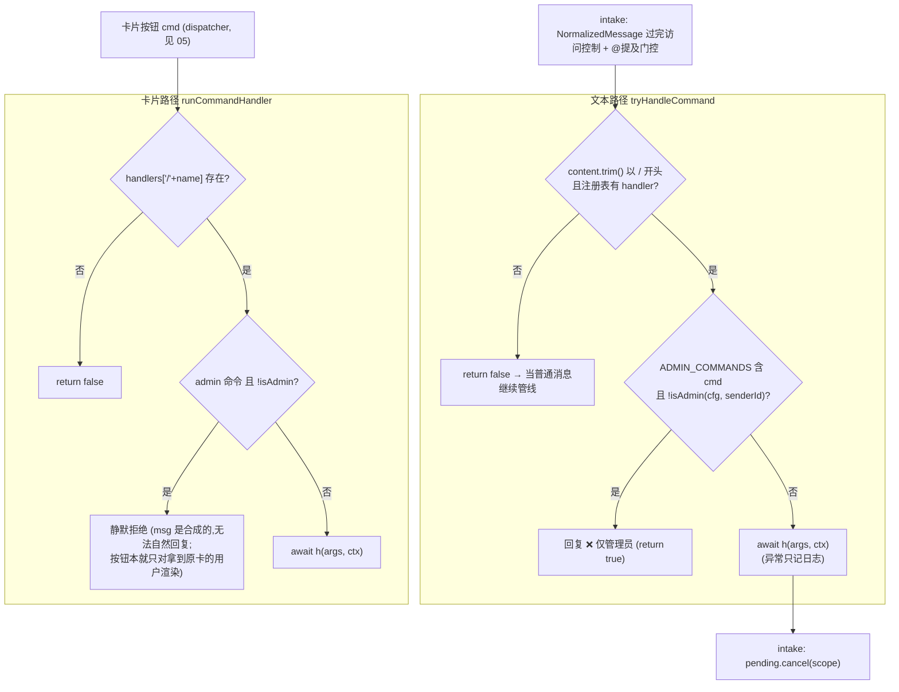
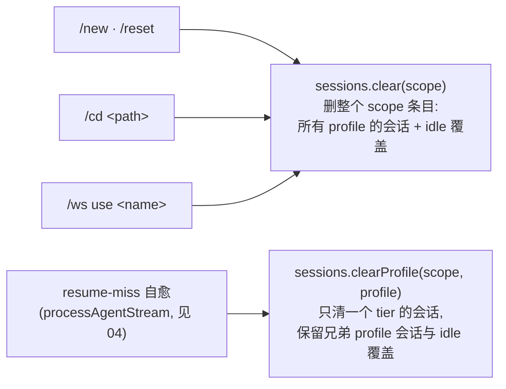
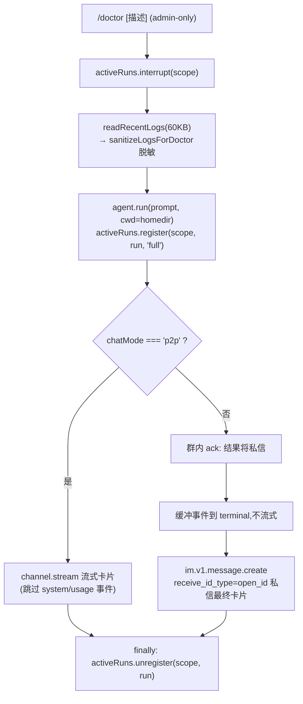
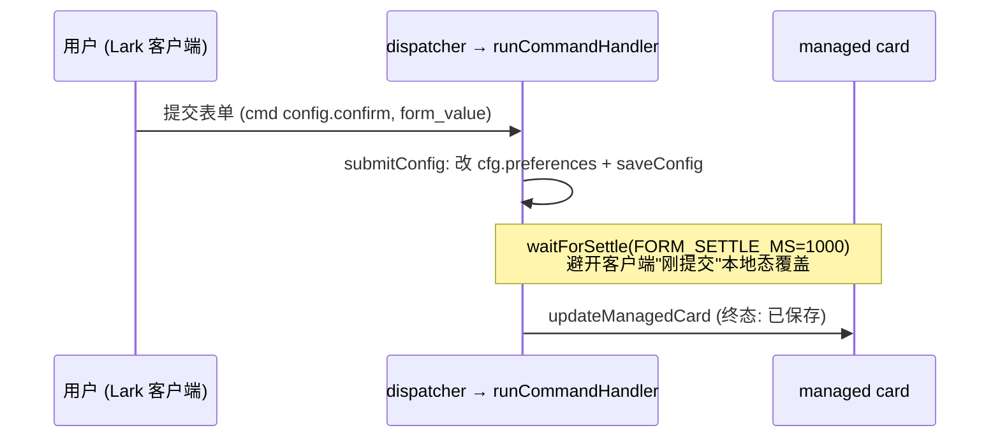

# 10 · 聊天命令

> 源码基线：commit `33bcea3`（文档对应的源码 commit；详见 [README](./README.md)）。

> 覆盖范围：聊天内命令分发器（handler 注册表、`ADMIN_COMMANDS` + `isAdmin` 门控、`tryHandleCommand` 文本路径 vs `runCommandHandler` 卡片路径）；逐命令行为 + 触及子系统 + 渲染的卡片；相关卡片模板。
>
> 源文件：`src/commands/index.ts`、`src/card/config-card.ts`、`src/card/switch-card.ts`、`src/card/account-cards.ts`、`src/card/templates.ts`、`README.md`（命令表）。

相关篇：[消息管线](./04-message-pipeline.md)（命令在 intake 的位置）、[流式与卡片](./05-streaming-and-cards.md)（卡片回调）、[会话/工作空间/媒体](./07-sessions-workspaces-media.md)、[配置与密钥](./08-config-and-secrets.md)、[守护进程与 CLI 运行时](./11-daemon-cli-runtime.md)。

## 1. 注册表与分发

`handlers: Record<string, Handler>`（`src/commands/index.ts`）：`/new`、`/reset`（→ `handleNew`）、`/cd`、`/ws`、`/status`、`/help`、`/account`、`/config`、`/switch`、`/stop`、`/timeout`、`/ps`、`/exit`、`/doctor`、`/reconnect`。

`ADMIN_COMMANDS`（需管理员）：`/account`、`/config`、`/exit`、`/reconnect`、`/doctor`、`/cd`、`/ws`、`/switch`。`isAdminCommand(cmd)` 归一化 `/` 前缀后查集合。按用途分类：

| 类别 | 所有放行用户可用 | 仅管理员 |
| --- | --- | --- |
| 会话 / 工作空间 | `/new` `/reset` `/status` `/timeout` | `/cd` `/ws` |
| 运行 / 进程 | `/stop` `/ps` | `/exit` `/reconnect` |
| 诊断 / 配置表单 | — | `/doctor` `/config` `/switch` `/account` |
| 帮助 | `/help` | — |

- **`tryHandleCommand(ctx)`（文本路径）**：`msg.content.trim()` 不以 `/` 开头返回 false；拆 `cmd`/`args`；无对应 handler 返回 false；admin 命令但 `!isAdmin(cfg, senderId)` → 回复“❌ 此命令仅管理员可用。”返回 true；否则 `await h(args, ctx)`（异常只记日志），返回 true。被 intake 调用，处理则 `pending.cancel(scope)`（见 [04](./04-message-pipeline.md)）。
- **`runCommandHandler(name, args, ctx)`（卡片路径）**：从卡片按钮 `cmd` 触发（见 [05](./05-streaming-and-cards.md) dispatcher）。同样的 admin 门控，但卡片合成的 msg 无法自然回复，故 admin 拒绝时静默（按钮本就只对拿到原卡的用户渲染）。

`CommandContext` 携带 `channel`/`msg`/`scope`/`chatMode`/`sessions`/`workspaces`/`agent`/`activeRuns`/`controls`/`formValue?`/`fromCardAction?`。`scope` 由 intake 的 `scopeForMessage(msg)`（`src/bot/scope.ts`）解出——消息带 `thread_id` 即 `${chatId}:${threadId}`，与 chat_mode 无关（开话题的普通群也线程隔离，见 [04](./04-message-pipeline.md)）；所有 handler 的 session / workspace / activeRuns 操作一律走 `scope`，不直接用 `msg.chatId`。`Controls` 携带 `restart()`/`exit()`/`configPath`/`cfg`（快照，按引用共享，故 `/config`/`/switch` 就地改 `cfg.preferences` 即下条消息生效）/`processId`。`reply(ctx, md)` 是吞错的 markdown 回复。

## 2. 逐命令

| 命令 | 行为 | 触及子系统 | 卡片 |
| --- | --- | --- | --- |
| `/new`、`/reset` | `activeRuns.interrupt(scope)` + `sessions.clear(scope)`——删除**整个 scope 条目**：该 scope 下所有 profile 的会话 + `/timeout` 覆盖（session store 现按 (scope, profile) 嵌套存储，见 [07](./07-sessions-workspaces-media.md)），下条消息新建会话。 | active-runs、session | 纯文本回复 |
| `/new chat [name]` | `createBoundChat`（需 `im:chat`）建私有群拉发送者进去，继承当前 cwd（`workspaces.setCwd(newChatId, sourceCwd)`），新群里发欢迎语。 | group、workspace | 纯文本回复 |
| `/cd <path>` | 校验绝对路径/`~`、`stat` 是目录；`activeRuns.interrupt` + `workspaces.setCwd(scope, abs)` + `sessions.clear`（cwd 变即重置该 scope 全部 profile 的 session）。 | workspace、session | 纯文本回复 |
| `/ws list`（或裸 `/ws`） | 列命名工作空间 + 当前 cwd。 | workspace | `workspacesCard` |
| `/ws save <name>` | 把当前 cwd 存为命名别名（无 cwd 提示先 `/cd`）。 | workspace | 纯文本回复 |
| `/ws use <name>` | `interrupt` + `setCwd(命名 cwd)` + `clear` session（同 `/new`，清全 scope）。 | workspace、session | 纯文本回复 |
| `/ws remove\|rm <name>` | 删命名别名。 | workspace | 纯文本回复 |
| `/status` | 显示 scope、chatMode、cwd、session、agent 名（`ctx.agent.displayName`）。session 取 `sessions.latestSession(scope)`——跨 profile 取该 scope 下**最近更新**的一条（返回 `{sessionId, cwd, profile}`；卡片只渲染 sessionId 前 8 位，profile 不上卡），`sessionStale = sess.cwd !== cwd` 时标 “⚠️ 旧 cwd，下一条会新建”。 | session、workspace | `statusCard` |
| `/stop` | `activeRuns.interrupt(scope)`，不回复（运行中的卡会自渲染 `⏹ 已被中断`）。 | active-runs | 卡片自渲染（见 [05](./05-streaming-and-cards.md)） |
| `/timeout [N\|off\|default]` | 裸：显示当前 scope 探活 + 全局默认 + 用法；`N`(1-120)：`sessions.setIdleTimeoutMinutes`；`off`/`0`：设 0；`default`：`clearIdleTimeoutOverride` 回退全局。 | session | 纯文本回复 |
| `/ps` | `readAndPrune()` 列本机 bridge 进程，标记当前回复进程（`← 当前正在回复`）。 | runtime/registry | markdown 表 |
| `/exit <id\|#>` | `resolveTarget`：目标是自己 → `controls.exit()`（优雅断开+退出）；他者 → `process.kill(pid,'SIGTERM')` 并复查存活。 | runtime/registry、controls | 纯文本回复 |
| `/reconnect` | `controls.restart()`（连后断的热重连；不重建 OMP adapter）。 | controls | 纯文本回复 |
| `/doctor [描述]` | `interrupt` 当前 run，`readRecentLogs({maxBytes:60000})` → `sanitizeLogsForDoctor` 脱敏 → 喂 `agent.run`（cwd=homedir，session-less）。run 以 `activeRuns.register(ctx.scope, run, 'full')` 注册——`/doctor` 是 admin-only 的无限制运行，profile 快照标 `'full'`（mid-run 注入门控 `injectionDecision` 按此比对，见 [04](./04-message-pipeline.md)）。事件循环跳过 `system`（不把 doctor 的 sessionId 持久化到用户真实 session 上）与 `usage`（只记 cost 日志）。p2p 流式卡片；群/话题先 ack，结果**私信**发给操作者 open_id。 | logger、agent、active-runs | 流式卡片 / 私信卡片 |
| `/help` | 显示帮助卡片。 | — | `helpCard` |
| `/config` | 打开偏好表单；提交（`submitConfig`）就地改 `cfg.preferences` + `saveConfig`，下条消息生效。两道自锁护栏：非空 `admins` 不含提交者本人、或（非 p2p 时）非空 `allowedChats` 不含当前 chat_id，都拒绝提交并说明原因。 | config store、schema | `configFormCard`/`configSavedCard`/`configCancelledCard` |
| `/switch` | OMP 模型选择器：下拉列角色绑定模型（`default` 标“· 默认”，已认证 provider 标 ✅）+ 可输入任意模型名；提交（`submitSwitch`）写 `preferences.ompModel`（选默认则删 `ompModel`/`codexModel`）+ `saveConfig`，立即全局生效。 | model-catalog、config store | `switchModelFormCard`/`switchModelSavedCard`/`switchModelCancelledCard` |
| `/account` | 更换 bot app 凭据：表单输入 App ID/Secret/tenant，`validateAppCredentials` 校验，`buildEncryptedAccountConfig` 加密落盘 + `setSecret` keystore，成功卡展示 1.5s 后 `controls.restart()` 用新凭据重连。取消 = 直接撤回表单卡（无“已取消”卡）。 | feishu-auth、keystore、config store、controls | `accountCurrentCard`/`accountFormCard`/`accountSuccessCard`/`accountFailureCard` |

命令触发的 session 清理粒度（对照 `src/session/store.ts` 的两把刀，见 [07](./07-sessions-workspaces-media.md)）：

`/doctor` 的两条出口路径：

## 3. 表单卡片机制

`/config`、`/switch`、`/account` 都用托管卡片（`sendManagedCard`/`updateManagedCard`，见 [05](./05-streaming-and-cards.md)）+ CardKit 2.0 表单。提交从卡片按钮回调（`cmd: 'config.confirm'` 等）经 dispatcher → `runCommandHandler` → 对应 `submit*`，`formValue` 携带输入值。

注意 `FORM_SETTLE_MS=1000`：Lark 客户端在表单提交后短窗口内持有“刚提交”的本地态会覆盖我们的 `cardkit.card.update`，故终态翻转前都至少等这么久。`submitAccount`/`submitConfig`/`submitSwitch` 都用 `void (async()=>{...})()` 解耦（cardAction handler pending 期间客户端锁着表单，必须先返回让锁释放），先 `waitForSettle` 再 update；`cancelConfig`/`cancelSwitch` 同样先等 `FORM_SETTLE_MS` 再翻“已取消”卡。另外 `submitSwitch` 在纯文本 `/switch confirm`（无 `fromCardAction`）时不重置模型，而是重开选择器。

## 4. 卡片模板（`src/card/templates.ts`）

`button`/`divMd`/`actions`/`HR`/`shell` 基础件 + `escapeMd`/`escapeCode`。导出：

- `workspacesCard(current, named)`：当前 cwd + 命名工作空间列表（带 `/ws use` 按钮）。
- `statusCard(info: StatusInfo)`：scope/cwd/session/agent/chatMode。scope 行的“（话题独立 session）”标注按 `scope.includes(':')` 判断（线程隔离的 scope 才含 `:`——话题群或开了话题的普通群），**不再看** `chatMode === 'topic'`；`chatMode` 字段仍在 `StatusInfo` 里但仅作信息展示。
- `helpCard()`：命令帮助。

`config-card.ts`：`configFormCard`（messageReply/showToolCalls/maxConcurrentRuns/runIdleTimeoutMinutes/requireMentionInGroup/allowedUsers/allowedChats/admins 表单）、`configSavedCard`、`configCancelledCard`。`switch-card.ts`：`switchModelFormCard`（`OMP_DEFAULT_MODEL_VALUE='__omp_default__'` 哨兵）、`switchModelSavedCard`、`switchModelCancelledCard`。`account-cards.ts`：内部 `maskAppId` + 6 个导出卡（`accountCurrentCard`/`accountFormCard`/`accountValidatingCard`/`accountSuccessCard`/`accountFailureCard`/`accountCancelledCard`）——其中 `accountValidatingCard`/`accountCancelledCard` 当前未被 `/account` 流程引用（校验无中间态卡、取消 = 撤回表单卡）。

## 5. 后端差异

`/switch` 与 `model-catalog`、`switch-card` 都是 OMP 专属（模型选择）。Dify 应用内已固定模型，`dify-feishu-bridge` v1 **移除** `/switch`（可选地改造成“应用选择器”），`/status` 的 agent 行显示 `Dify` + app 标签，`/doctor` 改为把最近日志当普通 Dify query 发。详见 [dify 通道与命令适配](../dify-feishu-bridge-design/05-channel-and-commands-adaptation.md)。
