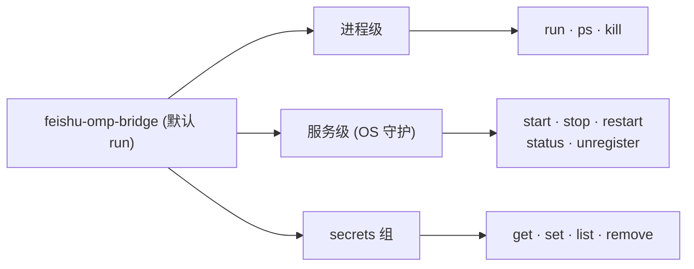
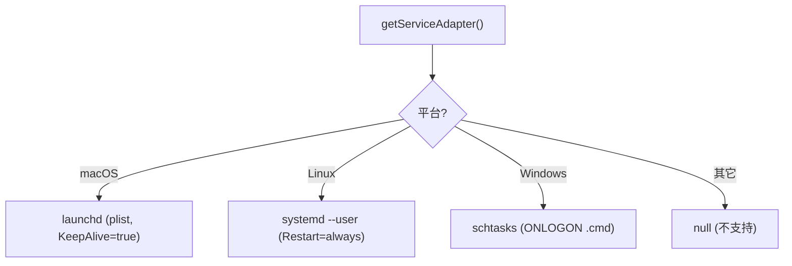
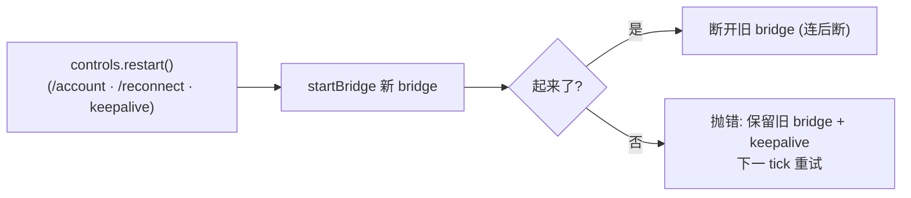

# 11 · 守护进程与 CLI 运行时

> 源码基线：commit `78460f6`（文档对应的源码 commit；详见 [README](./README.md)）。

> 覆盖范围：CLI 命令面（commander 接线）；预检（lark-cli 检测/安装/绑定、OMP 检查）；`ServiceAdapter` 接口与三平台实现（launchd/systemd/schtasks）、服务标识；`cli/commands/*`；进程注册表；日志器；进程生命周期/信号 + 未捕获异常网。
>
> 源文件：`src/cli/index.ts`、`src/cli/preflight.ts`、`src/cli/commands/{start,service,ps,secrets,migrate}.ts`、`src/daemon/{service-adapter,launchd,systemd,schtasks,paths}.ts`、`src/runtime/registry.ts`、`src/core/logger.ts`。

相关篇：[总览与架构](./01-overview-and-architecture.md)（启动序列）、[配置与密钥](./08-config-and-secrets.md)（secrets 子命令）、[聊天命令](./10-commands.md)（`/ps`/`/exit`/`/doctor`）。

## 1. CLI 命令面（`cli/index.ts`）

commander 程序 `feishu-omp-bridge`，默认子命令 `run`（`argv.length>2 ? argv : [...argv, 'run']`）：

进程级：
- `run`（默认）：`-c, --config <path>`、`--skip-check-lark-cli` → `runStart`（见 [01](./01-overview-and-architecture.md)）。
- `ps` → `runPs`（列本机进程）。
- `kill <target>` → `runKillCli`（按短 id / 序号杀，SIGTERM 后 2s SIGKILL）。

服务级（OS 守护）：
- `start` → `runServiceStart`（安装并启动 daemon）。
- `stop` → `runServiceStop`（停且禁自启）。
- `restart` → `runServiceRestart`。
- `status` → `runServiceStatus`（pid、上次退出、日志路径）。
- `unregister` → `runServiceUnregister`（停 + 禁自启 + 删服务文件）。

`secrets` 子命令组：`get`（exec-provider 协议，stdin JSON → stdout JSON，供 lark-cli `config bind --source lark-channel`）、`set --app-id`、`list`、`remove --app-id`（见 [08](./08-config-and-secrets.md)、`cli/commands/secrets.ts`）。

> `runMigrate`（`cli/commands/migrate.ts`）在 `cli/index.ts` 被 import，但当前未注册为 commander 子命令——它是一次性遗留迁移器（`~/.config/feishu-codex-bridge` + `~/.cache/feishu-codex-bridge` → `~/.feishu-omp-bridge`，以及 `{app}` → `{accounts:{app}}` 配置形状），幂等，可在需要时手动调用。

## 2. 预检（`cli/preflight.ts`）

`preFlightChecks({ skipCheckLarkCli })` → `checkLarkCli`：检测 `lark-cli` 是否安装（`isLarkCliInstalled`），未装则提示并尝试 `npm install -g @larksuite/cli` + `lark-cli config bind --source lark-channel --identity bot-only`（`runCapture` 捕获输出保持 clack spinner 干净，`INSTALL_TIMEOUT_MS=5min`、`BIND_TIMEOUT_MS=30s`），失败打印手动安装提示但不致命。`--skip-check-lark-cli` 跳过整步。OMP 可用性检查不在 preflight，而在 `runStart` 里 `agent.isAvailable()`（缺失即 `process.exit(1)`，见 [01](./01-overview-and-architecture.md)）。

## 3. 服务适配器（`daemon/`）

`ServiceAdapter` 接口（`daemon/service-adapter.ts`）：`platformName`、`fileExists()`、`isRunning()`、`servicePath()`、`install()`、`start()`、`stop()`、`stopAndDisableAutostart()`、`restart()`、`waitUntilStopped(timeoutMs?)`、`deleteFile()`、`describeStatus()`、`parseStatus(text)`（提取 pid/lastExit）。返回值可同步或异步（`ServiceResultLike`）。`getServiceAdapter()` 按平台返回 `makeLaunchdAdapter`/`makeSystemdAdapter`/`makeSchtasksAdapter`，不支持的 OS 返回 null。

服务标识（`daemon/paths.ts`）：

| 项 | 值 |
| --- | --- |
| `SERVICE_NAME` | `feishu-omp-bridge.bot` |
| macOS `LAUNCH_AGENT_LABEL` | `ai.feishu-omp-bridge.bot`（plist 在 `~/Library/LaunchAgents/`） |
| Linux `SYSTEMD_UNIT_NAME` | `feishu-omp-bridge.bot.service`（unit 在 `$XDG_CONFIG_HOME/systemd/user/` 或 `~/.config/systemd/user/`） |
| Windows `WINDOWS_TASK_NAME` | `FeishuOmpBridge.Bot`（`.cmd` 包装在 `~/.feishu-omp-bridge/daemon-launcher.cmd`） |

daemon 日志：`daemonLogDir()`=`~/.feishu-omp-bridge/logs/`，`daemonStdoutPath()`/`daemonStderrPath()`（`daemon-stdout.log`/`daemon-stderr.log`，与结构化日志同目录、`daemon-` 前缀区分）。

三平台实现：
- `launchd.ts`：`buildPlist`/`writePlist`、`bootstrap`/`bootout`/`kickstart -k`（重启）、`isLoaded`（`launchctl print`）、`describeService`、`deletePlist`、`waitUntilUnloaded`。`KeepAlive=true` 等价于 systemd `Restart=always`。
- `systemd.ts`：`buildUnit`/`writeUnit`、`daemonReload`、`enableAndStart`（`enable --now`）、`stop`、`disableAndStop`、`restart`、`isActive`（`is-active`）、`describeService`、`deleteUnit`、`waitUntilInactive`。Unit 含 `Restart=always`+`RestartSec=5`。
- `schtasks.ts`：`buildLauncherCmd`/`writeLauncherCmd`、`installTask`（触发 ONLOGON，`/Create /F`）、`runTask`/`endTask`/`disableTask`/`enableTask`/`endAndDisable`/`restartTask`（end→wait→run）、`isTaskRegistered`/`isTaskRunning`（解析 `/Query /V /FO LIST`）、`describeTask`、`waitUntilStopped`、`deleteTask`。

`cli/commands/service.ts`：`requireAdapter`（无适配器友好退出）、`reportConnectAfter`（start/restart 后轮询注册表等新条目出现再打印连接行，与 `run` 一致）、`runServiceStart/Stop/Restart/Status/Unregister`、`ensureBridgeConfigured`、`formatServiceStderr`/`printServiceFailure`（中文化常见失败）。

## 4. 进程注册表（`runtime/registry.ts`）

`processes.json`（`paths.processesFile`）记录运行中的 bridge 进程，用于 `/ps`、`/exit`、同应用冲突检测。

- `ProcessRole = 'standalone'|'front'|'worker'`（仅前两者开飞书 WS 长连接；worker 共享应用但不开，故不算竞争连接）。
- `ProcessEntry`（id/pid/appId/tenant/configPath/version/role/botName?/startedAt 等）。
- `isAlive(pid)`（`kill(pid,0)`）、`readAndPrune(path)`（读并丢死条目，不持久化，供只读视图）、`register(args)`（原子 prune+add，返回带短 id 的 entry）、`unregister`/`unregisterSync`、`updateEntry(id, patch)`（`/account` 后更新 appId/tenant/botName）、`generateShortId`、`sameAppOthers(appId, excludePid)`（同应用其它存活进程，冲突检测用）、`resolveTarget(target)`（短 id 或 1-based 序号 → entry）、`cleanupTmpFiles`。`writeAtomic`/`writeAtomicSync` 原子写。

`cli/commands/ps.ts`：`runPs`（定宽表）、`runKillCli`（SIGTERM→2s→SIGKILL）。

## 5. 日志器（`core/logger.ts`）

结构化日志 + 紧凑 stdout。

- 每日 `YYYY-MM-DD.log` 写在 `logsDir()`（`~/.feishu-omp-bridge/logs/`），保留 `LOG_RETENTION_DAYS`（默认 7，`LARK_CHANNEL_LOG_DAYS` 覆盖）。
- `log` 导出（`info`/`warn`/`error`/`fail`）：`emit(level, phase, event, fields)` 写 JSON 行；`RESERVED_KEYS` 防 caller 覆盖内部字段；stdout 只放 `STDOUT_INFO_ALLOWLIST` 里的 info 事件（其余降噪）。
- `withTrace(ctx, fn)`：`AsyncLocalStorage` 让 fn 内（跨 await）所有 `log.*` 自动带 `traceId`/`chatId`/`msgId`；`newTraceId()`。
- `sanitizeLogsForDoctor(logs)`：脱敏标识/凭据材料（`/doctor` 把日志喂模型前用，见 [10](./10-commands.md)）。
- `readRecentLogs({maxBytes})`：读今天（必要时含昨天）日志尾（`readTail`）。
- `gcOldLogs()`：删超出保留窗口的日志文件（启动时调，返回删除数）。

## 6. 进程生命周期与信号

`runStart`（`cli/commands/start.ts`，见 [01](./01-overview-and-architecture.md)）：
- 顶部 `process.on('unhandledRejection')` / `process.on('uncaughtException')` 只记 `log.fail('process', ...)` 不退出——丢一条回复也比崩掉强。
- `dns.setDefaultResultOrder('ipv4first')` 规避 IPv6 坏路由。
- `stop(sig)`：幂等，断开 bridge、`unregisterSync(entry.id)`、`process.exit(0)`。注册到 `SIGINT`/`SIGTERM`。
- `process.on('exit')`：`unregisterSync` + `cleanupTmpFiles`（兜底，防绕过 stop 的退出留下陈旧条目）。
- `controls.restart()`：**连后断**——先 `startBridge` 新 bridge，成功才断旧 bridge（新 bridge 起不来时抛错保留旧 bridge 及其 keepalive，下一 keepalive tick 可重试）。`/account`、`/reconnect`、keepalive 强制重连都走它。

## 7. 是否后端通用

整个 daemon/CLI/registry/logger 层与 agent 后端无关，可整体复用——`dify-feishu-bridge` 仅重命名服务标识（`daemon/paths.ts` → `dify-feishu-bridge.bot` / `ai.dify-feishu-bridge.bot` / `DifyFeishuBridge.Bot`）、数据根（`config/paths.ts`）、`package.json` name/bin，并把 `preflight.ts` 的 OMP 检查换成可选的 Dify 连通性探测。详见 [dify 迁移与验证](../dify-feishu-bridge-design/06-migration-and-verification.md)。
