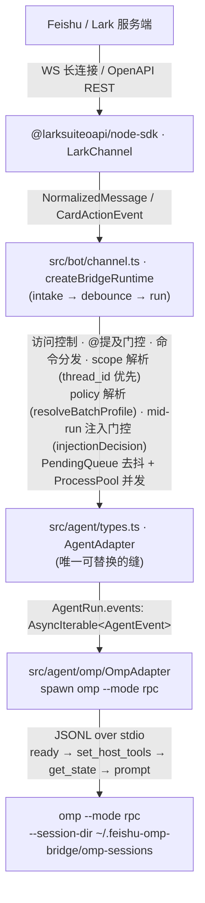

# how-it-works —— feishu-omp-bridge 实现详解

> **源码基线**：本系列描述的源代码状态为 commit `103dd04dc92e035fc59a3f49d7daea830dcda3ba`（短 `103dd04`）——这是文档对应的**源码** commit；文档本身随代码同分支提交（`chore/remove-legacy-surface`），不额外滞后。
>
> 该基线在**统一 policy 模型**（`src/config/policy.ts`：principals × profiles × rules、`resolvePolicy` / `resolveBatchProfile` / `relayRunTarget`）之上，落地了六件事：**per-profile 会话**（`sessions.json` 嵌套为 scope → profile → session，`resumeFor(scope, cwd, profile)`，低权 profile 永不 resume 高权线程）；**mid-run 注入门控**（`injectionDecision`：消息发送者自己解析出的 profile 与活跃 run 同名才注入，否则打 ⏳ reaction 缓期，run 结束后按其自身 profile 执行）；**per-principal `relayScenarios`**（worker-bound principal 只把列出的聊天场景 relay 到 worker）；**thread_id 优先的 scope**（`scopeFor`：消息带 `thread_id` 即 `${chatId}:${threadId}`，覆盖话题群和开启话题的普通群）；**卡片 / markdown 权限徽章**（`RunBadge` 在 run 启动时快照 profile + 发起人）；**omp 早退不挂起 + stale `--resume` 自愈**（`EXIT_DRAIN_GRACE_MS` 强制关闭 stdout reader、`isSessionMissingError` 识别丢失会话、同一张卡片里 fresh 重试一次）。[04 消息管线](./04-message-pipeline.md)、[07 会话/工作空间/媒体](./07-sessions-workspaces-media.md)、[09 访问控制与统一策略](./09-access-and-guest-sandbox.md) 是这些变化的主要落点。
>
> **本次基线相对上一份（`33bcea3`）的变化**：`chore/remove-legacy-surface` 分支（commits `4584ef1..103dd04`）删除了七组 legacy/低使用功能——① `synthesizeLegacyPolicy` 向后兼容合成（现在 `effectivePolicy(cfg) = cfg.policy ?? DEFAULT_OPEN_POLICY`，人人 `full`、不中继；`preferences.guestPolicy`/`relay.route` 字段整个删除，写了会被 `assertNoLegacyPolicyFields` 在启动/`restart` 时拒绝，见 [CONFIGURATION.zh.md §13](../CONFIGURATION.zh.md#13-legacy-字段已移除与迁移对照)；`access` 门控不受影响，仍活跃）；② `migrate` CLI 子命令、`legacyPaths`、`codexBinary`/`codexModel` 别名；③ `text` 回复模式与 `messageReplyMigrated`（`messageReply` 现只剩 `card`/`markdown`）；④ `/timeout` per-scope 覆盖（`ScopeEntry` 现只有 `{sessions, updatedAt}`，全局 `runIdleTimeoutMinutes` 看门狗不受影响）；⑤ `/account` 聊天内换凭据（换凭据现为 CLI-only：向导 / `secrets set` + `service restart`）；⑥ 云文档评论管线（`comments.ts`、`CommentEvent`、`routeComment`、评论 reaction 全删，@bot 评论不再有任何响应）；⑦ Windows schtasks 守护（win32 现直接报错，建议前台 `run` 或 WSL+systemd；launchd/systemd 不受影响）。
>
> 维护规则：每次更新 how-it-works 前，先把本源码基线 hash 刷新到对应 commit（代码处于未提交状态时标 dirty）。

> 覆盖范围：本目录是 `feishu-omp-bridge` 当前实现的“事无巨细”说明，逐子系统、逐文件、逐导出符号、逐数据流地解释 bot 如何把飞书/Lark 消息接到本地 `omp --mode rpc`。读完任意一篇 + 其引用的源码，应当能不靠猜测重写该子系统。
>
> 源文件：本篇为索引，引用 `README.md`、`README.zh.md`、`src/**`。

## 项目定位

`feishu-omp-bridge` 不是重新实现一个飞书机器人框架，而是把已有的 Feishu/Lark 桥接层（`@larksuiteoapi/node-sdk` 的 `LarkChannel`）和 Oh My Pi 的 RPC Agent 能力接起来：它把私聊、普通群 `@bot`、话题群 topic 中的消息转给 `omp --mode rpc`，再把 OMP 的文本、thinking、工具调用、工具增量、原生 UI 交互、token usage 和结果流式回写到飞书交互卡片。它适合在飞书里直接驱动本地 OMP 读写项目、跑命令、分析日志、改代码，并让团队共享一个可恢复的 OMP 会话。（引自 `README.md` 项目定位/核心能力两节；云文档评论管线已整体移除，@bot 评论不再触发响应。）

## 分层架构

呈现侧（卡片/文本）只消费规范化后的 `AgentEvent` 联合类型，对“后端是谁”完全无感。换一个后端（例如 Dify）= 只写一个新的 `AgentAdapter`，下游全部复用——这正是 `dify-feishu-bridge-design/` 那套设计文档的立足点。

## 文档清单与建议阅读顺序

| # | 文档 | 一句话 |
| --- | --- | --- |
| — | [README.md](./README.md)（本篇） | 索引、架构图、术语表 |
| 01 | [总览与架构](./01-overview-and-architecture.md) | 四层结构、`AgentAdapter` 缝、启动序列、数据目录 |
| 02 | [Agent 适配器与 OMP](./02-agent-adapter-and-omp.md) | `AgentEvent`/`AgentRun`/`AgentAdapter` 类型参考 + `OmpAdapter` RPC 实现 |
| 03 | [飞书传输层](./03-feishu-transport.md) | `LarkChannel`、事件注册、keepalive、代理、引用、交互卡片展开、relay 中继 |
| 04 | [消息管线](./04-message-pipeline.md) | intake → 去抖 → batch → run → 流式 的端到端主线 + mid-run 注入门控（脊柱文档） |
| 05 | [流式与卡片](./05-streaming-and-cards.md) | `reduce()` 状态机、CardKit 2.0 渲染、托管卡片、卡片回调分发 |
| 06 | [飞书 host 工具面](./06-feishu-host-surface.md) | `feishu_*` host tools + 只读 `feishu://` scheme |
| 07 | [会话 / 工作空间 / 媒体](./07-sessions-workspaces-media.md) | `sessions.json`（scope → profile 嵌套）、`workspaces.json`、媒体缓存 |
| 08 | [配置与密钥](./08-config-and-secrets.md) | `AppConfig` 全字段、secret 解析五段管线、AES keystore |
| 09 | [访问控制与统一策略](./09-access-and-guest-sandbox.md) | 统一 policy：principals × profiles × rules、fail-closed、三层封锁、command tools |
| 10 | [聊天命令](./10-commands.md) | 命令注册表、admin 门控、逐命令行为 + 卡片 |
| 11 | [守护进程与 CLI 运行时](./11-daemon-cli-runtime.md) | commander CLI、launchd/systemd（Windows 不支持）、进程注册表、日志 |

建议顺序：先读 01 建立全局观，再读 02（理解“缝”的契约），然后读 04（端到端主线），04 会反复引用 03/05/06/07；之后按需读 08/09/10/11。

## 术语表

- **scope（作用域）**：会话隔离键，**thread_id 优先**：消息带 `thread_id` 即 `${chatId}:${threadId}`——覆盖话题群 **和** 开启"话题"功能的普通群（后者 `chat_mode` 仍是 `'group'`，但每条消息带稳定 `thread_id`，形如 `omt_…`）；否则为 `chatId`。session、cwd、pending queue、active run 全部以 scope 为键。见 `src/bot/scope.ts` 的 `scopeFor` / `scopeForMessage`（唯一事实来源，intake 与卡片 dispatcher 共用）。
- **run（一次运行）**：一个 batch prompt 触发的一次 agent 执行，对应一个 `AgentRun`（OMP 下即一个 `omp --mode rpc` 子进程）。
- **batch（批）**：去抖窗口内攒下的一组 `NormalizedMessage`，合并成一个 prompt。见 `PendingQueue`。
- **principal / profile（主体 / 档位）**：统一 policy 的两根轴。principal 是命名的发送者集合（含保留名 `guest`，可带 `run: 'front'|'worker'` 与 `relayScenarios`）；profile 是 agent 的工具档位（内建 `full` / `locked`，自定义档位可 restricted 沙箱或 full），由 rules（首个匹配生效，无匹配 fail-closed 到 `locked`）把 (principal, 场景) 映射到 profile。session 按 (scope, profile) 存取。见 `src/config/policy.ts`、[09](./09-access-and-guest-sandbox.md)。
- **badge（权限徽章）**：run 启动时快照的 `RunBadge { profileName, restricted, owner }`（仅 group/topic；p2p 无），卡片模式渲染为彩色 header（红 ⛔ locked / 灰 🔒 受限 / 绿 🔓），markdown 模式渲染为顶行 `badgeLine()`。快照而非实时查询，防止 mid-stream 改配置错标权限。见 `src/card/run-state.ts`、`run-renderer.ts` 的 `badgeHeader()`、`text-renderer.ts` 的 `badgeLine()`。
- **deferred（缓期消息）**：run 进行中到达、但发送者 profile 与活跃 run 不同名的消息——不注入，打 ⏳（`OneSecond`）reaction 后回落 pending queue，活跃 run 结束后按其自身 profile 执行。见 `src/config/policy.ts` 的 `injectionDecision`、`src/bot/reaction.ts` 的 `REACTION_DEFERRED`。
- **managed card（托管卡片）**：用 CardKit 2.0 `cardkit.v1.card.create` 创建、可按 `card_id` + 递增 `sequence` 反复 `update` 的卡片（OMP UI 卡片、`/config`/`/switch` 表单等用它）。见 `src/card/managed.ts`。流式回复卡片走 SDK 的 `channel.stream`，是另一条路径。
- **host tool（宿主工具）**：bridge 在进程内实现、注册给 OMP 的工具（`feishu_*`、profile 声明的 command tools），OMP 通过 RPC `host_tool_call` 回调本地执行，**不经 shell**。见 `src/bot/feishu-host.ts`、`src/bot/command-tools.ts`、`src/agent/types.ts` 的 `AgentHostTool`。
- **guest sandbox（访客沙箱）**：对 restricted profile 的运行用三层手段（`--tools` 去内置、`--config` overlay 关发现源/记忆、fail-closed 的 `tool_call` hook）把 OMP 锁到白名单工具，由 `buildProfileRunArgs(profile)` 按 profile 生成。不设 `policy` 时走内置 `DEFAULT_OPEN_POLICY`（人人 `full`，无沙箱）；旧 `guestPolicy` 字段（连同曾经的 `synthesizeLegacyPolicy` 合成逻辑）已整体删除，写了会被 `assertNoLegacyPolicyFields` 拒绝，见 [CONFIGURATION.zh.md §13](../CONFIGURATION.zh.md#13-legacy-字段已移除与迁移对照)。见 `src/bot/guest-lockdown.ts`、`src/config/policy.ts`。
- **front / worker（中继角色）**：可选的双进程拓扑——`front` 持有唯一的飞书长连接并把 worker-bound principal 的事件转发给 `worker`（如你的笔记本）执行 agent；`worker` 自己回写飞书。principal 可用 `relayScenarios`（如 `['p2p']`）限制哪些聊天场景去 worker，其余留在常驻 front；卡片回调经同一门控（front 用 `ChatModeCache` 解析场景），保证回调落在渲染卡片的一侧。见 `src/relay/*`、`src/config/schema.ts` 的 `RelayConfig` / `PrincipalConfig.relayScenarios`。
